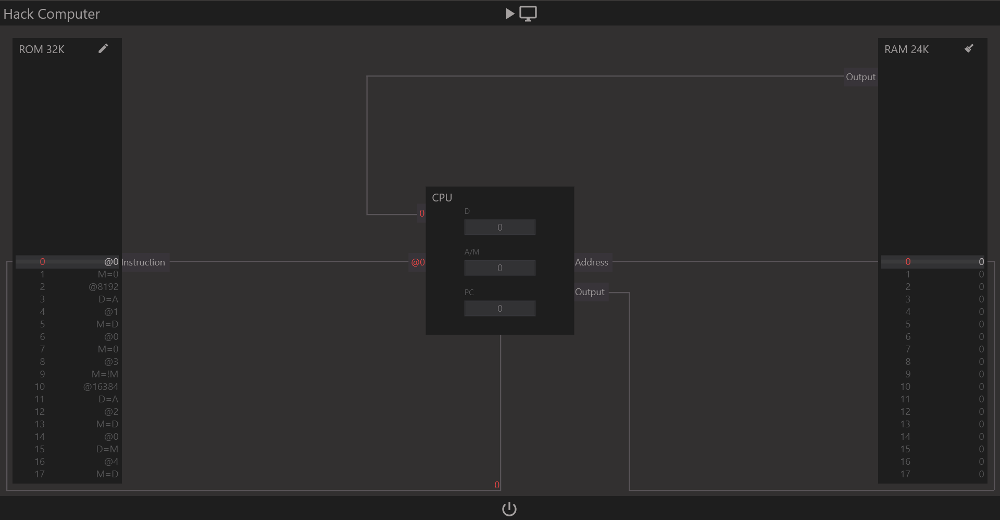

<h1>Bindings</h1>

<a href="https://github.com/CharlesCarley/HackComputer#~">~</a>
<a href="index.md#index">HackComputer</a>
/
<b>Hc07</b>
 
 
Provides a script language interface.
 
 

It is currently on the back-burner until primary functionality is complete.
 
 

A proof of concept Flutter application can be found in the flutter branch. It makes use of this interface to communicate with dart to replicate the command line debugger in Flutter.
 
 

<h2>Defined in</h2>
The source is defined in 
<a href="../../Source/Bindings#source-bindings">Source/Bindings</a>
 

</body>
</html>
