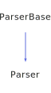

<h1>Parser</h1>

<a href="https://github.com/CharlesCarley/HackComputer#~">~</a>
<a href="index.md#index">HackComputer</a>
/
<a href="namespaceHack.md#hack">Hack</a>
::
<a href="namespaceHack_1_1Assembler.md#assembler">Assembler</a>
::
<b>Parser</b>
 
 

<h4>Derived From</h4>

<a href="classHack_1_1ParserBase.md#parserbase">Hack::ParserBase</a>

 

<h2>Public Typedefs</h2>
<a href="#instructions" class="icon-list-item">Instructions
</a>

 
<a href="#labellookup" class="icon-list-item">LabelLookup
</a>

 
<a href="#labels" class="icon-list-item">Labels
</a>

 

<h2>Private Members</h2>
<a href="#_abit" class="icon-list-item">_aBit
</a>

 
<a href="#_cbits" class="icon-list-item">_cBits
</a>

 
<a href="#_dbits" class="icon-list-item">_dBits
</a>

 
<a href="#_instructions" class="icon-list-item">_instructions
</a>

 
<a href="#_jbits" class="icon-list-item">_jBits
</a>

 
<a href="#_labels" class="icon-list-item">_labels
</a>

 
<a href="#_resolution" class="icon-list-item">_resolution
</a>

 

<h2>Private Methods</h2>
<a href="#assignmentexpression" class="icon-list-item">assignmentExpression
</a>

 
<a href="#compoundexpression" class="icon-list-item">compoundExpression
</a>

 
<a href="#compoundexpressionaone" class="icon-list-item">compoundExpressionAOne
</a>

 
<a href="#compoundexpressionazero" class="icon-list-item">compoundExpressionAZero
</a>

 
<a href="#expression" class="icon-list-item">expression
</a>

 
<a href="#expressiona" class="icon-list-item">expressionA
</a>

 
<a href="#expressionc" class="icon-list-item">expressionC
</a>

 
<a href="#identityexpression" class="icon-list-item">identityExpression
</a>

 
<a href="#label" class="icon-list-item">label
</a>

 
<a href="#parseimpl" class="icon-list-item">parseImpl
</a>

 
<a href="#pushcinstruction" class="icon-list-item">pushCInstruction
</a>

 
<a href="#resolvelabels" class="icon-list-item">resolveLabels
</a>

 
<a href="#writeimpl" class="icon-list-item">writeImpl
</a>

 

<h2>Public Methods</h2>
<a href="#parser" class="icon-list-item">Parser
</a>

 
<a href="#~parser" class="icon-list-item">~Parser
</a>

 
<a href="#instructions" class="icon-list-item">instructions
</a>

 

<h4>Defined in</h4>
<a href="https://github.com/CharlesCarley/HackComputer/blob/master/Source/Assembler/Parser.h#L32" class="icon-list-item">Parser.h
</a>

 
<a href="#parser" class="icon-list-item">top
</a>

<h2>Instructions</h2>
std::vector&lt; 
<b>uint16_t</b>
 &gt;
<b>Instructions</b>
 

<h4>Defined in</h4>
<a href="https://github.com/CharlesCarley/HackComputer/blob/master/Source/Assembler/Parser.h#L34" class="icon-list-item">Parser.h
</a>

 
<a href="#parser" class="icon-list-item">top
</a>

 

<h2>LabelLookup</h2>
std::vector&lt; 
<a href="namespaceHack_1_1Assembler.md#stringindex">StringIndex</a>
 &gt;
<b>LabelLookup</b>
 

<h4>Defined in</h4>
<a href="https://github.com/CharlesCarley/HackComputer/blob/master/Source/Assembler/Parser.h#L36" class="icon-list-item">Parser.h
</a>

 
<a href="#parser" class="icon-list-item">top
</a>

 

<h2>Labels</h2>
std::unordered_map&lt; 
<a href="namespaceHack.md#string">String</a>
, size_t &gt;
<b>Labels</b>
 

<h4>Defined in</h4>
<a href="https://github.com/CharlesCarley/HackComputer/blob/master/Source/Assembler/Parser.h#L35" class="icon-list-item">Parser.h
</a>

 
<a href="#parser" class="icon-list-item">top
</a>

 

<h2>_aBit</h2>
<b>uint8_t</b>
<b>_aBit</b>
 

<h4>Defined in</h4>
<a href="https://github.com/CharlesCarley/HackComputer/blob/master/Source/Assembler/Parser.h#L43" class="icon-list-item">Parser.h
</a>

 
<a href="#parser" class="icon-list-item">top
</a>

 

<h2>_cBits</h2>
<b>uint16_t</b>
<b>_cBits</b>
 

<h4>Defined in</h4>
<a href="https://github.com/CharlesCarley/HackComputer/blob/master/Source/Assembler/Parser.h#L41" class="icon-list-item">Parser.h
</a>

 
<a href="#parser" class="icon-list-item">top
</a>

 

<h2>_dBits</h2>
<b>uint8_t</b>
<b>_dBits</b>
 

<h4>Defined in</h4>
<a href="https://github.com/CharlesCarley/HackComputer/blob/master/Source/Assembler/Parser.h#L42" class="icon-list-item">Parser.h
</a>

 
<a href="#parser" class="icon-list-item">top
</a>

 

<h2>_instructions</h2>
<a href="classHack_1_1Assembler_1_1Parser.md#instructions">Instructions</a>
<b>_instructions</b>
 

<h4>Defined in</h4>
<a href="https://github.com/CharlesCarley/HackComputer/blob/master/Source/Assembler/Parser.h#L39" class="icon-list-item">Parser.h
</a>

 
<a href="#parser" class="icon-list-item">top
</a>

 

<h2>_jBits</h2>
<b>uint8_t</b>
<b>_jBits</b>
 

<h4>Defined in</h4>
<a href="https://github.com/CharlesCarley/HackComputer/blob/master/Source/Assembler/Parser.h#L44" class="icon-list-item">Parser.h
</a>

 
<a href="#parser" class="icon-list-item">top
</a>

 

<h2>_labels</h2>
<a href="classHack_1_1Assembler_1_1Parser.md#labels">Labels</a>
<b>_labels</b>
 

<h4>Defined in</h4>
<a href="https://github.com/CharlesCarley/HackComputer/blob/master/Source/Assembler/Parser.h#L40" class="icon-list-item">Parser.h
</a>

 
<a href="#parser" class="icon-list-item">top
</a>

 

<h2>_resolution</h2>
<a href="classHack_1_1Assembler_1_1Parser.md#labellookup">LabelLookup</a>
<b>_resolution</b>
 

<h4>Defined in</h4>
<a href="https://github.com/CharlesCarley/HackComputer/blob/master/Source/Assembler/Parser.h#L45" class="icon-list-item">Parser.h
</a>

 
<a href="#parser" class="icon-list-item">top
</a>

 

<h2>assignmentExpression</h2>
void
<b>assignmentExpression</b>
<i>(</i>
<i>)</i>

<h4>Defined in</h4>
<a href="https://github.com/CharlesCarley/HackComputer/blob/master/Source/Assembler/Parser.h#L55" class="icon-list-item">Parser.h
</a>

 
<a href="https://github.com/CharlesCarley/HackComputer/blob/master/Source/Assembler/Parser.cpp#L359" class="icon-list-item">Parser.cpp
</a>

 
<a href="#parser" class="icon-list-item">top
</a>

 

<h2>compoundExpression</h2>
void
<b>compoundExpression</b>
<i>(</i>
<i>)</i>

<h4>Defined in</h4>
<a href="https://github.com/CharlesCarley/HackComputer/blob/master/Source/Assembler/Parser.h#L53" class="icon-list-item">Parser.h
</a>

 
<a href="https://github.com/CharlesCarley/HackComputer/blob/master/Source/Assembler/Parser.cpp#L342" class="icon-list-item">Parser.cpp
</a>

 
<a href="#parser" class="icon-list-item">top
</a>

 

<h2>compoundExpressionAOne</h2>
void
<b>compoundExpressionAOne</b>
<i>(</i>
<i>)</i>

<h4>Defined in</h4>
<a href="https://github.com/CharlesCarley/HackComputer/blob/master/Source/Assembler/Parser.h#L51" class="icon-list-item">Parser.h
</a>

 
<a href="https://github.com/CharlesCarley/HackComputer/blob/master/Source/Assembler/Parser.cpp#L271" class="icon-list-item">Parser.cpp
</a>

 
<a href="#parser" class="icon-list-item">top
</a>

 

<h2>compoundExpressionAZero</h2>
void
<b>compoundExpressionAZero</b>
<i>(</i>
<i>)</i>

<h4>Defined in</h4>
<a href="https://github.com/CharlesCarley/HackComputer/blob/master/Source/Assembler/Parser.h#L49" class="icon-list-item">Parser.h
</a>

 
<a href="https://github.com/CharlesCarley/HackComputer/blob/master/Source/Assembler/Parser.cpp#L182" class="icon-list-item">Parser.cpp
</a>

 
<a href="#parser" class="icon-list-item">top
</a>

 

<h2>expression</h2>
void
<b>expression</b>
<i>(</i>
<i>)</i>

<h4>Defined in</h4>
<a href="https://github.com/CharlesCarley/HackComputer/blob/master/Source/Assembler/Parser.h#L65" class="icon-list-item">Parser.h
</a>

 
<a href="https://github.com/CharlesCarley/HackComputer/blob/master/Source/Assembler/Parser.cpp#L472" class="icon-list-item">Parser.cpp
</a>

 
<a href="#parser" class="icon-list-item">top
</a>

 

<h2>expressionA</h2>
void
<b>expressionA</b>
<i>(</i>
<i>)</i>

<h4>Defined in</h4>
<a href="https://github.com/CharlesCarley/HackComputer/blob/master/Source/Assembler/Parser.h#L61" class="icon-list-item">Parser.h
</a>

 
<a href="https://github.com/CharlesCarley/HackComputer/blob/master/Source/Assembler/Parser.cpp#L105" class="icon-list-item">Parser.cpp
</a>

 
<a href="#parser" class="icon-list-item">top
</a>

 

<h2>expressionC</h2>
void
<b>expressionC</b>
<i>(</i>
<i>)</i>

<h4>Defined in</h4>
<a href="https://github.com/CharlesCarley/HackComputer/blob/master/Source/Assembler/Parser.h#L59" class="icon-list-item">Parser.h
</a>

 
<a href="https://github.com/CharlesCarley/HackComputer/blob/master/Source/Assembler/Parser.cpp#L387" class="icon-list-item">Parser.cpp
</a>

 
<a href="#parser" class="icon-list-item">top
</a>

 

<h2>identityExpression</h2>
void
<b>identityExpression</b>
<i>(</i>
<i>)</i>

<h4>Defined in</h4>
<a href="https://github.com/CharlesCarley/HackComputer/blob/master/Source/Assembler/Parser.h#L57" class="icon-list-item">Parser.h
</a>

 
<a href="https://github.com/CharlesCarley/HackComputer/blob/master/Source/Assembler/Parser.cpp#L154" class="icon-list-item">Parser.cpp
</a>

 
<a href="#parser" class="icon-list-item">top
</a>

 

<h2>label</h2>
void
<b>label</b>
<i>(</i>
<i>)</i>

<h4>Defined in</h4>
<a href="https://github.com/CharlesCarley/HackComputer/blob/master/Source/Assembler/Parser.h#L63" class="icon-list-item">Parser.h
</a>

 
<a href="https://github.com/CharlesCarley/HackComputer/blob/master/Source/Assembler/Parser.cpp#L451" class="icon-list-item">Parser.cpp
</a>

 
<a href="#parser" class="icon-list-item">top
</a>

 

<h2>parseImpl</h2>
void
<b>parseImpl</b>
<i>(</i>

<a href="namespaceHack.md#istream">IStream</a>
 &amp;
is

<i>)</i>

<h4>Defined in</h4>
<a href="https://github.com/CharlesCarley/HackComputer/blob/master/Source/Assembler/Parser.h#L69" class="icon-list-item">Parser.h
</a>

 
<a href="https://github.com/CharlesCarley/HackComputer/blob/master/Source/Assembler/Parser.cpp#L491" class="icon-list-item">Parser.cpp
</a>

 
<a href="#parser" class="icon-list-item">top
</a>

 

<h2>pushCInstruction</h2>
void
<b>pushCInstruction</b>
<i>(</i>
<i>)</i>

<h4>Defined in</h4>
<a href="https://github.com/CharlesCarley/HackComputer/blob/master/Source/Assembler/Parser.h#L47" class="icon-list-item">Parser.h
</a>

 
<a href="https://github.com/CharlesCarley/HackComputer/blob/master/Source/Assembler/Parser.cpp#L78" class="icon-list-item">Parser.cpp
</a>

 
<a href="#parser" class="icon-list-item">top
</a>

 

<h2>resolveLabels</h2>
void
<b>resolveLabels</b>
<i>(</i>
<i>)</i>

<h4>Defined in</h4>
<a href="https://github.com/CharlesCarley/HackComputer/blob/master/Source/Assembler/Parser.h#L67" class="icon-list-item">Parser.h
</a>

 
<a href="https://github.com/CharlesCarley/HackComputer/blob/master/Source/Assembler/Parser.cpp#L416" class="icon-list-item">Parser.cpp
</a>

 
<a href="#parser" class="icon-list-item">top
</a>

 

<h2>writeImpl</h2>
void
<b>writeImpl</b>
<i>(</i>

<a href="namespaceHack.md#ostream">OStream</a>
 &amp;
os

int
format
 = 
0

<i>)</i>

<h4>Defined in</h4>
<a href="https://github.com/CharlesCarley/HackComputer/blob/master/Source/Assembler/Parser.h#L71" class="icon-list-item">Parser.h
</a>

 
<a href="https://github.com/CharlesCarley/HackComputer/blob/master/Source/Assembler/Parser.cpp#L517" class="icon-list-item">Parser.cpp
</a>

 
<a href="#parser" class="icon-list-item">top
</a>

 

<h2>Parser</h2>
<b>Parser</b>
<i>(</i>
<i>)</i>

<h4>References</h4>

<a href="classHack_1_1ParserBase.md#_scanner">_scanner</a>

<h4>Defined in</h4>
<a href="https://github.com/CharlesCarley/HackComputer/blob/master/Source/Assembler/Parser.h#L74" class="icon-list-item">Parser.h
</a>

 
<a href="https://github.com/CharlesCarley/HackComputer/blob/master/Source/Assembler/Parser.cpp#L63" class="icon-list-item">Parser.cpp
</a>

 
<a href="#parser" class="icon-list-item">top
</a>

 

<h2>~Parser</h2>
<b>~Parser</b>
<i>(</i>
<i>)</i>

<h4>References</h4>

<a href="classHack_1_1ParserBase.md#_scanner">_scanner</a>

<h4>Defined in</h4>
<a href="https://github.com/CharlesCarley/HackComputer/blob/master/Source/Assembler/Parser.h#L75" class="icon-list-item">Parser.h
</a>

 
<a href="https://github.com/CharlesCarley/HackComputer/blob/master/Source/Assembler/Parser.cpp#L72" class="icon-list-item">Parser.cpp
</a>

 
<a href="#parser" class="icon-list-item">top
</a>

 

<h2>instructions</h2>
const 
<a href="classHack_1_1Assembler_1_1Parser.md#instructions">Instructions</a>
 &amp;
<b>instructions</b>
<i>(</i>
<i>)</i>

<h4>Defined in</h4>
<a href="https://github.com/CharlesCarley/HackComputer/blob/master/Source/Assembler/Parser.h#L77" class="icon-list-item">Parser.h
</a>

 
<a href="#parser" class="icon-list-item">top
</a>

 

</body>
</html>
