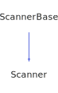

<h1>Scanner</h1>

<a href="https://github.com/CharlesCarley/HackComputer#~">~</a>
<a href="index.md#index">HackComputer</a>
/
<a href="namespaceHack.md#hack">Hack</a>
::
<a href="namespaceHack_1_1Assembler.md#assembler">Assembler</a>
::
<b>Scanner</b>
 
 

<h4>Derived From</h4>

<a href="classHack_1_1ScannerBase.md#scannerbase">Hack::ScannerBase</a>

 

<h2>Private Members</h2>
<a href="#_fsr" class="icon-list-item">_fsr
</a>

 
<a href="#_offs" class="icon-list-item">_offs
</a>

 

<h2>Private Methods</h2>
<a href="#extractrsymbol" class="icon-list-item">extractRSymbol
</a>

 
<a href="#initializetables" class="icon-list-item">initializeTables
</a>

 
<a href="#readsymbol" class="icon-list-item">readSymbol
</a>

 
<a href="#scandecimal" class="icon-list-item">scanDecimal
</a>

 
<a href="#scansymbol" class="icon-list-item">scanSymbol
</a>

 
<a href="#testmultipleregisterandjump" class="icon-list-item">testMultipleRegisterAndJump
</a>

 
<a href="#testsingleregister" class="icon-list-item">testSingleRegister
</a>

 

<h2>Public Methods</h2>
<a href="#scanner" class="icon-list-item">Scanner
</a>

 
<a href="#firststaticregister" class="icon-list-item">firstStaticRegister
</a>

 
<a href="#nextstaticregister" class="icon-list-item">nextStaticRegister
</a>

 
<a href="#scan" class="icon-list-item">scan
</a>

 

<h4>Defined in</h4>
<a href="https://github.com/CharlesCarley/HackComputer/blob/master/Source/Assembler/Scanner.h#L29" class="icon-list-item">Scanner.h
</a>

 
<a href="#scanner" class="icon-list-item">top
</a>

<h2>_fsr</h2>
size_t
<b>_fsr</b>
 

<h4>Defined in</h4>
<a href="https://github.com/CharlesCarley/HackComputer/blob/master/Source/Assembler/Scanner.h#L31" class="icon-list-item">Scanner.h
</a>

 
<a href="#scanner" class="icon-list-item">top
</a>

 

<h2>_offs</h2>
size_t
<b>_offs</b>
 

<h4>Defined in</h4>
<a href="https://github.com/CharlesCarley/HackComputer/blob/master/Source/Assembler/Scanner.h#L31" class="icon-list-item">Scanner.h
</a>

 
<a href="#scanner" class="icon-list-item">top
</a>

 

<h2>extractRSymbol</h2>
bool
<b>extractRSymbol</b>
<i>(</i>

<a href="namespaceHack_1_1Assembler.md#token">Token</a>
 &amp;
tok

<i>)</i>

<h4>Defined in</h4>
<a href="https://github.com/CharlesCarley/HackComputer/blob/master/Source/Assembler/Scanner.h#L39" class="icon-list-item">Scanner.h
</a>

 
<a href="https://github.com/CharlesCarley/HackComputer/blob/master/Source/Assembler/Scanner.cpp#L139" class="icon-list-item">Scanner.cpp
</a>

 
<a href="#scanner" class="icon-list-item">top
</a>

 

<h2>initializeTables</h2>
void
<b>initializeTables</b>
<i>(</i>
<i>)</i>

<h4>Defined in</h4>
<a href="https://github.com/CharlesCarley/HackComputer/blob/master/Source/Assembler/Scanner.h#L33" class="icon-list-item">Scanner.h
</a>

 
<a href="https://github.com/CharlesCarley/HackComputer/blob/master/Source/Assembler/Scanner.cpp#L75" class="icon-list-item">Scanner.cpp
</a>

 
<a href="#scanner" class="icon-list-item">top
</a>

 

<h2>readSymbol</h2>
void
<b>readSymbol</b>
<i>(</i>

<a href="namespaceHack.md#string">String</a>
 &amp;
dest

<i>)</i>

<h4>Defined in</h4>
<a href="https://github.com/CharlesCarley/HackComputer/blob/master/Source/Assembler/Scanner.h#L41" class="icon-list-item">Scanner.h
</a>

 
<a href="https://github.com/CharlesCarley/HackComputer/blob/master/Source/Assembler/Scanner.cpp#L163" class="icon-list-item">Scanner.cpp
</a>

 
<a href="#scanner" class="icon-list-item">top
</a>

 

<h2>scanDecimal</h2>
void
<b>scanDecimal</b>
<i>(</i>

<a href="namespaceHack_1_1Assembler.md#token">Token</a>
 &amp;
tok

<i>)</i>

<h4>Defined in</h4>
<a href="https://github.com/CharlesCarley/HackComputer/blob/master/Source/Assembler/Scanner.h#L35" class="icon-list-item">Scanner.h
</a>

 
<a href="https://github.com/CharlesCarley/HackComputer/blob/master/Source/Assembler/Scanner.cpp#L95" class="icon-list-item">Scanner.cpp
</a>

 
<a href="#scanner" class="icon-list-item">top
</a>

 

<h2>scanSymbol</h2>
void
<b>scanSymbol</b>
<i>(</i>

<a href="namespaceHack_1_1Assembler.md#token">Token</a>
 &amp;
tok

<i>)</i>

<h4>Defined in</h4>
<a href="https://github.com/CharlesCarley/HackComputer/blob/master/Source/Assembler/Scanner.h#L37" class="icon-list-item">Scanner.h
</a>

 
<a href="https://github.com/CharlesCarley/HackComputer/blob/master/Source/Assembler/Scanner.cpp#L250" class="icon-list-item">Scanner.cpp
</a>

 
<a href="#scanner" class="icon-list-item">top
</a>

 

<h2>testMultipleRegisterAndJump</h2>
bool
<b>testMultipleRegisterAndJump</b>
<i>(</i>

<a href="namespaceHack_1_1Assembler.md#token">Token</a>
 &amp;
tok

<i>)</i>

<h4>Defined in</h4>
<a href="https://github.com/CharlesCarley/HackComputer/blob/master/Source/Assembler/Scanner.h#L45" class="icon-list-item">Scanner.h
</a>

 
<a href="https://github.com/CharlesCarley/HackComputer/blob/master/Source/Assembler/Scanner.cpp#L216" class="icon-list-item">Scanner.cpp
</a>

 
<a href="#scanner" class="icon-list-item">top
</a>

 

<h2>testSingleRegister</h2>
bool
<b>testSingleRegister</b>
<i>(</i>

<a href="namespaceHack_1_1Assembler.md#token">Token</a>
 &amp;
tok

<i>)</i>

<h4>Defined in</h4>
<a href="https://github.com/CharlesCarley/HackComputer/blob/master/Source/Assembler/Scanner.h#L43" class="icon-list-item">Scanner.h
</a>

 
<a href="https://github.com/CharlesCarley/HackComputer/blob/master/Source/Assembler/Scanner.cpp#L180" class="icon-list-item">Scanner.cpp
</a>

 
<a href="#scanner" class="icon-list-item">top
</a>

 

<h2>Scanner</h2>
<b>Scanner</b>
<i>(</i>
<i>)</i>

<h4>Defined in</h4>
<a href="https://github.com/CharlesCarley/HackComputer/blob/master/Source/Assembler/Scanner.h#L48" class="icon-list-item">Scanner.h
</a>

 
<a href="https://github.com/CharlesCarley/HackComputer/blob/master/Source/Assembler/Scanner.cpp#L68" class="icon-list-item">Scanner.cpp
</a>

 
<a href="#scanner" class="icon-list-item">top
</a>

 

<h2>firstStaticRegister</h2>
size_t
<b>firstStaticRegister</b>
<i>(</i>
<i>)</i>

<h4>Defined in</h4>
<a href="https://github.com/CharlesCarley/HackComputer/blob/master/Source/Assembler/Scanner.h#L54" class="icon-list-item">Scanner.h
</a>

 
<a href="https://github.com/CharlesCarley/HackComputer/blob/master/Source/Assembler/Scanner.cpp#L127" class="icon-list-item">Scanner.cpp
</a>

 
<a href="#scanner" class="icon-list-item">top
</a>

 

<h2>nextStaticRegister</h2>
size_t
<b>nextStaticRegister</b>
<i>(</i>
<i>)</i>

<h4>Defined in</h4>
<a href="https://github.com/CharlesCarley/HackComputer/blob/master/Source/Assembler/Scanner.h#L56" class="icon-list-item">Scanner.h
</a>

 
<a href="https://github.com/CharlesCarley/HackComputer/blob/master/Source/Assembler/Scanner.cpp#L132" class="icon-list-item">Scanner.cpp
</a>

 
<a href="#scanner" class="icon-list-item">top
</a>

 

<h2>scan</h2>
void
<b>scan</b>
<i>(</i>

<a href="namespaceHack_1_1Assembler.md#token">Token</a>
 &amp;
tok

<i>)</i>

<h4>References</h4>

<a href="classHack_1_1ScannerBase.md#_stream">_stream</a>

<a href="classHack_1_1TokenBase.md#clear">clear</a>

<a href="classHack_1_1TokenBase.md#setline">setLine</a>

<a href="classHack_1_1ScannerBase.md#_line">_line</a>

<a href="classHack_1_1ScannerBase.md#scanlinecomment">scanLineComment</a>

<a href="classHack_1_1TokenBase.md#settype">setType</a>

<a href="namespaceHack_1_1Assembler.md#tok_at">TOK_AT</a>

<a href="namespaceHack_1_1Assembler.md#tok_minus">TOK_MINUS</a>

<a href="namespaceHack_1_1Assembler.md#tok_and">TOK_AND</a>

<a href="namespaceHack_1_1Assembler.md#tok_or">TOK_OR</a>

<a href="namespaceHack_1_1Assembler.md#tok_not">TOK_NOT</a>

<a href="namespaceHack_1_1Assembler.md#tok_semi_colon">TOK_SEMI_COLON</a>

<a href="namespaceHack_1_1Assembler.md#tok_plus">TOK_PLUS</a>

<a href="namespaceHack_1_1Assembler.md#tok_equal">TOK_EQUAL</a>

<a href="namespaceHack_1_1Assembler.md#tok_l_paren">TOK_L_PAREN</a>

<a href="namespaceHack_1_1Assembler.md#tok_r_paren">TOK_R_PAREN</a>

<a href="classHack_1_1ScannerBase.md#scanwhitespace">scanWhiteSpace</a>

<a href="classHack_1_1ScannerBase.md#syntaxerror">syntaxError</a>

<a href="namespaceHack_1_1Assembler.md#tok_eof">TOK_EOF</a>

<h4>Defined in</h4>
<a href="https://github.com/CharlesCarley/HackComputer/blob/master/Source/Assembler/Scanner.h#L50" class="icon-list-item">Scanner.h
</a>

 
<a href="https://github.com/CharlesCarley/HackComputer/blob/master/Source/Assembler/Scanner.cpp#L285" class="icon-list-item">Scanner.cpp
</a>

 
<a href="#scanner" class="icon-list-item">top
</a>

 

</body>
</html>
