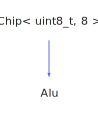

<h1>Alu</h1>

<a href="https://github.com/CharlesCarley/HackComputer#~">~</a>
<a href="index.md#index">HackComputer</a>
/
<a href="namespaceHack.md#hack">Hack</a>
::
<a href="namespaceHack_1_1Chips.md#chips">Chips</a>
::
<b>Alu</b>
 
 

<h4>Derived From</h4>

<a href="classHack_1_1Chips_1_1Chip.md#chip">Hack::Chips::Chip&lt; uint8_t, 8 &gt;</a>

 

<h2>Private Members</h2>
<a href="#_io" class="icon-list-item">_io
</a>

 

<h2>Private Methods</h2>
<a href="#evaluate" class="icon-list-item">evaluate
</a>

 

<h2>Public Methods</h2>
<a href="#alu" class="icon-list-item">Alu
</a>

 
<a href="#getflags" class="icon-list-item">getFlags
</a>

 
<a href="#getne" class="icon-list-item">getNe
</a>

 
<a href="#getout" class="icon-list-item">getOut
</a>

 
<a href="#getzr" class="icon-list-item">getZr
</a>

 
<a href="#setflags" class="icon-list-item">setFlags
</a>

 
<a href="#setx" class="icon-list-item">setX
</a>

 
<a href="#sety" class="icon-list-item">setY
</a>

 

<h4>Defined in</h4>
<a href="https://github.com/CharlesCarley/HackComputer/blob/master/Source/Chips/ALU.h#L62" class="icon-list-item">ALU.h
</a>

 
<a href="#alu" class="icon-list-item">top
</a>

<h2>_io</h2>
<a href="unionHack_1_1Chips_1_1bit64__t.md#bit64_t">bit64_t</a>
<b>_io</b>
 

<h4>Defined in</h4>
<a href="https://github.com/CharlesCarley/HackComputer/blob/master/Source/Chips/ALU.h#L66" class="icon-list-item">ALU.h
</a>

 
<a href="#alu" class="icon-list-item">top
</a>

 

<h2>evaluate</h2>
void
<b>evaluate</b>
<i>(</i>
<i>)</i>

<h4>Defined in</h4>
<a href="https://github.com/CharlesCarley/HackComputer/blob/master/Source/Chips/ALU.h#L64" class="icon-list-item">ALU.h
</a>

 
<a href="https://github.com/CharlesCarley/HackComputer/blob/master/Source/Chips/ALU.cpp#L110" class="icon-list-item">ALU.cpp
</a>

 
<a href="#alu" class="icon-list-item">top
</a>

 

<h2>Alu</h2>
<b>Alu</b>
<i>(</i>
<i>)</i>

<h4>Defined in</h4>
<a href="https://github.com/CharlesCarley/HackComputer/blob/master/Source/Chips/ALU.h#L69" class="icon-list-item">ALU.h
</a>

 
<a href="https://github.com/CharlesCarley/HackComputer/blob/master/Source/Chips/ALU.cpp#L47" class="icon-list-item">ALU.cpp
</a>

 
<a href="#alu" class="icon-list-item">top
</a>

 

<h2>getFlags</h2>
<b>uint8_t</b>
<b>getFlags</b>
<i>(</i>
<i>)</i>

<h4>References</h4>

<a href="unionHack_1_1Chips_1_1bit64__t.md#b">b</a>

<a href="namespaceHack_1_1Chips.md#bit0">Bit0</a>

<h4>Defined in</h4>
<a href="https://github.com/CharlesCarley/HackComputer/blob/master/Source/Chips/ALU.h#L73" class="icon-list-item">ALU.h
</a>

 
<a href="https://github.com/CharlesCarley/HackComputer/blob/master/Source/Chips/ALU.cpp#L64" class="icon-list-item">ALU.cpp
</a>

 
<a href="#alu" class="icon-list-item">top
</a>

 

<h2>getNe</h2>
bool
<b>getNe</b>
<i>(</i>
<i>)</i>

<h4>References</h4>

<a href="unionHack_1_1Chips_1_1bit64__t.md#b">b</a>

<a href="namespaceHack_1_1Chips.md#bit0">Bit0</a>

<a href="namespaceHack_1_1Chips.md#ne">Ne</a>

<h4>Defined in</h4>
<a href="https://github.com/CharlesCarley/HackComputer/blob/master/Source/Chips/ALU.h#L83" class="icon-list-item">ALU.h
</a>

 
<a href="https://github.com/CharlesCarley/HackComputer/blob/master/Source/Chips/ALU.cpp#L96" class="icon-list-item">ALU.cpp
</a>

 
<a href="#alu" class="icon-list-item">top
</a>

 

<h2>getOut</h2>
<b>uint16_t</b>
<b>getOut</b>
<i>(</i>
<i>)</i>

<h4>References</h4>

<a href="unionHack_1_1Chips_1_1bit64__t.md#b">b</a>

<a href="namespaceHack_1_1Chips.md#bit0">Bit0</a>

<a href="unionHack_1_1Chips_1_1bit64__t.md#s">s</a>

<h4>Defined in</h4>
<a href="https://github.com/CharlesCarley/HackComputer/blob/master/Source/Chips/ALU.h#L79" class="icon-list-item">ALU.h
</a>

 
<a href="https://github.com/CharlesCarley/HackComputer/blob/master/Source/Chips/ALU.cpp#L103" class="icon-list-item">ALU.cpp
</a>

 
<a href="#alu" class="icon-list-item">top
</a>

 

<h2>getZr</h2>
bool
<b>getZr</b>
<i>(</i>
<i>)</i>

<h4>References</h4>

<a href="unionHack_1_1Chips_1_1bit64__t.md#b">b</a>

<a href="namespaceHack_1_1Chips.md#bit0">Bit0</a>

<a href="namespaceHack_1_1Chips.md#zr">Zr</a>

<h4>Defined in</h4>
<a href="https://github.com/CharlesCarley/HackComputer/blob/master/Source/Chips/ALU.h#L81" class="icon-list-item">ALU.h
</a>

 
<a href="https://github.com/CharlesCarley/HackComputer/blob/master/Source/Chips/ALU.cpp#L89" class="icon-list-item">ALU.cpp
</a>

 
<a href="#alu" class="icon-list-item">top
</a>

 

<h2>setFlags</h2>
void
<b>setFlags</b>
<i>(</i>

const 
<b>uint8_t</b>
 &amp;
flags

<i>)</i>

<h4>References</h4>

<a href="unionHack_1_1Chips_1_1bit64__t.md#b">b</a>

<a href="namespaceHack_1_1Chips.md#bit0">Bit0</a>

<h4>Defined in</h4>
<a href="https://github.com/CharlesCarley/HackComputer/blob/master/Source/Chips/ALU.h#L71" class="icon-list-item">ALU.h
</a>

 
<a href="https://github.com/CharlesCarley/HackComputer/blob/master/Source/Chips/ALU.cpp#L53" class="icon-list-item">ALU.cpp
</a>

 
<a href="#alu" class="icon-list-item">top
</a>

 

<h2>setX</h2>
void
<b>setX</b>
<i>(</i>

const 
<b>uint16_t</b>
 &amp;
x

<i>)</i>

<h4>References</h4>

<a href="unionHack_1_1Chips_1_1bit64__t.md#s">s</a>

<a href="unionHack_1_1Chips_1_1bit64__t.md#b">b</a>

<a href="namespaceHack_1_1Chips.md#bit0">Bit0</a>

<h4>Defined in</h4>
<a href="https://github.com/CharlesCarley/HackComputer/blob/master/Source/Chips/ALU.h#L75" class="icon-list-item">ALU.h
</a>

 
<a href="https://github.com/CharlesCarley/HackComputer/blob/master/Source/Chips/ALU.cpp#L71" class="icon-list-item">ALU.cpp
</a>

 
<a href="#alu" class="icon-list-item">top
</a>

 

<h2>setY</h2>
void
<b>setY</b>
<i>(</i>

const 
<b>uint16_t</b>
 &amp;
y

<i>)</i>

<h4>References</h4>

<a href="unionHack_1_1Chips_1_1bit64__t.md#s">s</a>

<a href="unionHack_1_1Chips_1_1bit64__t.md#b">b</a>

<a href="namespaceHack_1_1Chips.md#bit0">Bit0</a>

<h4>Defined in</h4>
<a href="https://github.com/CharlesCarley/HackComputer/blob/master/Source/Chips/ALU.h#L77" class="icon-list-item">ALU.h
</a>

 
<a href="https://github.com/CharlesCarley/HackComputer/blob/master/Source/Chips/ALU.cpp#L80" class="icon-list-item">ALU.cpp
</a>

 
<a href="#alu" class="icon-list-item">top
</a>

 

</body>
</html>
