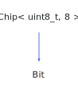

<h1>Bit</h1>

<a href="https://github.com/CharlesCarley/HackComputer#~">~</a>
<a href="index.md#index">HackComputer</a>
/
<a href="namespaceHack.md#hack">Hack</a>
::
<a href="namespaceHack_1_1Chips.md#chips">Chips</a>
::
<b>Bit</b>
 
 

<h4>Derived From</h4>

<a href="classHack_1_1Chips_1_1Chip.md#chip">Hack::Chips::Chip&lt; uint8_t, 8 &gt;</a>

 

<h2>Private Members</h2>
<a href="#_ff" class="icon-list-item">_ff
</a>

 

<h2>Private Methods</h2>
<a href="#evaluate" class="icon-list-item">evaluate
</a>

 

<h2>Public Methods</h2>
<a href="#bit" class="icon-list-item">Bit
</a>

 
<a href="#getout" class="icon-list-item">getOut
</a>

 
<a href="#setclock" class="icon-list-item">setClock
</a>

 
<a href="#setin" class="icon-list-item">setIn
</a>

 
<a href="#setload" class="icon-list-item">setLoad
</a>

 

<h4>Defined in</h4>
<a href="https://github.com/CharlesCarley/HackComputer/blob/master/Source/Chips/Bit.h#L30" class="icon-list-item">Bit.h
</a>

 
<a href="#bit" class="icon-list-item">top
</a>

<h2>_ff</h2>
<a href="classHack_1_1Chips_1_1DFlipFlop.md#dflipflop">DFlipFlop</a>
<b>_ff</b>
 

<h4>Defined in</h4>
<a href="https://github.com/CharlesCarley/HackComputer/blob/master/Source/Chips/Bit.h#L34" class="icon-list-item">Bit.h
</a>

 
<a href="#bit" class="icon-list-item">top
</a>

 

<h2>evaluate</h2>
void
<b>evaluate</b>
<i>(</i>
<i>)</i>

<h4>Defined in</h4>
<a href="https://github.com/CharlesCarley/HackComputer/blob/master/Source/Chips/Bit.h#L32" class="icon-list-item">Bit.h
</a>

 
<a href="https://github.com/CharlesCarley/HackComputer/blob/master/Source/Chips/Bit.cpp#L58" class="icon-list-item">Bit.cpp
</a>

 
<a href="#bit" class="icon-list-item">top
</a>

 

<h2>Bit</h2>
<b>Bit</b>
<i>(</i>
<i>)</i>

<h4>References</h4>

<a href="classHack_1_1Chips_1_1Chip.md#_bits">_bits</a>

<h4>Defined in</h4>
<a href="https://github.com/CharlesCarley/HackComputer/blob/master/Source/Chips/Bit.h#L37" class="icon-list-item">Bit.h
</a>

 
<a href="https://github.com/CharlesCarley/HackComputer/blob/master/Source/Chips/Bit.cpp#L32" class="icon-list-item">Bit.cpp
</a>

 
<a href="#bit" class="icon-list-item">top
</a>

 

<h2>getOut</h2>
bool
<b>getOut</b>
<i>(</i>
<i>)</i>

<h4>References</h4>

<a href="classHack_1_1Chips_1_1Chip.md#getbit">getBit</a>

<h4>Defined in</h4>
<a href="https://github.com/CharlesCarley/HackComputer/blob/master/Source/Chips/Bit.h#L45" class="icon-list-item">Bit.h
</a>

 
<a href="https://github.com/CharlesCarley/HackComputer/blob/master/Source/Chips/Bit.cpp#L52" class="icon-list-item">Bit.cpp
</a>

 
<a href="#bit" class="icon-list-item">top
</a>

 

<h2>setClock</h2>
void
<b>setClock</b>
<i>(</i>

bool
clock

<i>)</i>

<h4>References</h4>

<a href="classHack_1_1Chips_1_1Chip.md#applybit">applyBit</a>

<h4>Defined in</h4>
<a href="https://github.com/CharlesCarley/HackComputer/blob/master/Source/Chips/Bit.h#L43" class="icon-list-item">Bit.h
</a>

 
<a href="https://github.com/CharlesCarley/HackComputer/blob/master/Source/Chips/Bit.cpp#L47" class="icon-list-item">Bit.cpp
</a>

 
<a href="#bit" class="icon-list-item">top
</a>

 

<h2>setIn</h2>
void
<b>setIn</b>
<i>(</i>

bool
input

<i>)</i>

<h4>References</h4>

<a href="classHack_1_1Chips_1_1Chip.md#applybit">applyBit</a>

<h4>Defined in</h4>
<a href="https://github.com/CharlesCarley/HackComputer/blob/master/Source/Chips/Bit.h#L39" class="icon-list-item">Bit.h
</a>

 
<a href="https://github.com/CharlesCarley/HackComputer/blob/master/Source/Chips/Bit.cpp#L37" class="icon-list-item">Bit.cpp
</a>

 
<a href="#bit" class="icon-list-item">top
</a>

 

<h2>setLoad</h2>
void
<b>setLoad</b>
<i>(</i>

bool
load

<i>)</i>

<h4>References</h4>

<a href="classHack_1_1Chips_1_1Chip.md#applybit">applyBit</a>

<h4>Defined in</h4>
<a href="https://github.com/CharlesCarley/HackComputer/blob/master/Source/Chips/Bit.h#L41" class="icon-list-item">Bit.h
</a>

 
<a href="https://github.com/CharlesCarley/HackComputer/blob/master/Source/Chips/Bit.cpp#L42" class="icon-list-item">Bit.cpp
</a>

 
<a href="#bit" class="icon-list-item">top
</a>

 

</body>
</html>
