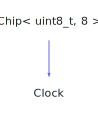

<h1>Clock</h1>

<a href="https://github.com/CharlesCarley/HackComputer#~">~</a>
<a href="index.md#index">HackComputer</a>
/
<a href="namespaceHack.md#hack">Hack</a>
::
<a href="namespaceHack_1_1Chips.md#chips">Chips</a>
::
<b>Clock</b>
 
 

<h4>Derived From</h4>

<a href="classHack_1_1Chips_1_1Chip.md#chip">Hack::Chips::Chip&lt; uint8_t, 8 &gt;</a>

 

<h2>Public Methods</h2>
<a href="#clock" class="icon-list-item">Clock
</a>

 
<a href="#getout" class="icon-list-item">getOut
</a>

 
<a href="#setin" class="icon-list-item">setIn
</a>

 
<a href="#setreset" class="icon-list-item">setReset
</a>

 

<h4>Defined in</h4>
<a href="https://github.com/CharlesCarley/HackComputer/blob/master/Source/Chips/Clock.h#L28" class="icon-list-item">Clock.h
</a>

 
<a href="#clock" class="icon-list-item">top
</a>

<h2>Clock</h2>
<b>Clock</b>
<i>(</i>
<i>)</i>

<h4>References</h4>

<a href="classHack_1_1Chips_1_1Chip.md#_bits">_bits</a>

<h4>Defined in</h4>
<a href="https://github.com/CharlesCarley/HackComputer/blob/master/Source/Chips/Clock.h#L30" class="icon-list-item">Clock.h
</a>

 
<a href="https://github.com/CharlesCarley/HackComputer/blob/master/Source/Chips/Clock.cpp#L28" class="icon-list-item">Clock.cpp
</a>

 
<a href="#clock" class="icon-list-item">top
</a>

 

<h2>getOut</h2>
bool
<b>getOut</b>
<i>(</i>
<i>)</i>

<h4>References</h4>

<a href="classHack_1_1Chips_1_1Chip.md#getbit">getBit</a>

<a href="classHack_1_1Chips_1_1Chip.md#applybit">applyBit</a>

<a href="namespaceHack_1_1Chips_1_1Gates.md#not">Not</a>

<a href="classHack_1_1Chips_1_1Chip.md#_bits">_bits</a>

<a href="namespaceHack_1_1Chips.md#clockmask">ClockMask</a>

<a href="namespaceHack_1_1Chips.md#bit6">Bit6</a>

<a href="namespaceHack_1_1Chips.md#bit1">Bit1</a>

<a href="namespaceHack_1_1Chips.md#bit0">Bit0</a>

<h4>Defined in</h4>
<a href="https://github.com/CharlesCarley/HackComputer/blob/master/Source/Chips/Clock.h#L36" class="icon-list-item">Clock.h
</a>

 
<a href="https://github.com/CharlesCarley/HackComputer/blob/master/Source/Chips/Clock.cpp#L48" class="icon-list-item">Clock.cpp
</a>

 
<a href="#clock" class="icon-list-item">top
</a>

 

<h2>setIn</h2>
void
<b>setIn</b>
<i>(</i>

bool
input

<i>)</i>

<h4>References</h4>

<a href="classHack_1_1Chips_1_1Chip.md#applybit">applyBit</a>

<h4>Defined in</h4>
<a href="https://github.com/CharlesCarley/HackComputer/blob/master/Source/Chips/Clock.h#L32" class="icon-list-item">Clock.h
</a>

 
<a href="https://github.com/CharlesCarley/HackComputer/blob/master/Source/Chips/Clock.cpp#L38" class="icon-list-item">Clock.cpp
</a>

 
<a href="#clock" class="icon-list-item">top
</a>

 

<h2>setReset</h2>
void
<b>setReset</b>
<i>(</i>

bool
reset

<i>)</i>

<h4>References</h4>

<a href="classHack_1_1Chips_1_1Chip.md#applybit">applyBit</a>

<h4>Defined in</h4>
<a href="https://github.com/CharlesCarley/HackComputer/blob/master/Source/Chips/Clock.h#L34" class="icon-list-item">Clock.h
</a>

 
<a href="https://github.com/CharlesCarley/HackComputer/blob/master/Source/Chips/Clock.cpp#L43" class="icon-list-item">Clock.cpp
</a>

 
<a href="#clock" class="icon-list-item">top
</a>

 

</body>
</html>
