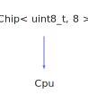

<h1>Cpu</h1>

<a href="https://github.com/CharlesCarley/HackComputer#~">~</a>
<a href="index.md#index">HackComputer</a>
/
<a href="namespaceHack.md#hack">Hack</a>
::
<a href="namespaceHack_1_1Chips.md#chips">Chips</a>
::
<b>Cpu</b>
 
 

<h4>Derived From</h4>

<a href="classHack_1_1Chips_1_1Chip.md#chip">Hack::Chips::Chip&lt; uint8_t, 8 &gt;</a>

 

<h2>Private Members</h2>
<a href="#_a" class="icon-list-item">_a
</a>

 
<a href="#_alu" class="icon-list-item">_alu
</a>

 
<a href="#_d" class="icon-list-item">_d
</a>

 
<a href="#_in" class="icon-list-item">_in
</a>

 
<a href="#_ins" class="icon-list-item">_ins
</a>

 
<a href="#_pc" class="icon-list-item">_pc
</a>

 

<h2>Private Methods</h2>
<a href="#evaluate" class="icon-list-item">evaluate
</a>

 
<a href="#isdirty" class="icon-list-item">isDirty
</a>

 
<a href="#markdirty" class="icon-list-item">markDirty
</a>

 

<h2>Public Methods</h2>
<a href="#cpu" class="icon-list-item">Cpu
</a>

 
<a href="#clear" class="icon-list-item">clear
</a>

 
<a href="#getaddress" class="icon-list-item">getAddress
</a>

 
<a href="#getamregister" class="icon-list-item">getAmRegister
</a>

 
<a href="#getdregister" class="icon-list-item">getDRegister
</a>

 
<a href="#getnext" class="icon-list-item">getNext
</a>

 
<a href="#getout" class="icon-list-item">getOut
</a>

 
<a href="#getwrite" class="icon-list-item">getWrite
</a>

 
<a href="#lock" class="icon-list-item">lock
</a>

 
<a href="#setclock" class="icon-list-item">setClock
</a>

 
<a href="#setinmemory" class="icon-list-item">setInMemory
</a>

 
<a href="#setinstruction" class="icon-list-item">setInstruction
</a>

 
<a href="#setreset" class="icon-list-item">setReset
</a>

 

<h4>Defined in</h4>
<a href="https://github.com/CharlesCarley/HackComputer/blob/master/Source/Chips/CPU.h#L31" class="icon-list-item">CPU.h
</a>

 
<a href="#cpu" class="icon-list-item">top
</a>

<h2>_a</h2>
<a href="classHack_1_1Chips_1_1Register.md#register">Register</a>
<b>_a</b>
 

<h4>Defined in</h4>
<a href="https://github.com/CharlesCarley/HackComputer/blob/master/Source/Chips/CPU.h#L39" class="icon-list-item">CPU.h
</a>

 
<a href="#cpu" class="icon-list-item">top
</a>

 

<h2>_alu</h2>
<a href="classHack_1_1Chips_1_1Alu.md#alu">Alu</a>
<b>_alu</b>
 

<h4>Defined in</h4>
<a href="https://github.com/CharlesCarley/HackComputer/blob/master/Source/Chips/CPU.h#L43" class="icon-list-item">CPU.h
</a>

 
<a href="#cpu" class="icon-list-item">top
</a>

 

<h2>_d</h2>
<a href="classHack_1_1Chips_1_1Register.md#register">Register</a>
<b>_d</b>
 

<h4>Defined in</h4>
<a href="https://github.com/CharlesCarley/HackComputer/blob/master/Source/Chips/CPU.h#L39" class="icon-list-item">CPU.h
</a>

 
<a href="#cpu" class="icon-list-item">top
</a>

 

<h2>_in</h2>
<b>uint16_t</b>
<b>_in</b>
 

<h4>Defined in</h4>
<a href="https://github.com/CharlesCarley/HackComputer/blob/master/Source/Chips/CPU.h#L42" class="icon-list-item">CPU.h
</a>

 
<a href="#cpu" class="icon-list-item">top
</a>

 

<h2>_ins</h2>
<b>uint16_t</b>
<b>_ins</b>
 

<h4>Defined in</h4>
<a href="https://github.com/CharlesCarley/HackComputer/blob/master/Source/Chips/CPU.h#L41" class="icon-list-item">CPU.h
</a>

 
<a href="#cpu" class="icon-list-item">top
</a>

 

<h2>_pc</h2>
<a href="classHack_1_1Chips_1_1ProgramCounter.md#programcounter">ProgramCounter</a>
<b>_pc</b>
 

<h4>Defined in</h4>
<a href="https://github.com/CharlesCarley/HackComputer/blob/master/Source/Chips/CPU.h#L40" class="icon-list-item">CPU.h
</a>

 
<a href="#cpu" class="icon-list-item">top
</a>

 

<h2>evaluate</h2>
void
<b>evaluate</b>
<i>(</i>
<i>)</i>

<h4>Defined in</h4>
<a href="https://github.com/CharlesCarley/HackComputer/blob/master/Source/Chips/CPU.h#L33" class="icon-list-item">CPU.h
</a>

 
<a href="https://github.com/CharlesCarley/HackComputer/blob/master/Source/Chips/CPU.cpp#L168" class="icon-list-item">CPU.cpp
</a>

 
<a href="#cpu" class="icon-list-item">top
</a>

 

<h2>isDirty</h2>
bool
<b>isDirty</b>
<i>(</i>
<i>)</i>

<h4>Defined in</h4>
<a href="https://github.com/CharlesCarley/HackComputer/blob/master/Source/Chips/CPU.h#L35" class="icon-list-item">CPU.h
</a>

 
<a href="https://github.com/CharlesCarley/HackComputer/blob/master/Source/Chips/CPU.cpp#L158" class="icon-list-item">CPU.cpp
</a>

 
<a href="#cpu" class="icon-list-item">top
</a>

 

<h2>markDirty</h2>
void
<b>markDirty</b>
<i>(</i>
<i>)</i>

<h4>Defined in</h4>
<a href="https://github.com/CharlesCarley/HackComputer/blob/master/Source/Chips/CPU.h#L37" class="icon-list-item">CPU.h
</a>

 
<a href="https://github.com/CharlesCarley/HackComputer/blob/master/Source/Chips/CPU.cpp#L163" class="icon-list-item">CPU.cpp
</a>

 
<a href="#cpu" class="icon-list-item">top
</a>

 

<h2>Cpu</h2>
<b>Cpu</b>
<i>(</i>
<i>)</i>

<h4>Defined in</h4>
<a href="https://github.com/CharlesCarley/HackComputer/blob/master/Source/Chips/CPU.h#L46" class="icon-list-item">CPU.h
</a>

 
<a href="https://github.com/CharlesCarley/HackComputer/blob/master/Source/Chips/CPU.cpp#L53" class="icon-list-item">CPU.cpp
</a>

 
<a href="#cpu" class="icon-list-item">top
</a>

 

<h2>clear</h2>
void
<b>clear</b>
<i>(</i>
<i>)</i>

<h4>References</h4>

<a href="classHack_1_1Chips_1_1Register.md#setin">setIn</a>

<a href="classHack_1_1Chips_1_1Register.md#setload">setLoad</a>

<a href="classHack_1_1Chips_1_1Register.md#setclock">setClock</a>

<a href="classHack_1_1Chips_1_1ProgramCounter.md#setin">setIn</a>

<a href="classHack_1_1Chips_1_1ProgramCounter.md#setinc">setInc</a>

<a href="classHack_1_1Chips_1_1ProgramCounter.md#setload">setLoad</a>

<a href="classHack_1_1Chips_1_1ProgramCounter.md#setclock">setClock</a>

<a href="classHack_1_1Chips_1_1Alu.md#setx">setX</a>

<a href="classHack_1_1Chips_1_1Alu.md#sety">setY</a>

<a href="classHack_1_1Chips_1_1Alu.md#setflags">setFlags</a>

<a href="classHack_1_1Chips_1_1Chip.md#_bits">_bits</a>

<a href="classHack_1_1Chips_1_1Timer.md#reset">reset</a>

<h4>Defined in</h4>
<a href="https://github.com/CharlesCarley/HackComputer/blob/master/Source/Chips/CPU.h#L70" class="icon-list-item">CPU.h
</a>

 
<a href="https://github.com/CharlesCarley/HackComputer/blob/master/Source/Chips/CPU.cpp#L304" class="icon-list-item">CPU.cpp
</a>

 
<a href="#cpu" class="icon-list-item">top
</a>

 

<h2>getAddress</h2>
<b>uint16_t</b>
<b>getAddress</b>
<i>(</i>
<i>)</i>

<h4>References</h4>

<a href="namespaceHack_1_1Chips.md#cpudirty">CpuDirty</a>

<a href="classHack_1_1Chips_1_1Chip.md#_bits">_bits</a>

<a href="classHack_1_1Chips_1_1Register.md#getout">getOut</a>

<h4>Defined in</h4>
<a href="https://github.com/CharlesCarley/HackComputer/blob/master/Source/Chips/CPU.h#L60" class="icon-list-item">CPU.h
</a>

 
<a href="https://github.com/CharlesCarley/HackComputer/blob/master/Source/Chips/CPU.cpp#L130" class="icon-list-item">CPU.cpp
</a>

 
<a href="#cpu" class="icon-list-item">top
</a>

 

<h2>getAmRegister</h2>
<b>uint16_t</b>
<b>getAmRegister</b>
<i>(</i>
<i>)</i>

<h4>References</h4>

<a href="namespaceHack_1_1Chips.md#cpudirty">CpuDirty</a>

<a href="classHack_1_1Chips_1_1Chip.md#_bits">_bits</a>

<a href="classHack_1_1Chips_1_1Register.md#getout">getOut</a>

<h4>Defined in</h4>
<a href="https://github.com/CharlesCarley/HackComputer/blob/master/Source/Chips/CPU.h#L66" class="icon-list-item">CPU.h
</a>

 
<a href="https://github.com/CharlesCarley/HackComputer/blob/master/Source/Chips/CPU.cpp#L144" class="icon-list-item">CPU.cpp
</a>

 
<a href="#cpu" class="icon-list-item">top
</a>

 

<h2>getDRegister</h2>
<b>uint16_t</b>
<b>getDRegister</b>
<i>(</i>
<i>)</i>

<h4>References</h4>

<a href="namespaceHack_1_1Chips.md#cpudirty">CpuDirty</a>

<a href="classHack_1_1Chips_1_1Chip.md#_bits">_bits</a>

<a href="classHack_1_1Chips_1_1Register.md#getout">getOut</a>

<h4>Defined in</h4>
<a href="https://github.com/CharlesCarley/HackComputer/blob/master/Source/Chips/CPU.h#L64" class="icon-list-item">CPU.h
</a>

 
<a href="https://github.com/CharlesCarley/HackComputer/blob/master/Source/Chips/CPU.cpp#L137" class="icon-list-item">CPU.cpp
</a>

 
<a href="#cpu" class="icon-list-item">top
</a>

 

<h2>getNext</h2>
<b>uint16_t</b>
<b>getNext</b>
<i>(</i>
<i>)</i>

<h4>References</h4>

<a href="namespaceHack_1_1Chips.md#cpudirty">CpuDirty</a>

<a href="classHack_1_1Chips_1_1Chip.md#_bits">_bits</a>

<a href="classHack_1_1Chips_1_1ProgramCounter.md#getout">getOut</a>

<h4>Defined in</h4>
<a href="https://github.com/CharlesCarley/HackComputer/blob/master/Source/Chips/CPU.h#L62" class="icon-list-item">CPU.h
</a>

 
<a href="https://github.com/CharlesCarley/HackComputer/blob/master/Source/Chips/CPU.cpp#L151" class="icon-list-item">CPU.cpp
</a>

 
<a href="#cpu" class="icon-list-item">top
</a>

 

<h2>getOut</h2>
<b>uint16_t</b>
<b>getOut</b>
<i>(</i>
<i>)</i>

<h4>References</h4>

<a href="namespaceHack_1_1Chips.md#cpudirty">CpuDirty</a>

<a href="classHack_1_1Chips_1_1Chip.md#_bits">_bits</a>

<a href="classHack_1_1Chips_1_1Alu.md#getout">getOut</a>

<h4>Defined in</h4>
<a href="https://github.com/CharlesCarley/HackComputer/blob/master/Source/Chips/CPU.h#L58" class="icon-list-item">CPU.h
</a>

 
<a href="https://github.com/CharlesCarley/HackComputer/blob/master/Source/Chips/CPU.cpp#L123" class="icon-list-item">CPU.cpp
</a>

 
<a href="#cpu" class="icon-list-item">top
</a>

 

<h2>getWrite</h2>
bool
<b>getWrite</b>
<i>(</i>
<i>)</i>

<h4>References</h4>

<a href="namespaceHack_1_1Chips.md#cpudirty">CpuDirty</a>

<a href="classHack_1_1Chips_1_1Chip.md#_bits">_bits</a>

<a href="namespaceHack_1_1Chips.md#bit6">Bit6</a>

<h4>Defined in</h4>
<a href="https://github.com/CharlesCarley/HackComputer/blob/master/Source/Chips/CPU.h#L56" class="icon-list-item">CPU.h
</a>

 
<a href="https://github.com/CharlesCarley/HackComputer/blob/master/Source/Chips/CPU.cpp#L116" class="icon-list-item">CPU.cpp
</a>

 
<a href="#cpu" class="icon-list-item">top
</a>

 

<h2>lock</h2>
void
<b>lock</b>
<i>(</i>

bool
state

<i>)</i>

<h4>References</h4>

<a href="classHack_1_1Chips_1_1Chip.md#_bits">_bits</a>

<a href="namespaceHack_1_1Chips.md#bit2">Bit2</a>

<a href="classHack_1_1Chips_1_1Register.md#lock">lock</a>

<a href="classHack_1_1Chips_1_1ProgramCounter.md#lock">lock</a>

<h4>Defined in</h4>
<a href="https://github.com/CharlesCarley/HackComputer/blob/master/Source/Chips/CPU.h#L68" class="icon-list-item">CPU.h
</a>

 
<a href="https://github.com/CharlesCarley/HackComputer/blob/master/Source/Chips/CPU.cpp#L61" class="icon-list-item">CPU.cpp
</a>

 
<a href="#cpu" class="icon-list-item">top
</a>

 

<h2>setClock</h2>
void
<b>setClock</b>
<i>(</i>

bool
clock

<i>)</i>

<h4>References</h4>

<a href="classHack_1_1Chips_1_1Chip.md#_bits">_bits</a>

<a href="namespaceHack_1_1Chips.md#bit1">Bit1</a>

<a href="namespaceHack_1_1Chips.md#bit7">Bit7</a>

<h4>Defined in</h4>
<a href="https://github.com/CharlesCarley/HackComputer/blob/master/Source/Chips/CPU.h#L50" class="icon-list-item">CPU.h
</a>

 
<a href="https://github.com/CharlesCarley/HackComputer/blob/master/Source/Chips/CPU.cpp#L82" class="icon-list-item">CPU.cpp
</a>

 
<a href="#cpu" class="icon-list-item">top
</a>

 

<h2>setInMemory</h2>
void
<b>setInMemory</b>
<i>(</i>

const 
<b>uint16_t</b>
 &amp;
input

<i>)</i>

<h4>References</h4>

<a href="classHack_1_1Chips_1_1Chip.md#_bits">_bits</a>

<a href="namespaceHack_1_1Chips.md#bit7">Bit7</a>

<h4>Defined in</h4>
<a href="https://github.com/CharlesCarley/HackComputer/blob/master/Source/Chips/CPU.h#L48" class="icon-list-item">CPU.h
</a>

 
<a href="https://github.com/CharlesCarley/HackComputer/blob/master/Source/Chips/CPU.cpp#L73" class="icon-list-item">CPU.cpp
</a>

 
<a href="#cpu" class="icon-list-item">top
</a>

 

<h2>setInstruction</h2>
void
<b>setInstruction</b>
<i>(</i>

const 
<b>uint16_t</b>
 &amp;
instruction

<i>)</i>

<h4>References</h4>

<a href="classHack_1_1Chips_1_1Chip.md#_bits">_bits</a>

<a href="namespaceHack_1_1Chips.md#bit7">Bit7</a>

<h4>Defined in</h4>
<a href="https://github.com/CharlesCarley/HackComputer/blob/master/Source/Chips/CPU.h#L54" class="icon-list-item">CPU.h
</a>

 
<a href="https://github.com/CharlesCarley/HackComputer/blob/master/Source/Chips/CPU.cpp#L110" class="icon-list-item">CPU.cpp
</a>

 
<a href="#cpu" class="icon-list-item">top
</a>

 

<h2>setReset</h2>
void
<b>setReset</b>
<i>(</i>

bool
reset

<i>)</i>

<h4>References</h4>

<a href="classHack_1_1Chips_1_1Chip.md#_bits">_bits</a>

<a href="namespaceHack_1_1Chips.md#bit0">Bit0</a>

<a href="namespaceHack_1_1Chips.md#bit7">Bit7</a>

<h4>Defined in</h4>
<a href="https://github.com/CharlesCarley/HackComputer/blob/master/Source/Chips/CPU.h#L52" class="icon-list-item">CPU.h
</a>

 
<a href="https://github.com/CharlesCarley/HackComputer/blob/master/Source/Chips/CPU.cpp#L97" class="icon-list-item">CPU.cpp
</a>

 
<a href="#cpu" class="icon-list-item">top
</a>

 

</body>
</html>
