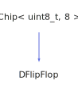

<h1>DFlipFlop</h1>

<a href="https://github.com/CharlesCarley/HackComputer#~">~</a>
<a href="index.md#index">HackComputer</a>
/
<a href="namespaceHack.md#hack">Hack</a>
::
<a href="namespaceHack_1_1Chips.md#chips">Chips</a>
::
<b>DFlipFlop</b>
 
 

<h4>Derived From</h4>

<a href="classHack_1_1Chips_1_1Chip.md#chip">Hack::Chips::Chip&lt; uint8_t, 8 &gt;</a>

 

<h2>Private Methods</h2>
<a href="#evaluate" class="icon-list-item">evaluate
</a>

 

<h2>Public Methods</h2>
<a href="#dflipflop" class="icon-list-item">DFlipFlop
</a>

 
<a href="#getq" class="icon-list-item">getQ
</a>

 
<a href="#getqplus" class="icon-list-item">getQPlus
</a>

 
<a href="#setd" class="icon-list-item">setD
</a>

 
<a href="#setg" class="icon-list-item">setG
</a>

 
<a href="#setqn" class="icon-list-item">setQn
</a>

 

<h4>Defined in</h4>
<a href="https://github.com/CharlesCarley/HackComputer/blob/master/Source/Chips/DFlipFlop.h#L28" class="icon-list-item">DFlipFlop.h
</a>

 
<a href="#dflipflop" class="icon-list-item">top
</a>

<h2>evaluate</h2>
void
<b>evaluate</b>
<i>(</i>
<i>)</i>

<h4>Defined in</h4>
<a href="https://github.com/CharlesCarley/HackComputer/blob/master/Source/Chips/DFlipFlop.h#L30" class="icon-list-item">DFlipFlop.h
</a>

 
<a href="https://github.com/CharlesCarley/HackComputer/blob/master/Source/Chips/DFlipFlop.cpp#L67" class="icon-list-item">DFlipFlop.cpp
</a>

 
<a href="#dflipflop" class="icon-list-item">top
</a>

 

<h2>DFlipFlop</h2>
<b>DFlipFlop</b>
<i>(</i>
<i>)</i>

<h4>References</h4>

<a href="classHack_1_1Chips_1_1Chip.md#assignbit">assignBit</a>

<a href="classHack_1_1Chips_1_1Chip.md#setbit">setBit</a>

<h4>Defined in</h4>
<a href="https://github.com/CharlesCarley/HackComputer/blob/master/Source/Chips/DFlipFlop.h#L33" class="icon-list-item">DFlipFlop.h
</a>

 
<a href="https://github.com/CharlesCarley/HackComputer/blob/master/Source/Chips/DFlipFlop.cpp#L26" class="icon-list-item">DFlipFlop.cpp
</a>

 
<a href="#dflipflop" class="icon-list-item">top
</a>

 

<h2>getQ</h2>
bool
<b>getQ</b>
<i>(</i>
<i>)</i>

<h4>References</h4>

<a href="classHack_1_1Chips_1_1Chip.md#getbit">getBit</a>

<h4>Defined in</h4>
<a href="https://github.com/CharlesCarley/HackComputer/blob/master/Source/Chips/DFlipFlop.h#L41" class="icon-list-item">DFlipFlop.h
</a>

 
<a href="https://github.com/CharlesCarley/HackComputer/blob/master/Source/Chips/DFlipFlop.cpp#L53" class="icon-list-item">DFlipFlop.cpp
</a>

 
<a href="#dflipflop" class="icon-list-item">top
</a>

 

<h2>getQPlus</h2>
bool
<b>getQPlus</b>
<i>(</i>
<i>)</i>

<h4>References</h4>

<a href="classHack_1_1Chips_1_1Chip.md#getbit">getBit</a>

<h4>Defined in</h4>
<a href="https://github.com/CharlesCarley/HackComputer/blob/master/Source/Chips/DFlipFlop.h#L43" class="icon-list-item">DFlipFlop.h
</a>

 
<a href="https://github.com/CharlesCarley/HackComputer/blob/master/Source/Chips/DFlipFlop.cpp#L60" class="icon-list-item">DFlipFlop.cpp
</a>

 
<a href="#dflipflop" class="icon-list-item">top
</a>

 

<h2>setD</h2>
void
<b>setD</b>
<i>(</i>

bool
d

<i>)</i>

<h4>References</h4>

<a href="classHack_1_1Chips_1_1Chip.md#applybit">applyBit</a>

<a href="classHack_1_1Chips_1_1Chip.md#setbit">setBit</a>

<h4>Defined in</h4>
<a href="https://github.com/CharlesCarley/HackComputer/blob/master/Source/Chips/DFlipFlop.h#L35" class="icon-list-item">DFlipFlop.h
</a>

 
<a href="https://github.com/CharlesCarley/HackComputer/blob/master/Source/Chips/DFlipFlop.cpp#L32" class="icon-list-item">DFlipFlop.cpp
</a>

 
<a href="#dflipflop" class="icon-list-item">top
</a>

 

<h2>setG</h2>
void
<b>setG</b>
<i>(</i>

bool
g

<i>)</i>

<h4>References</h4>

<a href="classHack_1_1Chips_1_1Chip.md#applybit">applyBit</a>

<a href="classHack_1_1Chips_1_1Chip.md#setbit">setBit</a>

<h4>Defined in</h4>
<a href="https://github.com/CharlesCarley/HackComputer/blob/master/Source/Chips/DFlipFlop.h#L37" class="icon-list-item">DFlipFlop.h
</a>

 
<a href="https://github.com/CharlesCarley/HackComputer/blob/master/Source/Chips/DFlipFlop.cpp#L38" class="icon-list-item">DFlipFlop.cpp
</a>

 
<a href="#dflipflop" class="icon-list-item">top
</a>

 

<h2>setQn</h2>
void
<b>setQn</b>
<i>(</i>

bool
qn

<i>)</i>

<h4>References</h4>

<a href="classHack_1_1Chips_1_1Chip.md#applybit">applyBit</a>

<a href="classHack_1_1Chips_1_1Chip.md#clearbit">clearBit</a>

<a href="classHack_1_1Chips_1_1Chip.md#setbit">setBit</a>

<h4>Defined in</h4>
<a href="https://github.com/CharlesCarley/HackComputer/blob/master/Source/Chips/DFlipFlop.h#L39" class="icon-list-item">DFlipFlop.h
</a>

 
<a href="https://github.com/CharlesCarley/HackComputer/blob/master/Source/Chips/DFlipFlop.cpp#L44" class="icon-list-item">DFlipFlop.cpp
</a>

 
<a href="#dflipflop" class="icon-list-item">top
</a>

 

</body>
</html>
