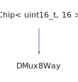

<h1>DMux8Way</h1>

<a href="https://github.com/CharlesCarley/HackComputer#~">~</a>
<a href="index.md#index">HackComputer</a>
/
<a href="namespaceHack.md#hack">Hack</a>
::
<a href="namespaceHack_1_1Chips.md#chips">Chips</a>
::
<b>DMux8Way</b>
 
 

<h4>Derived From</h4>

<a href="classHack_1_1Chips_1_1Chip.md#chip">Hack::Chips::Chip&lt; uint16_t, 16 &gt;</a>

 

<h2>Private Methods</h2>
<a href="#evaluate" class="icon-list-item">evaluate
</a>

 

<h2>Public Methods</h2>
<a href="#dmux8way" class="icon-list-item">DMux8Way
</a>

 
<a href="#geta" class="icon-list-item">getA
</a>

 
<a href="#getb" class="icon-list-item">getB
</a>

 
<a href="#getc" class="icon-list-item">getC
</a>

 
<a href="#getd" class="icon-list-item">getD
</a>

 
<a href="#gete" class="icon-list-item">getE
</a>

 
<a href="#getf" class="icon-list-item">getF
</a>

 
<a href="#getg" class="icon-list-item">getG
</a>

 
<a href="#geth" class="icon-list-item">getH
</a>

 
<a href="#getout" class="icon-list-item">getOut
</a>

 
<a href="#setin" class="icon-list-item">setIn
</a>

 
<a href="#setsel" class="icon-list-item">setSel
</a>

 

<h4>Defined in</h4>
<a href="https://github.com/CharlesCarley/HackComputer/blob/master/Source/Chips/DMux8Way.h#L28" class="icon-list-item">DMux8Way.h
</a>

 
<a href="#dmux8way" class="icon-list-item">top
</a>

<h2>evaluate</h2>
void
<b>evaluate</b>
<i>(</i>
<i>)</i>

<h4>Defined in</h4>
<a href="https://github.com/CharlesCarley/HackComputer/blob/master/Source/Chips/DMux8Way.h#L30" class="icon-list-item">DMux8Way.h
</a>

 
<a href="https://github.com/CharlesCarley/HackComputer/blob/master/Source/Chips/DMux8Way.cpp#L133" class="icon-list-item">DMux8Way.cpp
</a>

 
<a href="#dmux8way" class="icon-list-item">top
</a>

 

<h2>DMux8Way</h2>
<b>DMux8Way</b>
<i>(</i>
<i>)</i>

<h4>References</h4>

<a href="classHack_1_1Chips_1_1Chip.md#assignbit">assignBit</a>

<h4>Defined in</h4>
<a href="https://github.com/CharlesCarley/HackComputer/blob/master/Source/Chips/DMux8Way.h#L33" class="icon-list-item">DMux8Way.h
</a>

 
<a href="https://github.com/CharlesCarley/HackComputer/blob/master/Source/Chips/DMux8Way.cpp#L32" class="icon-list-item">DMux8Way.cpp
</a>

 
<a href="#dmux8way" class="icon-list-item">top
</a>

 

<h2>getA</h2>
bool
<b>getA</b>
<i>(</i>
<i>)</i>

<h4>References</h4>

<a href="classHack_1_1Chips_1_1Chip.md#getbit">getBit</a>

<h4>Defined in</h4>
<a href="https://github.com/CharlesCarley/HackComputer/blob/master/Source/Chips/DMux8Way.h#L39" class="icon-list-item">DMux8Way.h
</a>

 
<a href="https://github.com/CharlesCarley/HackComputer/blob/master/Source/Chips/DMux8Way.cpp#L51" class="icon-list-item">DMux8Way.cpp
</a>

 
<a href="#dmux8way" class="icon-list-item">top
</a>

 

<h2>getB</h2>
bool
<b>getB</b>
<i>(</i>
<i>)</i>

<h4>References</h4>

<a href="classHack_1_1Chips_1_1Chip.md#getbit">getBit</a>

<h4>Defined in</h4>
<a href="https://github.com/CharlesCarley/HackComputer/blob/master/Source/Chips/DMux8Way.h#L41" class="icon-list-item">DMux8Way.h
</a>

 
<a href="https://github.com/CharlesCarley/HackComputer/blob/master/Source/Chips/DMux8Way.cpp#L58" class="icon-list-item">DMux8Way.cpp
</a>

 
<a href="#dmux8way" class="icon-list-item">top
</a>

 

<h2>getC</h2>
bool
<b>getC</b>
<i>(</i>
<i>)</i>

<h4>References</h4>

<a href="classHack_1_1Chips_1_1Chip.md#getbit">getBit</a>

<h4>Defined in</h4>
<a href="https://github.com/CharlesCarley/HackComputer/blob/master/Source/Chips/DMux8Way.h#L43" class="icon-list-item">DMux8Way.h
</a>

 
<a href="https://github.com/CharlesCarley/HackComputer/blob/master/Source/Chips/DMux8Way.cpp#L65" class="icon-list-item">DMux8Way.cpp
</a>

 
<a href="#dmux8way" class="icon-list-item">top
</a>

 

<h2>getD</h2>
bool
<b>getD</b>
<i>(</i>
<i>)</i>

<h4>References</h4>

<a href="classHack_1_1Chips_1_1Chip.md#getbit">getBit</a>

<h4>Defined in</h4>
<a href="https://github.com/CharlesCarley/HackComputer/blob/master/Source/Chips/DMux8Way.h#L45" class="icon-list-item">DMux8Way.h
</a>

 
<a href="https://github.com/CharlesCarley/HackComputer/blob/master/Source/Chips/DMux8Way.cpp#L72" class="icon-list-item">DMux8Way.cpp
</a>

 
<a href="#dmux8way" class="icon-list-item">top
</a>

 

<h2>getE</h2>
bool
<b>getE</b>
<i>(</i>
<i>)</i>

<h4>References</h4>

<a href="classHack_1_1Chips_1_1Chip.md#getbit">getBit</a>

<h4>Defined in</h4>
<a href="https://github.com/CharlesCarley/HackComputer/blob/master/Source/Chips/DMux8Way.h#L47" class="icon-list-item">DMux8Way.h
</a>

 
<a href="https://github.com/CharlesCarley/HackComputer/blob/master/Source/Chips/DMux8Way.cpp#L79" class="icon-list-item">DMux8Way.cpp
</a>

 
<a href="#dmux8way" class="icon-list-item">top
</a>

 

<h2>getF</h2>
bool
<b>getF</b>
<i>(</i>
<i>)</i>

<h4>References</h4>

<a href="classHack_1_1Chips_1_1Chip.md#getbit">getBit</a>

<h4>Defined in</h4>
<a href="https://github.com/CharlesCarley/HackComputer/blob/master/Source/Chips/DMux8Way.h#L49" class="icon-list-item">DMux8Way.h
</a>

 
<a href="https://github.com/CharlesCarley/HackComputer/blob/master/Source/Chips/DMux8Way.cpp#L86" class="icon-list-item">DMux8Way.cpp
</a>

 
<a href="#dmux8way" class="icon-list-item">top
</a>

 

<h2>getG</h2>
bool
<b>getG</b>
<i>(</i>
<i>)</i>

<h4>References</h4>

<a href="classHack_1_1Chips_1_1Chip.md#getbit">getBit</a>

<h4>Defined in</h4>
<a href="https://github.com/CharlesCarley/HackComputer/blob/master/Source/Chips/DMux8Way.h#L51" class="icon-list-item">DMux8Way.h
</a>

 
<a href="https://github.com/CharlesCarley/HackComputer/blob/master/Source/Chips/DMux8Way.cpp#L93" class="icon-list-item">DMux8Way.cpp
</a>

 
<a href="#dmux8way" class="icon-list-item">top
</a>

 

<h2>getH</h2>
bool
<b>getH</b>
<i>(</i>
<i>)</i>

<h4>References</h4>

<a href="classHack_1_1Chips_1_1Chip.md#getbit">getBit</a>

<h4>Defined in</h4>
<a href="https://github.com/CharlesCarley/HackComputer/blob/master/Source/Chips/DMux8Way.h#L53" class="icon-list-item">DMux8Way.h
</a>

 
<a href="https://github.com/CharlesCarley/HackComputer/blob/master/Source/Chips/DMux8Way.cpp#L100" class="icon-list-item">DMux8Way.cpp
</a>

 
<a href="#dmux8way" class="icon-list-item">top
</a>

 

<h2>getOut</h2>
<b>uint8_t</b>
<b>getOut</b>
<i>(</i>
<i>)</i>

<h4>References</h4>

<a href="classHack_1_1Chips_1_1Chip.md#getbit">getBit</a>

<h4>Defined in</h4>
<a href="https://github.com/CharlesCarley/HackComputer/blob/master/Source/Chips/DMux8Way.h#L55" class="icon-list-item">DMux8Way.h
</a>

 
<a href="https://github.com/CharlesCarley/HackComputer/blob/master/Source/Chips/DMux8Way.cpp#L107" class="icon-list-item">DMux8Way.cpp
</a>

 
<a href="#dmux8way" class="icon-list-item">top
</a>

 

<h2>setIn</h2>
void
<b>setIn</b>
<i>(</i>

bool
input

<i>)</i>

<h4>References</h4>

<a href="classHack_1_1Chips_1_1Chip.md#applybit">applyBit</a>

<a href="classHack_1_1Chips_1_1Chip.md#setbit">setBit</a>

<h4>Defined in</h4>
<a href="https://github.com/CharlesCarley/HackComputer/blob/master/Source/Chips/DMux8Way.h#L35" class="icon-list-item">DMux8Way.h
</a>

 
<a href="https://github.com/CharlesCarley/HackComputer/blob/master/Source/Chips/DMux8Way.cpp#L37" class="icon-list-item">DMux8Way.cpp
</a>

 
<a href="#dmux8way" class="icon-list-item">top
</a>

 

<h2>setSel</h2>
void
<b>setSel</b>
<i>(</i>

const 
<b>uint8_t</b>
 &amp;
selection

<i>)</i>

<h4>References</h4>

<a href="classHack_1_1Chips_1_1Chip.md#applybit">applyBit</a>

<a href="classHack_1_1Chips_1_1Chip.md#setbit">setBit</a>

<h4>Defined in</h4>
<a href="https://github.com/CharlesCarley/HackComputer/blob/master/Source/Chips/DMux8Way.h#L37" class="icon-list-item">DMux8Way.h
</a>

 
<a href="https://github.com/CharlesCarley/HackComputer/blob/master/Source/Chips/DMux8Way.cpp#L43" class="icon-list-item">DMux8Way.cpp
</a>

 
<a href="#dmux8way" class="icon-list-item">top
</a>

 

</body>
</html>
