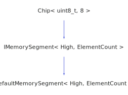

<h1>DefaultMemorySegment</h1>

<a href="https://github.com/CharlesCarley/HackComputer#~">~</a>
<a href="index.md#index">HackComputer</a>
/
<a href="namespaceHack.md#hack">Hack</a>
::
<a href="namespaceHack_1_1Chips.md#chips">Chips</a>
::
<b>DefaultMemorySegment</b>
 
 

<h4>Derived From</h4>

<a href="classHack_1_1Chips_1_1IMemorySegment.md#imemorysegment">Hack::Chips::IMemorySegment&lt; High, ElementCount &gt;</a>

 

<h2>Public Typedefs</h2>
<a href="#basetype" class="icon-list-item">BaseType
</a>

 

<h2>Private Members</h2>
<a href="#_ram" class="icon-list-item">_ram
</a>

 

<h2>Public Methods</h2>
<a href="#defaultmemorysegment" class="icon-list-item">DefaultMemorySegment
</a>

 
<a href="#~defaultmemorysegment" class="icon-list-item">~DefaultMemorySegment
</a>

 
<a href="#get" class="icon-list-item">get
</a>

 
<a href="#getout" class="icon-list-item">getOut
</a>

 
<a href="#pointer" class="icon-list-item">pointer
</a>

 
<a href="#setvalue" class="icon-list-item">setValue
</a>

 
<a href="#zero" class="icon-list-item">zero
</a>

 

<h2>Protected Methods</h2>
<a href="#evaluate" class="icon-list-item">evaluate
</a>

 

<h4>Defined in</h4>
<a href="https://github.com/CharlesCarley/HackComputer/blob/master/Source/Chips/DefaultMemorySegment.h#L29" class="icon-list-item">DefaultMemorySegment.h
</a>

 
<a href="#defaultmemorysegment" class="icon-list-item">top
</a>

<h2>BaseType</h2>
<a href="classHack_1_1Chips_1_1IMemorySegment.md#imemorysegment">IMemorySegment</a>
&lt; High, ElementCount &gt;
<b>BaseType</b>
 

<h4>Defined in</h4>
<a href="https://github.com/CharlesCarley/HackComputer/blob/master/Source/Chips/DefaultMemorySegment.h#L31" class="icon-list-item">DefaultMemorySegment.h
</a>

 
<a href="#defaultmemorysegment" class="icon-list-item">top
</a>

 

<h2>_ram</h2>
<b>uint16_t</b>
 *
<b>_ram</b>
 

<h4>Defined in</h4>
<a href="https://github.com/CharlesCarley/HackComputer/blob/master/Source/Chips/DefaultMemorySegment.h#L34" class="icon-list-item">DefaultMemorySegment.h
</a>

 
<a href="#defaultmemorysegment" class="icon-list-item">top
</a>

 

<h2>DefaultMemorySegment</h2>
<b>DefaultMemorySegment</b>
<i>(</i>
<i>)</i>

<h4>References</h4>

<a href="classHack_1_1Chips_1_1DefaultMemorySegment.md#zero">zero</a>

<h4>Defined in</h4>
<a href="https://github.com/CharlesCarley/HackComputer/blob/master/Source/Chips/DefaultMemorySegment.h#L37" class="icon-list-item">DefaultMemorySegment.h
</a>

 
<a href="#defaultmemorysegment" class="icon-list-item">top
</a>

 

<h2>~DefaultMemorySegment</h2>
<b>~DefaultMemorySegment</b>
<i>(</i>
<i>)</i>

<h4>Defined in</h4>
<a href="https://github.com/CharlesCarley/HackComputer/blob/master/Source/Chips/DefaultMemorySegment.h#L39" class="icon-list-item">DefaultMemorySegment.h
</a>

 
<a href="#defaultmemorysegment" class="icon-list-item">top
</a>

 

<h2>get</h2>
<b>uint16_t</b>
<b>get</b>
<i>(</i>

const size_t &amp;
index

<i>)</i>

<h4>Defined in</h4>
<a href="https://github.com/CharlesCarley/HackComputer/blob/master/Source/Chips/DefaultMemorySegment.h#L41" class="icon-list-item">DefaultMemorySegment.h
</a>

 
<a href="#defaultmemorysegment" class="icon-list-item">top
</a>

 

<h2>getOut</h2>
<b>uint16_t</b>
<b>getOut</b>
<i>(</i>
<i>)</i>

<h4>References</h4>

<a href="namespaceHack_1_1Chips.md#bit7">Bit7</a>

<a href="namespaceHack_1_1Chips.md#bit6">Bit6</a>

<h4>Defined in</h4>
<a href="https://github.com/CharlesCarley/HackComputer/blob/master/Source/Chips/DefaultMemorySegment.h#L49" class="icon-list-item">DefaultMemorySegment.h
</a>

 
<a href="#defaultmemorysegment" class="icon-list-item">top
</a>

 

<h2>pointer</h2>
<b>uint16_t</b>
 *
<b>pointer</b>
<i>(</i>

const size_t &amp;
address

<i>)</i>

<h4>Defined in</h4>
<a href="https://github.com/CharlesCarley/HackComputer/blob/master/Source/Chips/DefaultMemorySegment.h#L43" class="icon-list-item">DefaultMemorySegment.h
</a>

 
<a href="#defaultmemorysegment" class="icon-list-item">top
</a>

 

<h2>setValue</h2>
void
<b>setValue</b>
<i>(</i>

const size_t &amp;
address

const 
<b>uint16_t</b>
 &amp;
value

<i>)</i>

<h4>Defined in</h4>
<a href="https://github.com/CharlesCarley/HackComputer/blob/master/Source/Chips/DefaultMemorySegment.h#L45" class="icon-list-item">DefaultMemorySegment.h
</a>

 
<a href="#defaultmemorysegment" class="icon-list-item">top
</a>

 

<h2>zero</h2>
void
<b>zero</b>
<i>(</i>
<i>)</i>

<h4>Defined in</h4>
<a href="https://github.com/CharlesCarley/HackComputer/blob/master/Source/Chips/DefaultMemorySegment.h#L47" class="icon-list-item">DefaultMemorySegment.h
</a>

 
<a href="#defaultmemorysegment" class="icon-list-item">top
</a>

 

<h2>evaluate</h2>
void
<b>evaluate</b>
<i>(</i>
<i>)</i>

<h4>References</h4>

<a href="namespaceHack_1_1Chips.md#bit0">Bit0</a>

<a href="namespaceHack_1_1Chips.md#bit1">Bit1</a>

<h4>Defined in</h4>
<a href="https://github.com/CharlesCarley/HackComputer/blob/master/Source/Chips/DefaultMemorySegment.h#L52" class="icon-list-item">DefaultMemorySegment.h
</a>

 
<a href="#defaultmemorysegment" class="icon-list-item">top
</a>

 

</body>
</html>
