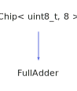

<h1>FullAdder</h1>

<a href="https://github.com/CharlesCarley/HackComputer#~">~</a>
<a href="index.md#index">HackComputer</a>
/
<a href="namespaceHack.md#hack">Hack</a>
::
<a href="namespaceHack_1_1Chips.md#chips">Chips</a>
::
<b>FullAdder</b>
 
 

<h4>Derived From</h4>

<a href="classHack_1_1Chips_1_1Chip.md#chip">Hack::Chips::Chip&lt; uint8_t, 8 &gt;</a>

 

<h2>Private Methods</h2>
<a href="#evaluate" class="icon-list-item">evaluate
</a>

 

<h2>Public Methods</h2>
<a href="#fulladder" class="icon-list-item">FullAdder
</a>

 
<a href="#getcary" class="icon-list-item">getCary
</a>

 
<a href="#getsum" class="icon-list-item">getSum
</a>

 
<a href="#seta" class="icon-list-item">setA
</a>

 
<a href="#setb" class="icon-list-item">setB
</a>

 
<a href="#setcary" class="icon-list-item">setCary
</a>

 

<h4>Defined in</h4>
<a href="https://github.com/CharlesCarley/HackComputer/blob/master/Source/Chips/FullAdder.h#L28" class="icon-list-item">FullAdder.h
</a>

 
<a href="#fulladder" class="icon-list-item">top
</a>

<h2>evaluate</h2>
void
<b>evaluate</b>
<i>(</i>
<i>)</i>

<h4>Defined in</h4>
<a href="https://github.com/CharlesCarley/HackComputer/blob/master/Source/Chips/FullAdder.h#L30" class="icon-list-item">FullAdder.h
</a>

 
<a href="https://github.com/CharlesCarley/HackComputer/blob/master/Source/Chips/FullAdder.cpp#L66" class="icon-list-item">FullAdder.cpp
</a>

 
<a href="#fulladder" class="icon-list-item">top
</a>

 

<h2>FullAdder</h2>
<b>FullAdder</b>
<i>(</i>
<i>)</i>

<h4>References</h4>

<a href="classHack_1_1Chips_1_1Chip.md#assignbit">assignBit</a>

<h4>Defined in</h4>
<a href="https://github.com/CharlesCarley/HackComputer/blob/master/Source/Chips/FullAdder.h#L33" class="icon-list-item">FullAdder.h
</a>

 
<a href="https://github.com/CharlesCarley/HackComputer/blob/master/Source/Chips/FullAdder.cpp#L29" class="icon-list-item">FullAdder.cpp
</a>

 
<a href="#fulladder" class="icon-list-item">top
</a>

 

<h2>getCary</h2>
bool
<b>getCary</b>
<i>(</i>
<i>)</i>

<h4>References</h4>

<a href="classHack_1_1Chips_1_1Chip.md#getbit">getBit</a>

<h4>Defined in</h4>
<a href="https://github.com/CharlesCarley/HackComputer/blob/master/Source/Chips/FullAdder.h#L42" class="icon-list-item">FullAdder.h
</a>

 
<a href="https://github.com/CharlesCarley/HackComputer/blob/master/Source/Chips/FullAdder.cpp#L59" class="icon-list-item">FullAdder.cpp
</a>

 
<a href="#fulladder" class="icon-list-item">top
</a>

 

<h2>getSum</h2>
bool
<b>getSum</b>
<i>(</i>
<i>)</i>

<h4>References</h4>

<a href="classHack_1_1Chips_1_1Chip.md#getbit">getBit</a>

<h4>Defined in</h4>
<a href="https://github.com/CharlesCarley/HackComputer/blob/master/Source/Chips/FullAdder.h#L40" class="icon-list-item">FullAdder.h
</a>

 
<a href="https://github.com/CharlesCarley/HackComputer/blob/master/Source/Chips/FullAdder.cpp#L52" class="icon-list-item">FullAdder.cpp
</a>

 
<a href="#fulladder" class="icon-list-item">top
</a>

 

<h2>setA</h2>
void
<b>setA</b>
<i>(</i>

bool
a

<i>)</i>

<h4>References</h4>

<a href="classHack_1_1Chips_1_1Chip.md#applybit">applyBit</a>

<a href="classHack_1_1Chips_1_1Chip.md#setbit">setBit</a>

<h4>Defined in</h4>
<a href="https://github.com/CharlesCarley/HackComputer/blob/master/Source/Chips/FullAdder.h#L35" class="icon-list-item">FullAdder.h
</a>

 
<a href="https://github.com/CharlesCarley/HackComputer/blob/master/Source/Chips/FullAdder.cpp#L34" class="icon-list-item">FullAdder.cpp
</a>

 
<a href="#fulladder" class="icon-list-item">top
</a>

 

<h2>setB</h2>
void
<b>setB</b>
<i>(</i>

bool
b

<i>)</i>

<h4>References</h4>

<a href="classHack_1_1Chips_1_1Chip.md#applybit">applyBit</a>

<a href="classHack_1_1Chips_1_1Chip.md#setbit">setBit</a>

<h4>Defined in</h4>
<a href="https://github.com/CharlesCarley/HackComputer/blob/master/Source/Chips/FullAdder.h#L36" class="icon-list-item">FullAdder.h
</a>

 
<a href="https://github.com/CharlesCarley/HackComputer/blob/master/Source/Chips/FullAdder.cpp#L40" class="icon-list-item">FullAdder.cpp
</a>

 
<a href="#fulladder" class="icon-list-item">top
</a>

 

<h2>setCary</h2>
void
<b>setCary</b>
<i>(</i>

bool
cary

<i>)</i>

<h4>References</h4>

<a href="classHack_1_1Chips_1_1Chip.md#applybit">applyBit</a>

<a href="classHack_1_1Chips_1_1Chip.md#setbit">setBit</a>

<h4>Defined in</h4>
<a href="https://github.com/CharlesCarley/HackComputer/blob/master/Source/Chips/FullAdder.h#L38" class="icon-list-item">FullAdder.h
</a>

 
<a href="https://github.com/CharlesCarley/HackComputer/blob/master/Source/Chips/FullAdder.cpp#L46" class="icon-list-item">FullAdder.cpp
</a>

 
<a href="#fulladder" class="icon-list-item">top
</a>

 

</body>
</html>
