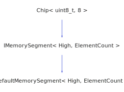

<h1>IMemorySegment</h1>

<a href="https://github.com/CharlesCarley/HackComputer#~">~</a>
<a href="index.md#index">HackComputer</a>
/
<a href="namespaceHack.md#hack">Hack</a>
::
<a href="namespaceHack_1_1Chips.md#chips">Chips</a>
::
<b>IMemorySegment</b>
 
 

<h4>Derived From</h4>

<a href="classHack_1_1Chips_1_1Chip.md#chip">Hack::Chips::Chip&lt; uint8_t, 8 &gt;</a>

<h4>Derived By</h4>

<a href="classHack_1_1Chips_1_1DefaultMemorySegment.md#defaultmemorysegment">Hack::Chips::DefaultMemorySegment&lt; High, ElementCount &gt;</a>

 

<h2>Public Static Members</h2>
<a href="#highaddress" class="icon-list-item">HighAddress
</a>

 
<a href="#max" class="icon-list-item">Max
</a>

 

<h2>Protected Members</h2>
<a href="#_address" class="icon-list-item">_address
</a>

 
<a href="#_in" class="icon-list-item">_in
</a>

 
<a href="#_out" class="icon-list-item">_out
</a>

 

<h2>Public Methods</h2>
<a href="#imemorysegment" class="icon-list-item">IMemorySegment
</a>

 
<a href="#get" class="icon-list-item">get
</a>

 
<a href="#getout" class="icon-list-item">getOut
</a>

 
<a href="#lock" class="icon-list-item">lock
</a>

 
<a href="#lockscreen" class="icon-list-item">lockScreen
</a>

 
<a href="#pointer" class="icon-list-item">pointer
</a>

 
<a href="#setaddress" class="icon-list-item">setAddress
</a>

 
<a href="#setclock" class="icon-list-item">setClock
</a>

 
<a href="#setin" class="icon-list-item">setIn
</a>

 
<a href="#setload" class="icon-list-item">setLoad
</a>

 
<a href="#setvalue" class="icon-list-item">setValue
</a>

 
<a href="#sync" class="icon-list-item">sync
</a>

 
<a href="#unlockscreen" class="icon-list-item">unlockScreen
</a>

 
<a href="#zero" class="icon-list-item">zero
</a>

 

<h2>Protected Methods</h2>
<a href="#isdirty" class="icon-list-item">isDirty
</a>

 
<a href="#markdirty" class="icon-list-item">markDirty
</a>

 

<h4>Defined in</h4>
<a href="https://github.com/CharlesCarley/HackComputer/blob/master/Source/Chips/IMemorySegment.h#L30" class="icon-list-item">IMemorySegment.h
</a>

 
<a href="#imemorysegment" class="icon-list-item">top
</a>

<h2>HighAddress</h2>
const 
<b>uint16_t</b>
<b>HighAddress</b>
 

<h4>Defined in</h4>
<a href="https://github.com/CharlesCarley/HackComputer/blob/master/Source/Chips/IMemorySegment.h#L32" class="icon-list-item">IMemorySegment.h
</a>

 
<a href="#imemorysegment" class="icon-list-item">top
</a>

 

<h2>Max</h2>
const 
<b>uint16_t</b>
<b>Max</b>
 

<h4>Defined in</h4>
<a href="https://github.com/CharlesCarley/HackComputer/blob/master/Source/Chips/IMemorySegment.h#L33" class="icon-list-item">IMemorySegment.h
</a>

 
<a href="#imemorysegment" class="icon-list-item">top
</a>

 

<h2>_address</h2>
<b>uint16_t</b>
<b>_address</b>
 

<h4>Defined in</h4>
<a href="https://github.com/CharlesCarley/HackComputer/blob/master/Source/Chips/IMemorySegment.h#L38" class="icon-list-item">IMemorySegment.h
</a>

 
<a href="#imemorysegment" class="icon-list-item">top
</a>

 

<h2>_in</h2>
<b>uint16_t</b>
<b>_in</b>
 

<h4>Defined in</h4>
<a href="https://github.com/CharlesCarley/HackComputer/blob/master/Source/Chips/IMemorySegment.h#L36" class="icon-list-item">IMemorySegment.h
</a>

 
<a href="#imemorysegment" class="icon-list-item">top
</a>

 

<h2>_out</h2>
<b>uint16_t</b>
<b>_out</b>
 

<h4>Defined in</h4>
<a href="https://github.com/CharlesCarley/HackComputer/blob/master/Source/Chips/IMemorySegment.h#L37" class="icon-list-item">IMemorySegment.h
</a>

 
<a href="#imemorysegment" class="icon-list-item">top
</a>

 

<h2>IMemorySegment</h2>
<b>IMemorySegment</b>
<i>(</i>
<i>)</i>

<h4>References</h4>

<a href="classHack_1_1Chips_1_1Chip.md#_bits">_bits</a>

<a href="namespaceHack_1_1Chips.md#bit7">Bit7</a>

<h4>Defined in</h4>
<a href="https://github.com/CharlesCarley/HackComputer/blob/master/Source/Chips/IMemorySegment.h#L41" class="icon-list-item">IMemorySegment.h
</a>

 
<a href="#imemorysegment" class="icon-list-item">top
</a>

 

<h2>get</h2>
<b>uint16_t</b>
<b>get</b>
<i>(</i>

const size_t &amp;
index

<i>)</i>

<h4>Defined in</h4>
<a href="https://github.com/CharlesCarley/HackComputer/blob/master/Source/Chips/IMemorySegment.h#L55" class="icon-list-item">IMemorySegment.h
</a>

 
<a href="#imemorysegment" class="icon-list-item">top
</a>

 

<h2>getOut</h2>
<b>uint16_t</b>
<b>getOut</b>
<i>(</i>
<i>)</i>

<h4>Defined in</h4>
<a href="https://github.com/CharlesCarley/HackComputer/blob/master/Source/Chips/IMemorySegment.h#L53" class="icon-list-item">IMemorySegment.h
</a>

 
<a href="#imemorysegment" class="icon-list-item">top
</a>

 

<h2>lock</h2>
void
<b>lock</b>
<i>(</i>

bool
state

<i>)</i>

<h4>References</h4>

<a href="namespaceHack_1_1Chips.md#bit6">Bit6</a>

<h4>Defined in</h4>
<a href="https://github.com/CharlesCarley/HackComputer/blob/master/Source/Chips/IMemorySegment.h#L51" class="icon-list-item">IMemorySegment.h
</a>

 
<a href="#imemorysegment" class="icon-list-item">top
</a>

 

<h2>lockScreen</h2>
void
<b>lockScreen</b>
<i>(</i>
<i>)</i>

<h4>Defined in</h4>
<a href="https://github.com/CharlesCarley/HackComputer/blob/master/Source/Chips/IMemorySegment.h#L63" class="icon-list-item">IMemorySegment.h
</a>

 
<a href="#imemorysegment" class="icon-list-item">top
</a>

 

<h2>pointer</h2>
<b>uint16_t</b>
 *
<b>pointer</b>
<i>(</i>

const size_t &amp;
address

<i>)</i>

<h4>Defined in</h4>
<a href="https://github.com/CharlesCarley/HackComputer/blob/master/Source/Chips/IMemorySegment.h#L57" class="icon-list-item">IMemorySegment.h
</a>

 
<a href="#imemorysegment" class="icon-list-item">top
</a>

 

<h2>setAddress</h2>
void
<b>setAddress</b>
<i>(</i>

const 
<b>uint16_t</b>
 &amp;
address

<i>)</i>

<h4>Defined in</h4>
<a href="https://github.com/CharlesCarley/HackComputer/blob/master/Source/Chips/IMemorySegment.h#L45" class="icon-list-item">IMemorySegment.h
</a>

 
<a href="#imemorysegment" class="icon-list-item">top
</a>

 

<h2>setClock</h2>
void
<b>setClock</b>
<i>(</i>

bool
clock

<i>)</i>

<h4>References</h4>

<a href="namespaceHack_1_1Chips.md#bit1">Bit1</a>

<a href="namespaceHack_1_1Chips.md#bit7">Bit7</a>

<h4>Defined in</h4>
<a href="https://github.com/CharlesCarley/HackComputer/blob/master/Source/Chips/IMemorySegment.h#L49" class="icon-list-item">IMemorySegment.h
</a>

 
<a href="#imemorysegment" class="icon-list-item">top
</a>

 

<h2>setIn</h2>
void
<b>setIn</b>
<i>(</i>

const 
<b>uint16_t</b>
 &amp;
input

<i>)</i>

<h4>References</h4>

<a href="namespaceHack_1_1Chips.md#bit7">Bit7</a>

<h4>Defined in</h4>
<a href="https://github.com/CharlesCarley/HackComputer/blob/master/Source/Chips/IMemorySegment.h#L43" class="icon-list-item">IMemorySegment.h
</a>

 
<a href="#imemorysegment" class="icon-list-item">top
</a>

 

<h2>setLoad</h2>
void
<b>setLoad</b>
<i>(</i>

bool
load

<i>)</i>

<h4>References</h4>

<a href="namespaceHack_1_1Chips.md#bit0">Bit0</a>

<a href="namespaceHack_1_1Chips.md#bit7">Bit7</a>

<h4>Defined in</h4>
<a href="https://github.com/CharlesCarley/HackComputer/blob/master/Source/Chips/IMemorySegment.h#L47" class="icon-list-item">IMemorySegment.h
</a>

 
<a href="#imemorysegment" class="icon-list-item">top
</a>

 

<h2>setValue</h2>
void
<b>setValue</b>
<i>(</i>

const size_t &amp;
address

const 
<b>uint16_t</b>
 &amp;
value

<i>)</i>

<h4>Defined in</h4>
<a href="https://github.com/CharlesCarley/HackComputer/blob/master/Source/Chips/IMemorySegment.h#L59" class="icon-list-item">IMemorySegment.h
</a>

 
<a href="#imemorysegment" class="icon-list-item">top
</a>

 

<h2>sync</h2>
void
<b>sync</b>
<i>(</i>
<i>)</i>

<h4>Defined in</h4>
<a href="https://github.com/CharlesCarley/HackComputer/blob/master/Source/Chips/IMemorySegment.h#L65" class="icon-list-item">IMemorySegment.h
</a>

 
<a href="#imemorysegment" class="icon-list-item">top
</a>

 

<h2>unlockScreen</h2>
void
<b>unlockScreen</b>
<i>(</i>
<i>)</i>

<h4>Defined in</h4>
<a href="https://github.com/CharlesCarley/HackComputer/blob/master/Source/Chips/IMemorySegment.h#L69" class="icon-list-item">IMemorySegment.h
</a>

 
<a href="#imemorysegment" class="icon-list-item">top
</a>

 

<h2>zero</h2>
void
<b>zero</b>
<i>(</i>
<i>)</i>

<h4>Defined in</h4>
<a href="https://github.com/CharlesCarley/HackComputer/blob/master/Source/Chips/IMemorySegment.h#L61" class="icon-list-item">IMemorySegment.h
</a>

 
<a href="#imemorysegment" class="icon-list-item">top
</a>

 

<h2>isDirty</h2>
bool
<b>isDirty</b>
<i>(</i>
<i>)</i>

<h4>References</h4>

<a href="namespaceHack_1_1Chips.md#bit7">Bit7</a>

<a href="namespaceHack_1_1Chips.md#bit6">Bit6</a>

<h4>Defined in</h4>
<a href="https://github.com/CharlesCarley/HackComputer/blob/master/Source/Chips/IMemorySegment.h#L72" class="icon-list-item">IMemorySegment.h
</a>

 
<a href="#imemorysegment" class="icon-list-item">top
</a>

 

<h2>markDirty</h2>
void
<b>markDirty</b>
<i>(</i>
<i>)</i>

<h4>References</h4>

<a href="namespaceHack_1_1Chips.md#bit7">Bit7</a>

<h4>Defined in</h4>
<a href="https://github.com/CharlesCarley/HackComputer/blob/master/Source/Chips/IMemorySegment.h#L74" class="icon-list-item">IMemorySegment.h
</a>

 
<a href="#imemorysegment" class="icon-list-item">top
</a>

 

</body>
</html>
