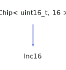

<h1>Inc16</h1>

<a href="https://github.com/CharlesCarley/HackComputer#~">~</a>
<a href="index.md#index">HackComputer</a>
/
<a href="namespaceHack.md#hack">Hack</a>
::
<a href="namespaceHack_1_1Chips.md#chips">Chips</a>
::
<b>Inc16</b>
 
 

<h4>Derived From</h4>

<a href="classHack_1_1Chips_1_1Chip.md#chip">Hack::Chips::Chip&lt; uint16_t, 16 &gt;</a>

 

<h2>Private Methods</h2>
<a href="#evaluate" class="icon-list-item">evaluate
</a>

 

<h2>Public Methods</h2>
<a href="#inc16" class="icon-list-item">Inc16
</a>

 
<a href="#getout" class="icon-list-item">getOut
</a>

 
<a href="#setin" class="icon-list-item">setIn
</a>

 

<h4>Defined in</h4>
<a href="https://github.com/CharlesCarley/HackComputer/blob/master/Source/Chips/Inc16.h#L28" class="icon-list-item">Inc16.h
</a>

 
<a href="#inc16" class="icon-list-item">top
</a>

<h2>evaluate</h2>
void
<b>evaluate</b>
<i>(</i>
<i>)</i>

<h4>Defined in</h4>
<a href="https://github.com/CharlesCarley/HackComputer/blob/master/Source/Chips/Inc16.h#L30" class="icon-list-item">Inc16.h
</a>

 
<a href="https://github.com/CharlesCarley/HackComputer/blob/master/Source/Chips/Inc16.cpp#L45" class="icon-list-item">Inc16.cpp
</a>

 
<a href="#inc16" class="icon-list-item">top
</a>

 

<h2>Inc16</h2>
<b>Inc16</b>
<i>(</i>
<i>)</i>

<h4>References</h4>

<a href="classHack_1_1Chips_1_1Chip.md#_bits">_bits</a>

<h4>Defined in</h4>
<a href="https://github.com/CharlesCarley/HackComputer/blob/master/Source/Chips/Inc16.h#L33" class="icon-list-item">Inc16.h
</a>

 
<a href="https://github.com/CharlesCarley/HackComputer/blob/master/Source/Chips/Inc16.cpp#L29" class="icon-list-item">Inc16.cpp
</a>

 
<a href="#inc16" class="icon-list-item">top
</a>

 

<h2>getOut</h2>
<b>uint16_t</b>
<b>getOut</b>
<i>(</i>
<i>)</i>

<h4>References</h4>

<a href="classHack_1_1Chips_1_1Chip.md#_bits">_bits</a>

<h4>Defined in</h4>
<a href="https://github.com/CharlesCarley/HackComputer/blob/master/Source/Chips/Inc16.h#L37" class="icon-list-item">Inc16.h
</a>

 
<a href="https://github.com/CharlesCarley/HackComputer/blob/master/Source/Chips/Inc16.cpp#L39" class="icon-list-item">Inc16.cpp
</a>

 
<a href="#inc16" class="icon-list-item">top
</a>

 

<h2>setIn</h2>
void
<b>setIn</b>
<i>(</i>

const 
<b>uint16_t</b>
 &amp;
v

<i>)</i>

<h4>References</h4>

<a href="classHack_1_1Chips_1_1Chip.md#_bits">_bits</a>

<h4>Defined in</h4>
<a href="https://github.com/CharlesCarley/HackComputer/blob/master/Source/Chips/Inc16.h#L35" class="icon-list-item">Inc16.h
</a>

 
<a href="https://github.com/CharlesCarley/HackComputer/blob/master/Source/Chips/Inc16.cpp#L34" class="icon-list-item">Inc16.cpp
</a>

 
<a href="#inc16" class="icon-list-item">top
</a>

 

</body>
</html>
