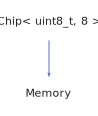

<h1>Memory</h1>

<a href="https://github.com/CharlesCarley/HackComputer#~">~</a>
<a href="index.md#index">HackComputer</a>
/
<a href="namespaceHack.md#hack">Hack</a>
::
<a href="namespaceHack_1_1Chips.md#chips">Chips</a>
::
<b>Memory</b>
 
 

<h4>Derived From</h4>

<a href="classHack_1_1Chips_1_1Chip.md#chip">Hack::Chips::Chip&lt; uint8_t, 8 &gt;</a>

 

<h2>Public Static Members</h2>
<a href="#extensionaddress" class="icon-list-item">ExtensionAddress
</a>

 
<a href="#heapaddress" class="icon-list-item">HeapAddress
</a>

 
<a href="#maxaddress" class="icon-list-item">MaxAddress
</a>

 
<a href="#screenaddress" class="icon-list-item">ScreenAddress
</a>

 
<a href="#stackaddress" class="icon-list-item">StackAddress
</a>

 

<h2>Private Members</h2>
<a href="#_address" class="icon-list-item">_address
</a>

 
<a href="#_in" class="icon-list-item">_in
</a>

 
<a href="#_out" class="icon-list-item">_out
</a>

 
<a href="#_ram16" class="icon-list-item">_ram16
</a>

 
<a href="#_screen" class="icon-list-item">_screen
</a>

 

<h2>Private Methods</h2>
<a href="#evaluate" class="icon-list-item">evaluate
</a>

 
<a href="#isdirty" class="icon-list-item">isDirty
</a>

 
<a href="#markdirty" class="icon-list-item">markDirty
</a>

 

<h2>Public Methods</h2>
<a href="#memory" class="icon-list-item">Memory
</a>

 
<a href="#~memory" class="icon-list-item">~Memory
</a>

 
<a href="#get" class="icon-list-item">get
</a>

 
<a href="#getout" class="icon-list-item">getOut
</a>

 
<a href="#getscreen" class="icon-list-item">getScreen
</a>

 
<a href="#initializescreen" class="icon-list-item">initializeScreen
</a>

 
<a href="#lock" class="icon-list-item">lock
</a>

 
<a href="#pointer" class="icon-list-item">pointer
</a>

 
<a href="#setaddress" class="icon-list-item">setAddress
</a>

 
<a href="#setclock" class="icon-list-item">setClock
</a>

 
<a href="#setin" class="icon-list-item">setIn
</a>

 
<a href="#setload" class="icon-list-item">setLoad
</a>

 
<a href="#setvalue" class="icon-list-item">setValue
</a>

 
<a href="#zero" class="icon-list-item">zero
</a>

 

<h4>Defined in</h4>
<a href="https://github.com/CharlesCarley/HackComputer/blob/master/Source/Chips/Memory.h#L30" class="icon-list-item">Memory.h
</a>

 
<a href="#memory" class="icon-list-item">top
</a>

<h2>ExtensionAddress</h2>
const 
<b>uint16_t</b>
<b>ExtensionAddress</b>
 

<h4>Defined in</h4>
<a href="https://github.com/CharlesCarley/HackComputer/blob/master/Source/Chips/Memory.h#L36" class="icon-list-item">Memory.h
</a>

 
<a href="#memory" class="icon-list-item">top
</a>

 

<h2>HeapAddress</h2>
const 
<b>uint16_t</b>
<b>HeapAddress</b>
 

<h4>Defined in</h4>
<a href="https://github.com/CharlesCarley/HackComputer/blob/master/Source/Chips/Memory.h#L35" class="icon-list-item">Memory.h
</a>

 
<a href="#memory" class="icon-list-item">top
</a>

 

<h2>MaxAddress</h2>
const 
<b>uint16_t</b>
<b>MaxAddress</b>
 

<h4>Defined in</h4>
<a href="https://github.com/CharlesCarley/HackComputer/blob/master/Source/Chips/Memory.h#L32" class="icon-list-item">Memory.h
</a>

 
<a href="#memory" class="icon-list-item">top
</a>

 

<h2>ScreenAddress</h2>
const 
<b>uint16_t</b>
<b>ScreenAddress</b>
 

<h4>Defined in</h4>
<a href="https://github.com/CharlesCarley/HackComputer/blob/master/Source/Chips/Memory.h#L33" class="icon-list-item">Memory.h
</a>

 
<a href="#memory" class="icon-list-item">top
</a>

 

<h2>StackAddress</h2>
const 
<b>uint16_t</b>
<b>StackAddress</b>
 

<h4>Defined in</h4>
<a href="https://github.com/CharlesCarley/HackComputer/blob/master/Source/Chips/Memory.h#L34" class="icon-list-item">Memory.h
</a>

 
<a href="#memory" class="icon-list-item">top
</a>

 

<h2>_address</h2>
<b>uint16_t</b>
<b>_address</b>
 

<h4>Defined in</h4>
<a href="https://github.com/CharlesCarley/HackComputer/blob/master/Source/Chips/Memory.h#L45" class="icon-list-item">Memory.h
</a>

 
<a href="#memory" class="icon-list-item">top
</a>

 

<h2>_in</h2>
<b>uint16_t</b>
<b>_in</b>
 

<h4>Defined in</h4>
<a href="https://github.com/CharlesCarley/HackComputer/blob/master/Source/Chips/Memory.h#L43" class="icon-list-item">Memory.h
</a>

 
<a href="#memory" class="icon-list-item">top
</a>

 

<h2>_out</h2>
<b>uint16_t</b>
<b>_out</b>
 

<h4>Defined in</h4>
<a href="https://github.com/CharlesCarley/HackComputer/blob/master/Source/Chips/Memory.h#L44" class="icon-list-item">Memory.h
</a>

 
<a href="#memory" class="icon-list-item">top
</a>

 

<h2>_ram16</h2>
<a href="namespaceHack_1_1Chips.md#ram16k">Ram16k</a>
 *
<b>_ram16</b>
 

<h4>Defined in</h4>
<a href="https://github.com/CharlesCarley/HackComputer/blob/master/Source/Chips/Memory.h#L47" class="icon-list-item">Memory.h
</a>

 
<a href="#memory" class="icon-list-item">top
</a>

 

<h2>_screen</h2>
<a href="namespaceHack_1_1Chips.md#screen">Screen</a>
 *
<b>_screen</b>
 

<h4>Defined in</h4>
<a href="https://github.com/CharlesCarley/HackComputer/blob/master/Source/Chips/Memory.h#L48" class="icon-list-item">Memory.h
</a>

 
<a href="#memory" class="icon-list-item">top
</a>

 

<h2>evaluate</h2>
void
<b>evaluate</b>
<i>(</i>
<i>)</i>

<h4>Defined in</h4>
<a href="https://github.com/CharlesCarley/HackComputer/blob/master/Source/Chips/Memory.h#L39" class="icon-list-item">Memory.h
</a>

 
<a href="https://github.com/CharlesCarley/HackComputer/blob/master/Source/Chips/Memory.cpp#L155" class="icon-list-item">Memory.cpp
</a>

 
<a href="#memory" class="icon-list-item">top
</a>

 

<h2>isDirty</h2>
bool
<b>isDirty</b>
<i>(</i>
<i>)</i>

<h4>Defined in</h4>
<a href="https://github.com/CharlesCarley/HackComputer/blob/master/Source/Chips/Memory.h#L40" class="icon-list-item">Memory.h
</a>

 
<a href="https://github.com/CharlesCarley/HackComputer/blob/master/Source/Chips/Memory.cpp#L145" class="icon-list-item">Memory.cpp
</a>

 
<a href="#memory" class="icon-list-item">top
</a>

 

<h2>markDirty</h2>
void
<b>markDirty</b>
<i>(</i>
<i>)</i>

<h4>Defined in</h4>
<a href="https://github.com/CharlesCarley/HackComputer/blob/master/Source/Chips/Memory.h#L41" class="icon-list-item">Memory.h
</a>

 
<a href="https://github.com/CharlesCarley/HackComputer/blob/master/Source/Chips/Memory.cpp#L150" class="icon-list-item">Memory.cpp
</a>

 
<a href="#memory" class="icon-list-item">top
</a>

 

<h2>Memory</h2>
<b>Memory</b>
<i>(</i>
<i>)</i>

<h4>Defined in</h4>
<a href="https://github.com/CharlesCarley/HackComputer/blob/master/Source/Chips/Memory.h#L51" class="icon-list-item">Memory.h
</a>

 
<a href="https://github.com/CharlesCarley/HackComputer/blob/master/Source/Chips/Memory.cpp#L31" class="icon-list-item">Memory.cpp
</a>

 
<a href="#memory" class="icon-list-item">top
</a>

 

<h2>~Memory</h2>
<b>~Memory</b>
<i>(</i>
<i>)</i>

<h4>Defined in</h4>
<a href="https://github.com/CharlesCarley/HackComputer/blob/master/Source/Chips/Memory.h#L52" class="icon-list-item">Memory.h
</a>

 
<a href="https://github.com/CharlesCarley/HackComputer/blob/master/Source/Chips/Memory.cpp#L40" class="icon-list-item">Memory.cpp
</a>

 
<a href="#memory" class="icon-list-item">top
</a>

 

<h2>get</h2>
<b>uint16_t</b>
<b>get</b>
<i>(</i>

const size_t &amp;
i

<i>)</i>

<h4>References</h4>

<a href="classHack_1_1Chips_1_1Memory.md#maxaddress">MaxAddress</a>

<a href="classHack_1_1Chips_1_1Memory.md#screenaddress">ScreenAddress</a>

<a href="classHack_1_1Chips_1_1DefaultMemorySegment.md#get">get</a>

<a href="classHack_1_1Chips_1_1IMemorySegment.md#get">get</a>

<h4>Defined in</h4>
<a href="https://github.com/CharlesCarley/HackComputer/blob/master/Source/Chips/Memory.h#L72" class="icon-list-item">Memory.h
</a>

 
<a href="https://github.com/CharlesCarley/HackComputer/blob/master/Source/Chips/Memory.cpp#L121" class="icon-list-item">Memory.cpp
</a>

 
<a href="#memory" class="icon-list-item">top
</a>

 

<h2>getOut</h2>
<b>uint16_t</b>
<b>getOut</b>
<i>(</i>
<i>)</i>

<h4>References</h4>

<a href="classHack_1_1Chips_1_1Chip.md#_bits">_bits</a>

<a href="namespaceHack_1_1Chips.md#bit7">Bit7</a>

<a href="namespaceHack_1_1Chips.md#bit6">Bit6</a>

<h4>Defined in</h4>
<a href="https://github.com/CharlesCarley/HackComputer/blob/master/Source/Chips/Memory.h#L70" class="icon-list-item">Memory.h
</a>

 
<a href="https://github.com/CharlesCarley/HackComputer/blob/master/Source/Chips/Memory.cpp#L114" class="icon-list-item">Memory.cpp
</a>

 
<a href="#memory" class="icon-list-item">top
</a>

 

<h2>getScreen</h2>
<a href="namespaceHack_1_1Chips.md#screen">Screen</a>
 *
<b>getScreen</b>
<i>(</i>
<i>)</i>

<h4>Defined in</h4>
<a href="https://github.com/CharlesCarley/HackComputer/blob/master/Source/Chips/Memory.h#L54" class="icon-list-item">Memory.h
</a>

 
<a href="https://github.com/CharlesCarley/HackComputer/blob/master/Source/Chips/Memory.cpp#L46" class="icon-list-item">Memory.cpp
</a>

 
<a href="#memory" class="icon-list-item">top
</a>

 

<h2>initializeScreen</h2>
void
<b>initializeScreen</b>
<i>(</i>

<a href="namespaceHack_1_1Chips.md#screen">Screen</a>
 *
screen
 = 
nullptr

<i>)</i>

<h4>Defined in</h4>
<a href="https://github.com/CharlesCarley/HackComputer/blob/master/Source/Chips/Memory.h#L56" class="icon-list-item">Memory.h
</a>

 
<a href="https://github.com/CharlesCarley/HackComputer/blob/master/Source/Chips/Memory.cpp#L51" class="icon-list-item">Memory.cpp
</a>

 
<a href="#memory" class="icon-list-item">top
</a>

 

<h2>lock</h2>
void
<b>lock</b>
<i>(</i>

bool
v

<i>)</i>

<h4>References</h4>

<a href="classHack_1_1Chips_1_1Chip.md#_bits">_bits</a>

<a href="namespaceHack_1_1Chips.md#bit6">Bit6</a>

<h4>Defined in</h4>
<a href="https://github.com/CharlesCarley/HackComputer/blob/master/Source/Chips/Memory.h#L68" class="icon-list-item">Memory.h
</a>

 
<a href="https://github.com/CharlesCarley/HackComputer/blob/master/Source/Chips/Memory.cpp#L106" class="icon-list-item">Memory.cpp
</a>

 
<a href="#memory" class="icon-list-item">top
</a>

 

<h2>pointer</h2>
<b>uint16_t</b>
 *
<b>pointer</b>
<i>(</i>

const size_t &amp;
address

<i>)</i>

<h4>References</h4>

<a href="classHack_1_1Chips_1_1Memory.md#screenaddress">ScreenAddress</a>

<a href="classHack_1_1Chips_1_1DefaultMemorySegment.md#pointer">pointer</a>

<a href="classHack_1_1Chips_1_1IMemorySegment.md#pointer">pointer</a>

<h4>Defined in</h4>
<a href="https://github.com/CharlesCarley/HackComputer/blob/master/Source/Chips/Memory.h#L74" class="icon-list-item">Memory.h
</a>

 
<a href="https://github.com/CharlesCarley/HackComputer/blob/master/Source/Chips/Memory.cpp#L132" class="icon-list-item">Memory.cpp
</a>

 
<a href="#memory" class="icon-list-item">top
</a>

 

<h2>setAddress</h2>
void
<b>setAddress</b>
<i>(</i>

const 
<b>uint16_t</b>
 &amp;
v

<i>)</i>

<h4>References</h4>

<a href="classHack_1_1Chips_1_1Memory.md#maxaddress">MaxAddress</a>

<h4>Defined in</h4>
<a href="https://github.com/CharlesCarley/HackComputer/blob/master/Source/Chips/Memory.h#L60" class="icon-list-item">Memory.h
</a>

 
<a href="https://github.com/CharlesCarley/HackComputer/blob/master/Source/Chips/Memory.cpp#L71" class="icon-list-item">Memory.cpp
</a>

 
<a href="#memory" class="icon-list-item">top
</a>

 

<h2>setClock</h2>
void
<b>setClock</b>
<i>(</i>

bool
v

<i>)</i>

<h4>References</h4>

<a href="classHack_1_1Chips_1_1Chip.md#_bits">_bits</a>

<a href="namespaceHack_1_1Chips.md#bit1">Bit1</a>

<a href="namespaceHack_1_1Chips.md#bit7">Bit7</a>

<h4>Defined in</h4>
<a href="https://github.com/CharlesCarley/HackComputer/blob/master/Source/Chips/Memory.h#L66" class="icon-list-item">Memory.h
</a>

 
<a href="https://github.com/CharlesCarley/HackComputer/blob/master/Source/Chips/Memory.cpp#L97" class="icon-list-item">Memory.cpp
</a>

 
<a href="#memory" class="icon-list-item">top
</a>

 

<h2>setIn</h2>
void
<b>setIn</b>
<i>(</i>

const 
<b>uint16_t</b>
 &amp;
v

<i>)</i>

<h4>References</h4>

<a href="classHack_1_1Chips_1_1Chip.md#_bits">_bits</a>

<a href="namespaceHack_1_1Chips.md#bit7">Bit7</a>

<h4>Defined in</h4>
<a href="https://github.com/CharlesCarley/HackComputer/blob/master/Source/Chips/Memory.h#L58" class="icon-list-item">Memory.h
</a>

 
<a href="https://github.com/CharlesCarley/HackComputer/blob/master/Source/Chips/Memory.cpp#L62" class="icon-list-item">Memory.cpp
</a>

 
<a href="#memory" class="icon-list-item">top
</a>

 

<h2>setLoad</h2>
void
<b>setLoad</b>
<i>(</i>

bool
v

<i>)</i>

<h4>References</h4>

<a href="classHack_1_1Chips_1_1Chip.md#_bits">_bits</a>

<a href="namespaceHack_1_1Chips.md#bit0">Bit0</a>

<a href="namespaceHack_1_1Chips.md#bit7">Bit7</a>

<h4>Defined in</h4>
<a href="https://github.com/CharlesCarley/HackComputer/blob/master/Source/Chips/Memory.h#L64" class="icon-list-item">Memory.h
</a>

 
<a href="https://github.com/CharlesCarley/HackComputer/blob/master/Source/Chips/Memory.cpp#L88" class="icon-list-item">Memory.cpp
</a>

 
<a href="#memory" class="icon-list-item">top
</a>

 

<h2>setValue</h2>
void
<b>setValue</b>
<i>(</i>

const size_t &amp;
index

const 
<b>uint16_t</b>
 &amp;
v

<i>)</i>

<h4>References</h4>

<a href="classHack_1_1Chips_1_1Memory.md#maxaddress">MaxAddress</a>

<a href="classHack_1_1Chips_1_1Memory.md#screenaddress">ScreenAddress</a>

<a href="classHack_1_1Chips_1_1DefaultMemorySegment.md#setvalue">setValue</a>

<a href="classHack_1_1Chips_1_1IMemorySegment.md#setvalue">setValue</a>

<h4>Defined in</h4>
<a href="https://github.com/CharlesCarley/HackComputer/blob/master/Source/Chips/Memory.h#L62" class="icon-list-item">Memory.h
</a>

 
<a href="https://github.com/CharlesCarley/HackComputer/blob/master/Source/Chips/Memory.cpp#L77" class="icon-list-item">Memory.cpp
</a>

 
<a href="#memory" class="icon-list-item">top
</a>

 

<h2>zero</h2>
void
<b>zero</b>
<i>(</i>
<i>)</i>

<h4>References</h4>

<a href="classHack_1_1Chips_1_1DefaultMemorySegment.md#zero">zero</a>

<a href="classHack_1_1Chips_1_1IMemorySegment.md#zero">zero</a>

<h4>Defined in</h4>
<a href="https://github.com/CharlesCarley/HackComputer/blob/master/Source/Chips/Memory.h#L76" class="icon-list-item">Memory.h
</a>

 
<a href="https://github.com/CharlesCarley/HackComputer/blob/master/Source/Chips/Memory.cpp#L139" class="icon-list-item">Memory.cpp
</a>

 
<a href="#memory" class="icon-list-item">top
</a>

 

</body>
</html>
