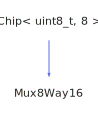

<h1>Mux8Way16</h1>

<a href="https://github.com/CharlesCarley/HackComputer#~">~</a>
<a href="index.md#index">HackComputer</a>
/
<a href="namespaceHack.md#hack">Hack</a>
::
<a href="namespaceHack_1_1Chips.md#chips">Chips</a>
::
<b>Mux8Way16</b>
 
 

<h4>Derived From</h4>

<a href="classHack_1_1Chips_1_1Chip.md#chip">Hack::Chips::Chip&lt; uint8_t, 8 &gt;</a>

 

<h2>Private Members</h2>
<a href="#_in" class="icon-list-item">_in
</a>

 
<a href="#_out" class="icon-list-item">_out
</a>

 

<h2>Private Methods</h2>
<a href="#evaluate" class="icon-list-item">evaluate
</a>

 

<h2>Public Methods</h2>
<a href="#mux8way16" class="icon-list-item">Mux8Way16
</a>

 
<a href="#getout" class="icon-list-item">getOut
</a>

 
<a href="#seta" class="icon-list-item">setA
</a>

 
<a href="#setb" class="icon-list-item">setB
</a>

 
<a href="#setc" class="icon-list-item">setC
</a>

 
<a href="#setd" class="icon-list-item">setD
</a>

 
<a href="#sete" class="icon-list-item">setE
</a>

 
<a href="#setf" class="icon-list-item">setF
</a>

 
<a href="#setg" class="icon-list-item">setG
</a>

 
<a href="#seth" class="icon-list-item">setH
</a>

 
<a href="#setsel" class="icon-list-item">setSel
</a>

 

<h4>Defined in</h4>
<a href="https://github.com/CharlesCarley/HackComputer/blob/master/Source/Chips/Mux8Way16.h#L28" class="icon-list-item">Mux8Way16.h
</a>

 
<a href="#mux8way16" class="icon-list-item">top
</a>

<h2>_in</h2>
<a href="unionHack_1_1Chips_1_1bit64__t.md#bit64_t">bit64_t</a>
<b>_in</b>
 

<h4>Defined in</h4>
<a href="https://github.com/CharlesCarley/HackComputer/blob/master/Source/Chips/Mux8Way16.h#L32" class="icon-list-item">Mux8Way16.h
</a>

 
<a href="#mux8way16" class="icon-list-item">top
</a>

 

<h2>_out</h2>
<b>uint16_t</b>
<b>_out</b>
 

<h4>Defined in</h4>
<a href="https://github.com/CharlesCarley/HackComputer/blob/master/Source/Chips/Mux8Way16.h#L33" class="icon-list-item">Mux8Way16.h
</a>

 
<a href="#mux8way16" class="icon-list-item">top
</a>

 

<h2>evaluate</h2>
void
<b>evaluate</b>
<i>(</i>
<i>)</i>

<h4>Defined in</h4>
<a href="https://github.com/CharlesCarley/HackComputer/blob/master/Source/Chips/Mux8Way16.h#L30" class="icon-list-item">Mux8Way16.h
</a>

 
<a href="https://github.com/CharlesCarley/HackComputer/blob/master/Source/Chips/Mux8Way16.cpp#L102" class="icon-list-item">Mux8Way16.cpp
</a>

 
<a href="#mux8way16" class="icon-list-item">top
</a>

 

<h2>Mux8Way16</h2>
<b>Mux8Way16</b>
<i>(</i>
<i>)</i>

<h4>Defined in</h4>
<a href="https://github.com/CharlesCarley/HackComputer/blob/master/Source/Chips/Mux8Way16.h#L36" class="icon-list-item">Mux8Way16.h
</a>

 
<a href="https://github.com/CharlesCarley/HackComputer/blob/master/Source/Chips/Mux8Way16.cpp#L32" class="icon-list-item">Mux8Way16.cpp
</a>

 
<a href="#mux8way16" class="icon-list-item">top
</a>

 

<h2>getOut</h2>
<b>uint16_t</b>
<b>getOut</b>
<i>(</i>
<i>)</i>

<h4>References</h4>

<a href="classHack_1_1Chips_1_1Chip.md#getbit">getBit</a>

<h4>Defined in</h4>
<a href="https://github.com/CharlesCarley/HackComputer/blob/master/Source/Chips/Mux8Way16.h#L56" class="icon-list-item">Mux8Way16.h
</a>

 
<a href="https://github.com/CharlesCarley/HackComputer/blob/master/Source/Chips/Mux8Way16.cpp#L95" class="icon-list-item">Mux8Way16.cpp
</a>

 
<a href="#mux8way16" class="icon-list-item">top
</a>

 

<h2>setA</h2>
void
<b>setA</b>
<i>(</i>

const 
<b>uint16_t</b>
 &amp;
a

<i>)</i>

<h4>References</h4>

<a href="unionHack_1_1Chips_1_1bit64__t.md#s">s</a>

<a href="classHack_1_1Chips_1_1Chip.md#setbit">setBit</a>

<h4>Defined in</h4>
<a href="https://github.com/CharlesCarley/HackComputer/blob/master/Source/Chips/Mux8Way16.h#L38" class="icon-list-item">Mux8Way16.h
</a>

 
<a href="https://github.com/CharlesCarley/HackComputer/blob/master/Source/Chips/Mux8Way16.cpp#L39" class="icon-list-item">Mux8Way16.cpp
</a>

 
<a href="#mux8way16" class="icon-list-item">top
</a>

 

<h2>setB</h2>
void
<b>setB</b>
<i>(</i>

const 
<b>uint16_t</b>
 &amp;
b

<i>)</i>

<h4>References</h4>

<a href="unionHack_1_1Chips_1_1bit64__t.md#s">s</a>

<a href="classHack_1_1Chips_1_1Chip.md#setbit">setBit</a>

<h4>Defined in</h4>
<a href="https://github.com/CharlesCarley/HackComputer/blob/master/Source/Chips/Mux8Way16.h#L40" class="icon-list-item">Mux8Way16.h
</a>

 
<a href="https://github.com/CharlesCarley/HackComputer/blob/master/Source/Chips/Mux8Way16.cpp#L45" class="icon-list-item">Mux8Way16.cpp
</a>

 
<a href="#mux8way16" class="icon-list-item">top
</a>

 

<h2>setC</h2>
void
<b>setC</b>
<i>(</i>

const 
<b>uint16_t</b>
 &amp;
c

<i>)</i>

<h4>References</h4>

<a href="unionHack_1_1Chips_1_1bit64__t.md#s">s</a>

<a href="classHack_1_1Chips_1_1Chip.md#setbit">setBit</a>

<h4>Defined in</h4>
<a href="https://github.com/CharlesCarley/HackComputer/blob/master/Source/Chips/Mux8Way16.h#L42" class="icon-list-item">Mux8Way16.h
</a>

 
<a href="https://github.com/CharlesCarley/HackComputer/blob/master/Source/Chips/Mux8Way16.cpp#L51" class="icon-list-item">Mux8Way16.cpp
</a>

 
<a href="#mux8way16" class="icon-list-item">top
</a>

 

<h2>setD</h2>
void
<b>setD</b>
<i>(</i>

const 
<b>uint16_t</b>
 &amp;
d

<i>)</i>

<h4>References</h4>

<a href="unionHack_1_1Chips_1_1bit64__t.md#s">s</a>

<a href="classHack_1_1Chips_1_1Chip.md#setbit">setBit</a>

<h4>Defined in</h4>
<a href="https://github.com/CharlesCarley/HackComputer/blob/master/Source/Chips/Mux8Way16.h#L44" class="icon-list-item">Mux8Way16.h
</a>

 
<a href="https://github.com/CharlesCarley/HackComputer/blob/master/Source/Chips/Mux8Way16.cpp#L57" class="icon-list-item">Mux8Way16.cpp
</a>

 
<a href="#mux8way16" class="icon-list-item">top
</a>

 

<h2>setE</h2>
void
<b>setE</b>
<i>(</i>

const 
<b>uint16_t</b>
 &amp;
e

<i>)</i>

<h4>References</h4>

<a href="unionHack_1_1Chips_1_1bit64__t.md#s">s</a>

<a href="classHack_1_1Chips_1_1Chip.md#setbit">setBit</a>

<h4>Defined in</h4>
<a href="https://github.com/CharlesCarley/HackComputer/blob/master/Source/Chips/Mux8Way16.h#L46" class="icon-list-item">Mux8Way16.h
</a>

 
<a href="https://github.com/CharlesCarley/HackComputer/blob/master/Source/Chips/Mux8Way16.cpp#L63" class="icon-list-item">Mux8Way16.cpp
</a>

 
<a href="#mux8way16" class="icon-list-item">top
</a>

 

<h2>setF</h2>
void
<b>setF</b>
<i>(</i>

const 
<b>uint16_t</b>
 &amp;
f

<i>)</i>

<h4>References</h4>

<a href="unionHack_1_1Chips_1_1bit64__t.md#s">s</a>

<a href="classHack_1_1Chips_1_1Chip.md#setbit">setBit</a>

<h4>Defined in</h4>
<a href="https://github.com/CharlesCarley/HackComputer/blob/master/Source/Chips/Mux8Way16.h#L48" class="icon-list-item">Mux8Way16.h
</a>

 
<a href="https://github.com/CharlesCarley/HackComputer/blob/master/Source/Chips/Mux8Way16.cpp#L69" class="icon-list-item">Mux8Way16.cpp
</a>

 
<a href="#mux8way16" class="icon-list-item">top
</a>

 

<h2>setG</h2>
void
<b>setG</b>
<i>(</i>

const 
<b>uint16_t</b>
 &amp;
g

<i>)</i>

<h4>References</h4>

<a href="unionHack_1_1Chips_1_1bit64__t.md#s">s</a>

<a href="classHack_1_1Chips_1_1Chip.md#setbit">setBit</a>

<h4>Defined in</h4>
<a href="https://github.com/CharlesCarley/HackComputer/blob/master/Source/Chips/Mux8Way16.h#L50" class="icon-list-item">Mux8Way16.h
</a>

 
<a href="https://github.com/CharlesCarley/HackComputer/blob/master/Source/Chips/Mux8Way16.cpp#L75" class="icon-list-item">Mux8Way16.cpp
</a>

 
<a href="#mux8way16" class="icon-list-item">top
</a>

 

<h2>setH</h2>
void
<b>setH</b>
<i>(</i>

const 
<b>uint16_t</b>
 &amp;
h

<i>)</i>

<h4>References</h4>

<a href="unionHack_1_1Chips_1_1bit64__t.md#s">s</a>

<a href="classHack_1_1Chips_1_1Chip.md#setbit">setBit</a>

<h4>Defined in</h4>
<a href="https://github.com/CharlesCarley/HackComputer/blob/master/Source/Chips/Mux8Way16.h#L52" class="icon-list-item">Mux8Way16.h
</a>

 
<a href="https://github.com/CharlesCarley/HackComputer/blob/master/Source/Chips/Mux8Way16.cpp#L81" class="icon-list-item">Mux8Way16.cpp
</a>

 
<a href="#mux8way16" class="icon-list-item">top
</a>

 

<h2>setSel</h2>
void
<b>setSel</b>
<i>(</i>

const 
<b>uint8_t</b>
 &amp;
selection

<i>)</i>

<h4>References</h4>

<a href="classHack_1_1Chips_1_1Chip.md#applybit">applyBit</a>

<a href="classHack_1_1Chips_1_1Chip.md#setbit">setBit</a>

<h4>Defined in</h4>
<a href="https://github.com/CharlesCarley/HackComputer/blob/master/Source/Chips/Mux8Way16.h#L54" class="icon-list-item">Mux8Way16.h
</a>

 
<a href="https://github.com/CharlesCarley/HackComputer/blob/master/Source/Chips/Mux8Way16.cpp#L87" class="icon-list-item">Mux8Way16.cpp
</a>

 
<a href="#mux8way16" class="icon-list-item">top
</a>

 

</body>
</html>
