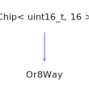

<h1>Or8Way</h1>

<a href="https://github.com/CharlesCarley/HackComputer#~">~</a>
<a href="index.md#index">HackComputer</a>
/
<a href="namespaceHack.md#hack">Hack</a>
::
<a href="namespaceHack_1_1Chips.md#chips">Chips</a>
::
<b>Or8Way</b>
 
 

<h4>Derived From</h4>

<a href="classHack_1_1Chips_1_1Chip.md#chip">Hack::Chips::Chip&lt; uint16_t, 16 &gt;</a>

 

<h2>Private Methods</h2>
<a href="#evaluate" class="icon-list-item">evaluate
</a>

 

<h2>Public Methods</h2>
<a href="#or8way" class="icon-list-item">Or8Way
</a>

 
<a href="#getout" class="icon-list-item">getOut
</a>

 
<a href="#setin" class="icon-list-item">setIn
</a>

 

<h4>Defined in</h4>
<a href="https://github.com/CharlesCarley/HackComputer/blob/master/Source/Chips/Or8Way.h#L28" class="icon-list-item">Or8Way.h
</a>

 
<a href="#or8way" class="icon-list-item">top
</a>

<h2>evaluate</h2>
void
<b>evaluate</b>
<i>(</i>
<i>)</i>

<h4>Defined in</h4>
<a href="https://github.com/CharlesCarley/HackComputer/blob/master/Source/Chips/Or8Way.h#L30" class="icon-list-item">Or8Way.h
</a>

 
<a href="https://github.com/CharlesCarley/HackComputer/blob/master/Source/Chips/Or8Way.cpp#L48" class="icon-list-item">Or8Way.cpp
</a>

 
<a href="#or8way" class="icon-list-item">top
</a>

 

<h2>Or8Way</h2>
<b>Or8Way</b>
<i>(</i>
<i>)</i>

<h4>References</h4>

<a href="classHack_1_1Chips_1_1Chip.md#assignbit">assignBit</a>

<h4>Defined in</h4>
<a href="https://github.com/CharlesCarley/HackComputer/blob/master/Source/Chips/Or8Way.h#L33" class="icon-list-item">Or8Way.h
</a>

 
<a href="https://github.com/CharlesCarley/HackComputer/blob/master/Source/Chips/Or8Way.cpp#L26" class="icon-list-item">Or8Way.cpp
</a>

 
<a href="#or8way" class="icon-list-item">top
</a>

 

<h2>getOut</h2>
bool
<b>getOut</b>
<i>(</i>
<i>)</i>

<h4>References</h4>

<a href="classHack_1_1Chips_1_1Chip.md#getbit">getBit</a>

<h4>Defined in</h4>
<a href="https://github.com/CharlesCarley/HackComputer/blob/master/Source/Chips/Or8Way.h#L37" class="icon-list-item">Or8Way.h
</a>

 
<a href="https://github.com/CharlesCarley/HackComputer/blob/master/Source/Chips/Or8Way.cpp#L41" class="icon-list-item">Or8Way.cpp
</a>

 
<a href="#or8way" class="icon-list-item">top
</a>

 

<h2>setIn</h2>
void
<b>setIn</b>
<i>(</i>

<b>uint8_t</b>
v

<i>)</i>

<h4>References</h4>

<a href="unionHack_1_1Chips_1_1bit16__t.md#b">b</a>

<a href="classHack_1_1Chips_1_1Chip.md#_bits">_bits</a>

<a href="classHack_1_1Chips_1_1Chip.md#setbit">setBit</a>

<h4>Defined in</h4>
<a href="https://github.com/CharlesCarley/HackComputer/blob/master/Source/Chips/Or8Way.h#L35" class="icon-list-item">Or8Way.h
</a>

 
<a href="https://github.com/CharlesCarley/HackComputer/blob/master/Source/Chips/Or8Way.cpp#L31" class="icon-list-item">Or8Way.cpp
</a>

 
<a href="#or8way" class="icon-list-item">top
</a>

 

</body>
</html>
