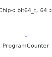

<h1>ProgramCounter</h1>

<a href="https://github.com/CharlesCarley/HackComputer#~">~</a>
<a href="index.md#index">HackComputer</a>
/
<a href="namespaceHack.md#hack">Hack</a>
::
<a href="namespaceHack_1_1Chips.md#chips">Chips</a>
::
<b>ProgramCounter</b>
 
 

<h4>Derived From</h4>

<a href="classHack_1_1Chips_1_1Chip.md#chip">Hack::Chips::Chip&lt; bit64_t, 64 &gt;</a>

 

<h2>Private Methods</h2>
<a href="#evaluate" class="icon-list-item">evaluate
</a>

 
<a href="#isdirty" class="icon-list-item">isDirty
</a>

 

<h2>Public Methods</h2>
<a href="#programcounter" class="icon-list-item">ProgramCounter
</a>

 
<a href="#getout" class="icon-list-item">getOut
</a>

 
<a href="#lock" class="icon-list-item">lock
</a>

 
<a href="#setclock" class="icon-list-item">setClock
</a>

 
<a href="#setflags" class="icon-list-item">setFlags
</a>

 
<a href="#setin" class="icon-list-item">setIn
</a>

 
<a href="#setinc" class="icon-list-item">setInc
</a>

 
<a href="#setload" class="icon-list-item">setLoad
</a>

 
<a href="#setreset" class="icon-list-item">setReset
</a>

 

<h4>Defined in</h4>
<a href="https://github.com/CharlesCarley/HackComputer/blob/master/Source/Chips/ProgramCounter.h#L39" class="icon-list-item">ProgramCounter.h
</a>

 
<a href="#programcounter" class="icon-list-item">top
</a>

<h2>evaluate</h2>
void
<b>evaluate</b>
<i>(</i>
<i>)</i>

<h4>Defined in</h4>
<a href="https://github.com/CharlesCarley/HackComputer/blob/master/Source/Chips/ProgramCounter.h#L41" class="icon-list-item">ProgramCounter.h
</a>

 
<a href="https://github.com/CharlesCarley/HackComputer/blob/master/Source/Chips/ProgramCounter.cpp#L106" class="icon-list-item">ProgramCounter.cpp
</a>

 
<a href="#programcounter" class="icon-list-item">top
</a>

 

<h2>isDirty</h2>
bool
<b>isDirty</b>
<i>(</i>
<i>)</i>

<h4>Defined in</h4>
<a href="https://github.com/CharlesCarley/HackComputer/blob/master/Source/Chips/ProgramCounter.h#L43" class="icon-list-item">ProgramCounter.h
</a>

 
<a href="https://github.com/CharlesCarley/HackComputer/blob/master/Source/Chips/ProgramCounter.cpp#L101" class="icon-list-item">ProgramCounter.cpp
</a>

 
<a href="#programcounter" class="icon-list-item">top
</a>

 

<h2>ProgramCounter</h2>
<b>ProgramCounter</b>
<i>(</i>
<i>)</i>

<h4>References</h4>

<a href="classHack_1_1Chips_1_1Chip.md#_bits">_bits</a>

<a href="unionHack_1_1Chips_1_1bit64__t.md#ll">ll</a>

<a href="unionHack_1_1Chips_1_1bit64__t.md#b">b</a>

<a href="namespaceHack_1_1Chips.md#bit7">Bit7</a>

<h4>Defined in</h4>
<a href="https://github.com/CharlesCarley/HackComputer/blob/master/Source/Chips/ProgramCounter.h#L50" class="icon-list-item">ProgramCounter.h
</a>

 
<a href="https://github.com/CharlesCarley/HackComputer/blob/master/Source/Chips/ProgramCounter.cpp#L32" class="icon-list-item">ProgramCounter.cpp
</a>

 
<a href="#programcounter" class="icon-list-item">top
</a>

 

<h2>getOut</h2>
<b>uint16_t</b>
<b>getOut</b>
<i>(</i>
<i>)</i>

<h4>References</h4>

<a href="classHack_1_1Chips_1_1Chip.md#_bits">_bits</a>

<a href="unionHack_1_1Chips_1_1bit64__t.md#b">b</a>

<a href="namespaceHack_1_1Chips.md#bit7">Bit7</a>

<a href="namespaceHack_1_1Chips.md#bit6">Bit6</a>

<a href="unionHack_1_1Chips_1_1bit64__t.md#s">s</a>

<h4>Defined in</h4>
<a href="https://github.com/CharlesCarley/HackComputer/blob/master/Source/Chips/ProgramCounter.h#L66" class="icon-list-item">ProgramCounter.h
</a>

 
<a href="https://github.com/CharlesCarley/HackComputer/blob/master/Source/Chips/ProgramCounter.cpp#L94" class="icon-list-item">ProgramCounter.cpp
</a>

 
<a href="#programcounter" class="icon-list-item">top
</a>

 

<h2>lock</h2>
void
<b>lock</b>
<i>(</i>

bool
v

<i>)</i>

<h4>References</h4>

<a href="classHack_1_1Chips_1_1Chip.md#_bits">_bits</a>

<a href="unionHack_1_1Chips_1_1bit64__t.md#b">b</a>

<a href="namespaceHack_1_1Chips.md#bit6">Bit6</a>

<h4>Defined in</h4>
<a href="https://github.com/CharlesCarley/HackComputer/blob/master/Source/Chips/ProgramCounter.h#L52" class="icon-list-item">ProgramCounter.h
</a>

 
<a href="https://github.com/CharlesCarley/HackComputer/blob/master/Source/Chips/ProgramCounter.cpp#L50" class="icon-list-item">ProgramCounter.cpp
</a>

 
<a href="#programcounter" class="icon-list-item">top
</a>

 

<h2>setClock</h2>
void
<b>setClock</b>
<i>(</i>

bool
v

<i>)</i>

<h4>References</h4>

<a href="classHack_1_1Chips_1_1Chip.md#_bits">_bits</a>

<a href="unionHack_1_1Chips_1_1bit64__t.md#b">b</a>

<a href="namespaceHack_1_1Chips.md#bit7">Bit7</a>

<h4>Defined in</h4>
<a href="https://github.com/CharlesCarley/HackComputer/blob/master/Source/Chips/ProgramCounter.h#L64" class="icon-list-item">ProgramCounter.h
</a>

 
<a href="https://github.com/CharlesCarley/HackComputer/blob/master/Source/Chips/ProgramCounter.cpp#L88" class="icon-list-item">ProgramCounter.cpp
</a>

 
<a href="#programcounter" class="icon-list-item">top
</a>

 

<h2>setFlags</h2>
void
<b>setFlags</b>
<i>(</i>

const 
<b>uint8_t</b>
 &amp;
v

<i>)</i>

<h4>References</h4>

<a href="classHack_1_1Chips_1_1Chip.md#_bits">_bits</a>

<a href="unionHack_1_1Chips_1_1bit64__t.md#b">b</a>

<a href="namespaceHack_1_1Chips.md#bit7">Bit7</a>

<h4>Defined in</h4>
<a href="https://github.com/CharlesCarley/HackComputer/blob/master/Source/Chips/ProgramCounter.h#L56" class="icon-list-item">ProgramCounter.h
</a>

 
<a href="https://github.com/CharlesCarley/HackComputer/blob/master/Source/Chips/ProgramCounter.cpp#L44" class="icon-list-item">ProgramCounter.cpp
</a>

 
<a href="#programcounter" class="icon-list-item">top
</a>

 

<h2>setIn</h2>
void
<b>setIn</b>
<i>(</i>

const 
<b>uint16_t</b>
 &amp;
v

<i>)</i>

<h4>References</h4>

<a href="classHack_1_1Chips_1_1Chip.md#_bits">_bits</a>

<a href="unionHack_1_1Chips_1_1bit64__t.md#s">s</a>

<a href="unionHack_1_1Chips_1_1bit64__t.md#b">b</a>

<a href="namespaceHack_1_1Chips.md#bit7">Bit7</a>

<h4>Defined in</h4>
<a href="https://github.com/CharlesCarley/HackComputer/blob/master/Source/Chips/ProgramCounter.h#L54" class="icon-list-item">ProgramCounter.h
</a>

 
<a href="https://github.com/CharlesCarley/HackComputer/blob/master/Source/Chips/ProgramCounter.cpp#L38" class="icon-list-item">ProgramCounter.cpp
</a>

 
<a href="#programcounter" class="icon-list-item">top
</a>

 

<h2>setInc</h2>
void
<b>setInc</b>
<i>(</i>

bool
v

<i>)</i>

<h4>References</h4>

<a href="classHack_1_1Chips_1_1Chip.md#_bits">_bits</a>

<a href="unionHack_1_1Chips_1_1bit64__t.md#b">b</a>

<a href="namespaceHack_1_1Chips.md#bit0">Bit0</a>

<a href="namespaceHack_1_1Chips.md#bit7">Bit7</a>

<h4>Defined in</h4>
<a href="https://github.com/CharlesCarley/HackComputer/blob/master/Source/Chips/ProgramCounter.h#L62" class="icon-list-item">ProgramCounter.h
</a>

 
<a href="https://github.com/CharlesCarley/HackComputer/blob/master/Source/Chips/ProgramCounter.cpp#L58" class="icon-list-item">ProgramCounter.cpp
</a>

 
<a href="#programcounter" class="icon-list-item">top
</a>

 

<h2>setLoad</h2>
void
<b>setLoad</b>
<i>(</i>

bool
v

<i>)</i>

<h4>References</h4>

<a href="classHack_1_1Chips_1_1Chip.md#_bits">_bits</a>

<a href="unionHack_1_1Chips_1_1bit64__t.md#b">b</a>

<a href="namespaceHack_1_1Chips.md#bit2">Bit2</a>

<a href="namespaceHack_1_1Chips.md#bit7">Bit7</a>

<h4>Defined in</h4>
<a href="https://github.com/CharlesCarley/HackComputer/blob/master/Source/Chips/ProgramCounter.h#L58" class="icon-list-item">ProgramCounter.h
</a>

 
<a href="https://github.com/CharlesCarley/HackComputer/blob/master/Source/Chips/ProgramCounter.cpp#L78" class="icon-list-item">ProgramCounter.cpp
</a>

 
<a href="#programcounter" class="icon-list-item">top
</a>

 

<h2>setReset</h2>
void
<b>setReset</b>
<i>(</i>

bool
v

<i>)</i>

<h4>References</h4>

<a href="classHack_1_1Chips_1_1Chip.md#_bits">_bits</a>

<a href="unionHack_1_1Chips_1_1bit64__t.md#b">b</a>

<a href="namespaceHack_1_1Chips.md#bit1">Bit1</a>

<a href="namespaceHack_1_1Chips.md#bit7">Bit7</a>

<h4>Defined in</h4>
<a href="https://github.com/CharlesCarley/HackComputer/blob/master/Source/Chips/ProgramCounter.h#L60" class="icon-list-item">ProgramCounter.h
</a>

 
<a href="https://github.com/CharlesCarley/HackComputer/blob/master/Source/Chips/ProgramCounter.cpp#L68" class="icon-list-item">ProgramCounter.cpp
</a>

 
<a href="#programcounter" class="icon-list-item">top
</a>

 

</body>
</html>
