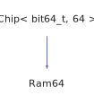

<h1>Ram64</h1>

<a href="https://github.com/CharlesCarley/HackComputer#~">~</a>
<a href="index.md#index">HackComputer</a>
/
<a href="namespaceHack.md#hack">Hack</a>
::
<a href="namespaceHack_1_1Chips.md#chips">Chips</a>
::
<b>Ram64</b>
 
 

<h4>Derived From</h4>

<a href="classHack_1_1Chips_1_1Chip.md#chip">Hack::Chips::Chip&lt; bit64_t, 64 &gt;</a>

 

<h2>Private Members</h2>
<a href="#_r" class="icon-list-item">_r
</a>

 

<h2>Private Methods</h2>
<a href="#evaluate" class="icon-list-item">evaluate
</a>

 
<a href="#isdirty" class="icon-list-item">isDirty
</a>

 
<a href="#markdirty" class="icon-list-item">markDirty
</a>

 

<h2>Public Methods</h2>
<a href="#ram64" class="icon-list-item">Ram64
</a>

 
<a href="#~ram64" class="icon-list-item">~Ram64
</a>

 
<a href="#getout" class="icon-list-item">getOut
</a>

 
<a href="#getout" class="icon-list-item">getOut
</a>

 
<a href="#setaddress" class="icon-list-item">setAddress
</a>

 
<a href="#setclock" class="icon-list-item">setClock
</a>

 
<a href="#setin" class="icon-list-item">setIn
</a>

 
<a href="#setload" class="icon-list-item">setLoad
</a>

 

<h4>Defined in</h4>
<a href="https://github.com/CharlesCarley/HackComputer/blob/master/Source/Chips/Ram64.h#L31" class="icon-list-item">Ram64.h
</a>

 
<a href="#ram64" class="icon-list-item">top
</a>

<h2>_r</h2>
<a href="unionHack_1_1Chips_1_1bit32__t.md#bit32_t">bit32_t</a>
 *
<b>_r</b>
 

<h4>Defined in</h4>
<a href="https://github.com/CharlesCarley/HackComputer/blob/master/Source/Chips/Ram64.h#L40" class="icon-list-item">Ram64.h
</a>

 
<a href="#ram64" class="icon-list-item">top
</a>

 

<h2>evaluate</h2>
void
<b>evaluate</b>
<i>(</i>
<i>)</i>

<h4>Defined in</h4>
<a href="https://github.com/CharlesCarley/HackComputer/blob/master/Source/Chips/Ram64.h#L33" class="icon-list-item">Ram64.h
</a>

 
<a href="https://github.com/CharlesCarley/HackComputer/blob/master/Source/Chips/Ram64.cpp#L98" class="icon-list-item">Ram64.cpp
</a>

 
<a href="#ram64" class="icon-list-item">top
</a>

 

<h2>isDirty</h2>
bool
<b>isDirty</b>
<i>(</i>
<i>)</i>

<h4>Defined in</h4>
<a href="https://github.com/CharlesCarley/HackComputer/blob/master/Source/Chips/Ram64.h#L34" class="icon-list-item">Ram64.h
</a>

 
<a href="https://github.com/CharlesCarley/HackComputer/blob/master/Source/Chips/Ram64.cpp#L88" class="icon-list-item">Ram64.cpp
</a>

 
<a href="#ram64" class="icon-list-item">top
</a>

 

<h2>markDirty</h2>
void
<b>markDirty</b>
<i>(</i>
<i>)</i>

<h4>Defined in</h4>
<a href="https://github.com/CharlesCarley/HackComputer/blob/master/Source/Chips/Ram64.h#L35" class="icon-list-item">Ram64.h
</a>

 
<a href="https://github.com/CharlesCarley/HackComputer/blob/master/Source/Chips/Ram64.cpp#L93" class="icon-list-item">Ram64.cpp
</a>

 
<a href="#ram64" class="icon-list-item">top
</a>

 

<h2>Ram64</h2>
<b>Ram64</b>
<i>(</i>
<i>)</i>

<h4>References</h4>

<a href="classHack_1_1Chips_1_1Chip.md#_bits">_bits</a>

<a href="unionHack_1_1Chips_1_1bit64__t.md#ll">ll</a>

<h4>Defined in</h4>
<a href="https://github.com/CharlesCarley/HackComputer/blob/master/Source/Chips/Ram64.h#L44" class="icon-list-item">Ram64.h
</a>

 
<a href="https://github.com/CharlesCarley/HackComputer/blob/master/Source/Chips/Ram64.cpp#L32" class="icon-list-item">Ram64.cpp
</a>

 
<a href="#ram64" class="icon-list-item">top
</a>

 

<h2>~Ram64</h2>
<b>~Ram64</b>
<i>(</i>
<i>)</i>

<h4>Defined in</h4>
<a href="https://github.com/CharlesCarley/HackComputer/blob/master/Source/Chips/Ram64.h#L45" class="icon-list-item">Ram64.h
</a>

 
<a href="https://github.com/CharlesCarley/HackComputer/blob/master/Source/Chips/Ram64.cpp#L46" class="icon-list-item">Ram64.cpp
</a>

 
<a href="#ram64" class="icon-list-item">top
</a>

 

<h2>getOut</h2>
<b>uint16_t</b>
<b>getOut</b>
<i>(</i>
<i>)</i>

<h4>References</h4>

<a href="classHack_1_1Chips_1_1Chip.md#_bits">_bits</a>

<a href="unionHack_1_1Chips_1_1bit64__t.md#s">s</a>

<h4>Defined in</h4>
<a href="https://github.com/CharlesCarley/HackComputer/blob/master/Source/Chips/Ram64.h#L52" class="icon-list-item">Ram64.h
</a>

 
<a href="https://github.com/CharlesCarley/HackComputer/blob/master/Source/Chips/Ram64.cpp#L75" class="icon-list-item">Ram64.cpp
</a>

 
<a href="#ram64" class="icon-list-item">top
</a>

 

<h2>getOut</h2>
<b>uint16_t</b>
<b>getOut</b>
<i>(</i>

bool
v

<i>)</i>

<h4>References</h4>

<a href="classHack_1_1Chips_1_1Ram64.md#setclock">setClock</a>

<a href="classHack_1_1Chips_1_1Ram64.md#getout">getOut</a>

<h4>Defined in</h4>
<a href="https://github.com/CharlesCarley/HackComputer/blob/master/Source/Chips/Ram64.h#L53" class="icon-list-item">Ram64.h
</a>

 
<a href="https://github.com/CharlesCarley/HackComputer/blob/master/Source/Chips/Ram64.cpp#L82" class="icon-list-item">Ram64.cpp
</a>

 
<a href="#ram64" class="icon-list-item">top
</a>

 

<h2>setAddress</h2>
void
<b>setAddress</b>
<i>(</i>

const 
<b>uint8_t</b>
 &amp;
v

<i>)</i>

<h4>References</h4>

<a href="classHack_1_1Chips_1_1Chip.md#_bits">_bits</a>

<a href="unionHack_1_1Chips_1_1bit64__t.md#b">b</a>

<h4>Defined in</h4>
<a href="https://github.com/CharlesCarley/HackComputer/blob/master/Source/Chips/Ram64.h#L48" class="icon-list-item">Ram64.h
</a>

 
<a href="https://github.com/CharlesCarley/HackComputer/blob/master/Source/Chips/Ram64.cpp#L57" class="icon-list-item">Ram64.cpp
</a>

 
<a href="#ram64" class="icon-list-item">top
</a>

 

<h2>setClock</h2>
void
<b>setClock</b>
<i>(</i>

bool
v

<i>)</i>

<h4>References</h4>

<a href="classHack_1_1Chips_1_1BitUtils.md#applybit">applyBit</a>

<a href="classHack_1_1Chips_1_1Chip.md#_bits">_bits</a>

<a href="unionHack_1_1Chips_1_1bit64__t.md#b">b</a>

<h4>Defined in</h4>
<a href="https://github.com/CharlesCarley/HackComputer/blob/master/Source/Chips/Ram64.h#L50" class="icon-list-item">Ram64.h
</a>

 
<a href="https://github.com/CharlesCarley/HackComputer/blob/master/Source/Chips/Ram64.cpp#L69" class="icon-list-item">Ram64.cpp
</a>

 
<a href="#ram64" class="icon-list-item">top
</a>

 

<h2>setIn</h2>
void
<b>setIn</b>
<i>(</i>

const 
<b>uint16_t</b>
 &amp;
v

<i>)</i>

<h4>References</h4>

<a href="classHack_1_1Chips_1_1Chip.md#_bits">_bits</a>

<a href="unionHack_1_1Chips_1_1bit64__t.md#s">s</a>

<h4>Defined in</h4>
<a href="https://github.com/CharlesCarley/HackComputer/blob/master/Source/Chips/Ram64.h#L47" class="icon-list-item">Ram64.h
</a>

 
<a href="https://github.com/CharlesCarley/HackComputer/blob/master/Source/Chips/Ram64.cpp#L51" class="icon-list-item">Ram64.cpp
</a>

 
<a href="#ram64" class="icon-list-item">top
</a>

 

<h2>setLoad</h2>
void
<b>setLoad</b>
<i>(</i>

bool
v

<i>)</i>

<h4>References</h4>

<a href="classHack_1_1Chips_1_1BitUtils.md#applybit">applyBit</a>

<a href="classHack_1_1Chips_1_1Chip.md#_bits">_bits</a>

<a href="unionHack_1_1Chips_1_1bit64__t.md#b">b</a>

<h4>Defined in</h4>
<a href="https://github.com/CharlesCarley/HackComputer/blob/master/Source/Chips/Ram64.h#L49" class="icon-list-item">Ram64.h
</a>

 
<a href="https://github.com/CharlesCarley/HackComputer/blob/master/Source/Chips/Ram64.cpp#L63" class="icon-list-item">Ram64.cpp
</a>

 
<a href="#ram64" class="icon-list-item">top
</a>

 

</body>
</html>
