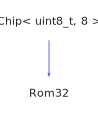

<h1>Rom32</h1>

<a href="https://github.com/CharlesCarley/HackComputer#~">~</a>
<a href="index.md#index">HackComputer</a>
/
<a href="namespaceHack.md#hack">Hack</a>
::
<a href="namespaceHack_1_1Chips.md#chips">Chips</a>
::
<b>Rom32</b>
 
 

<h4>Derived From</h4>

<a href="classHack_1_1Chips_1_1Chip.md#chip">Hack::Chips::Chip&lt; uint8_t, 8 &gt;</a>

 

<h2>Private Members</h2>
<a href="#_in" class="icon-list-item">_in
</a>

 
<a href="#_out" class="icon-list-item">_out
</a>

 
<a href="#_r" class="icon-list-item">_r
</a>

 
<a href="#_size" class="icon-list-item">_size
</a>

 

<h2>Private Methods</h2>
<a href="#evaluate" class="icon-list-item">evaluate
</a>

 
<a href="#isdirty" class="icon-list-item">isDirty
</a>

 

<h2>Public Methods</h2>
<a href="#rom32" class="icon-list-item">Rom32
</a>

 
<a href="#~rom32" class="icon-list-item">~Rom32
</a>

 
<a href="#get" class="icon-list-item">get
</a>

 
<a href="#getout" class="icon-list-item">getOut
</a>

 
<a href="#load" class="icon-list-item">load
</a>

 
<a href="#load" class="icon-list-item">load
</a>

 
<a href="#lock" class="icon-list-item">lock
</a>

 
<a href="#setin" class="icon-list-item">setIn
</a>

 
<a href="#size" class="icon-list-item">size
</a>

 

<h4>Defined in</h4>
<a href="https://github.com/CharlesCarley/HackComputer/blob/master/Source/Chips/Rom32.h#L28" class="icon-list-item">Rom32.h
</a>

 
<a href="#rom32" class="icon-list-item">top
</a>

<h2>_in</h2>
<b>uint16_t</b>
<b>_in</b>
 

<h4>Defined in</h4>
<a href="https://github.com/CharlesCarley/HackComputer/blob/master/Source/Chips/Rom32.h#L33" class="icon-list-item">Rom32.h
</a>

 
<a href="#rom32" class="icon-list-item">top
</a>

 

<h2>_out</h2>
<b>uint16_t</b>
<b>_out</b>
 

<h4>Defined in</h4>
<a href="https://github.com/CharlesCarley/HackComputer/blob/master/Source/Chips/Rom32.h#L33" class="icon-list-item">Rom32.h
</a>

 
<a href="#rom32" class="icon-list-item">top
</a>

 

<h2>_r</h2>
<b>uint16_t</b>
 *
<b>_r</b>
 

<h4>Defined in</h4>
<a href="https://github.com/CharlesCarley/HackComputer/blob/master/Source/Chips/Rom32.h#L34" class="icon-list-item">Rom32.h
</a>

 
<a href="#rom32" class="icon-list-item">top
</a>

 

<h2>_size</h2>
<b>uint16_t</b>
<b>_size</b>
 

<h4>Defined in</h4>
<a href="https://github.com/CharlesCarley/HackComputer/blob/master/Source/Chips/Rom32.h#L33" class="icon-list-item">Rom32.h
</a>

 
<a href="#rom32" class="icon-list-item">top
</a>

 

<h2>evaluate</h2>
void
<b>evaluate</b>
<i>(</i>
<i>)</i>

<h4>Defined in</h4>
<a href="https://github.com/CharlesCarley/HackComputer/blob/master/Source/Chips/Rom32.h#L30" class="icon-list-item">Rom32.h
</a>

 
<a href="https://github.com/CharlesCarley/HackComputer/blob/master/Source/Chips/Rom32.cpp#L84" class="icon-list-item">Rom32.cpp
</a>

 
<a href="#rom32" class="icon-list-item">top
</a>

 

<h2>isDirty</h2>
bool
<b>isDirty</b>
<i>(</i>
<i>)</i>

<h4>Defined in</h4>
<a href="https://github.com/CharlesCarley/HackComputer/blob/master/Source/Chips/Rom32.h#L31" class="icon-list-item">Rom32.h
</a>

 
<a href="https://github.com/CharlesCarley/HackComputer/blob/master/Source/Chips/Rom32.cpp#L79" class="icon-list-item">Rom32.cpp
</a>

 
<a href="#rom32" class="icon-list-item">top
</a>

 

<h2>Rom32</h2>
<b>Rom32</b>
<i>(</i>
<i>)</i>

<h4>References</h4>

<a href="classHack_1_1Chips_1_1Chip.md#_bits">_bits</a>

<a href="namespaceHack_1_1Chips.md#bit7">Bit7</a>

<h4>Defined in</h4>
<a href="https://github.com/CharlesCarley/HackComputer/blob/master/Source/Chips/Rom32.h#L37" class="icon-list-item">Rom32.h
</a>

 
<a href="https://github.com/CharlesCarley/HackComputer/blob/master/Source/Chips/Rom32.cpp#L28" class="icon-list-item">Rom32.cpp
</a>

 
<a href="#rom32" class="icon-list-item">top
</a>

 

<h2>~Rom32</h2>
<b>~Rom32</b>
<i>(</i>
<i>)</i>

<h4>Defined in</h4>
<a href="https://github.com/CharlesCarley/HackComputer/blob/master/Source/Chips/Rom32.h#L38" class="icon-list-item">Rom32.h
</a>

 
<a href="https://github.com/CharlesCarley/HackComputer/blob/master/Source/Chips/Rom32.cpp#L39" class="icon-list-item">Rom32.cpp
</a>

 
<a href="#rom32" class="icon-list-item">top
</a>

 

<h2>get</h2>
<b>uint16_t</b>
<b>get</b>
<i>(</i>

const int &amp;
i

<i>)</i>

<h4>Defined in</h4>
<a href="https://github.com/CharlesCarley/HackComputer/blob/master/Source/Chips/Rom32.h#L44" class="icon-list-item">Rom32.h
</a>

 
<a href="https://github.com/CharlesCarley/HackComputer/blob/master/Source/Chips/Rom32.cpp#L72" class="icon-list-item">Rom32.cpp
</a>

 
<a href="#rom32" class="icon-list-item">top
</a>

 

<h2>getOut</h2>
<b>uint16_t</b>
<b>getOut</b>
<i>(</i>
<i>)</i>

<h4>References</h4>

<a href="classHack_1_1Chips_1_1Chip.md#_bits">_bits</a>

<a href="namespaceHack_1_1Chips.md#bit7">Bit7</a>

<a href="namespaceHack_1_1Chips.md#bit6">Bit6</a>

<h4>Defined in</h4>
<a href="https://github.com/CharlesCarley/HackComputer/blob/master/Source/Chips/Rom32.h#L42" class="icon-list-item">Rom32.h
</a>

 
<a href="https://github.com/CharlesCarley/HackComputer/blob/master/Source/Chips/Rom32.cpp#L65" class="icon-list-item">Rom32.cpp
</a>

 
<a href="#rom32" class="icon-list-item">top
</a>

 

<h2>load</h2>
void
<b>load</b>
<i>(</i>

<a href="namespaceHack.md#string">String</a>
 &amp;
file

<i>)</i>

<h4>References</h4>

<a href="classHack_1_1Chips_1_1BitUtils.md#pack">pack</a>

<h4>Defined in</h4>
<a href="https://github.com/CharlesCarley/HackComputer/blob/master/Source/Chips/Rom32.h#L50" class="icon-list-item">Rom32.h
</a>

 
<a href="https://github.com/CharlesCarley/HackComputer/blob/master/Source/Chips/Rom32.cpp#L90" class="icon-list-item">Rom32.cpp
</a>

 
<a href="#rom32" class="icon-list-item">top
</a>

 

<h2>load</h2>
void
<b>load</b>
<i>(</i>

const 
<b>uint16_t</b>
 *
data

size_t
size

<i>)</i>

<h4>References</h4>

<a href="classHack_1_1Chips_1_1Rom32.md#size">size</a>

<h4>Defined in</h4>
<a href="https://github.com/CharlesCarley/HackComputer/blob/master/Source/Chips/Rom32.h#L52" class="icon-list-item">Rom32.h
</a>

 
<a href="https://github.com/CharlesCarley/HackComputer/blob/master/Source/Chips/Rom32.cpp#L104" class="icon-list-item">Rom32.cpp
</a>

 
<a href="#rom32" class="icon-list-item">top
</a>

 

<h2>lock</h2>
void
<b>lock</b>
<i>(</i>

bool
v

<i>)</i>

<h4>References</h4>

<a href="classHack_1_1Chips_1_1Chip.md#_bits">_bits</a>

<a href="namespaceHack_1_1Chips.md#bit6">Bit6</a>

<h4>Defined in</h4>
<a href="https://github.com/CharlesCarley/HackComputer/blob/master/Source/Chips/Rom32.h#L48" class="icon-list-item">Rom32.h
</a>

 
<a href="https://github.com/CharlesCarley/HackComputer/blob/master/Source/Chips/Rom32.cpp#L57" class="icon-list-item">Rom32.cpp
</a>

 
<a href="#rom32" class="icon-list-item">top
</a>

 

<h2>setIn</h2>
void
<b>setIn</b>
<i>(</i>

const 
<b>uint16_t</b>
 &amp;
v

<i>)</i>

<h4>References</h4>

<a href="classHack_1_1Chips_1_1Chip.md#_bits">_bits</a>

<a href="namespaceHack_1_1Chips.md#bit7">Bit7</a>

<h4>Defined in</h4>
<a href="https://github.com/CharlesCarley/HackComputer/blob/master/Source/Chips/Rom32.h#L40" class="icon-list-item">Rom32.h
</a>

 
<a href="https://github.com/CharlesCarley/HackComputer/blob/master/Source/Chips/Rom32.cpp#L45" class="icon-list-item">Rom32.cpp
</a>

 
<a href="#rom32" class="icon-list-item">top
</a>

 

<h2>size</h2>
<b>uint16_t</b>
<b>size</b>
<i>(</i>
<i>)</i>

<h4>Defined in</h4>
<a href="https://github.com/CharlesCarley/HackComputer/blob/master/Source/Chips/Rom32.h#L46" class="icon-list-item">Rom32.h
</a>

 
<a href="#rom32" class="icon-list-item">top
</a>

 

</body>
</html>
