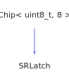

<h1>SRLatch</h1>

<a href="https://github.com/CharlesCarley/HackComputer#~">~</a>
<a href="index.md#index">HackComputer</a>
/
<a href="namespaceHack.md#hack">Hack</a>
::
<a href="namespaceHack_1_1Chips.md#chips">Chips</a>
::
<b>SRLatch</b>
 
 

<h4>Derived From</h4>

<a href="classHack_1_1Chips_1_1Chip.md#chip">Hack::Chips::Chip&lt; uint8_t, 8 &gt;</a>

 

<h2>Private Methods</h2>
<a href="#evaluate" class="icon-list-item">evaluate
</a>

 
<a href="#isdirty" class="icon-list-item">isDirty
</a>

 

<h2>Public Methods</h2>
<a href="#srlatch" class="icon-list-item">SRLatch
</a>

 
<a href="#getq" class="icon-list-item">getQ
</a>

 
<a href="#getqplus" class="icon-list-item">getQPlus
</a>

 
<a href="#setqn" class="icon-list-item">setQn
</a>

 
<a href="#setr" class="icon-list-item">setR
</a>

 
<a href="#sets" class="icon-list-item">setS
</a>

 

<h4>Defined in</h4>
<a href="https://github.com/CharlesCarley/HackComputer/blob/master/Source/Chips/SRLatch.h#L28" class="icon-list-item">SRLatch.h
</a>

 
<a href="#srlatch" class="icon-list-item">top
</a>

<h2>evaluate</h2>
void
<b>evaluate</b>
<i>(</i>
<i>)</i>

<h4>Defined in</h4>
<a href="https://github.com/CharlesCarley/HackComputer/blob/master/Source/Chips/SRLatch.h#L30" class="icon-list-item">SRLatch.h
</a>

 
<a href="https://github.com/CharlesCarley/HackComputer/blob/master/Source/Chips/SRLatch.cpp#L66" class="icon-list-item">SRLatch.cpp
</a>

 
<a href="#srlatch" class="icon-list-item">top
</a>

 

<h2>isDirty</h2>
bool
<b>isDirty</b>
<i>(</i>
<i>)</i>

<h4>Defined in</h4>
<a href="https://github.com/CharlesCarley/HackComputer/blob/master/Source/Chips/SRLatch.h#L32" class="icon-list-item">SRLatch.h
</a>

 
<a href="#srlatch" class="icon-list-item">top
</a>

 

<h2>SRLatch</h2>
<b>SRLatch</b>
<i>(</i>
<i>)</i>

<h4>References</h4>

<a href="classHack_1_1Chips_1_1Chip.md#assignbit">assignBit</a>

<a href="classHack_1_1Chips_1_1Chip.md#setbit">setBit</a>

<h4>Defined in</h4>
<a href="https://github.com/CharlesCarley/HackComputer/blob/master/Source/Chips/SRLatch.h#L38" class="icon-list-item">SRLatch.h
</a>

 
<a href="https://github.com/CharlesCarley/HackComputer/blob/master/Source/Chips/SRLatch.cpp#L28" class="icon-list-item">SRLatch.cpp
</a>

 
<a href="#srlatch" class="icon-list-item">top
</a>

 

<h2>getQ</h2>
bool
<b>getQ</b>
<i>(</i>
<i>)</i>

<h4>References</h4>

<a href="classHack_1_1Chips_1_1Chip.md#getbit">getBit</a>

<h4>Defined in</h4>
<a href="https://github.com/CharlesCarley/HackComputer/blob/master/Source/Chips/SRLatch.h#L44" class="icon-list-item">SRLatch.h
</a>

 
<a href="https://github.com/CharlesCarley/HackComputer/blob/master/Source/Chips/SRLatch.cpp#L52" class="icon-list-item">SRLatch.cpp
</a>

 
<a href="#srlatch" class="icon-list-item">top
</a>

 

<h2>getQPlus</h2>
bool
<b>getQPlus</b>
<i>(</i>
<i>)</i>

<h4>References</h4>

<a href="classHack_1_1Chips_1_1Chip.md#getbit">getBit</a>

<h4>Defined in</h4>
<a href="https://github.com/CharlesCarley/HackComputer/blob/master/Source/Chips/SRLatch.h#L45" class="icon-list-item">SRLatch.h
</a>

 
<a href="https://github.com/CharlesCarley/HackComputer/blob/master/Source/Chips/SRLatch.cpp#L59" class="icon-list-item">SRLatch.cpp
</a>

 
<a href="#srlatch" class="icon-list-item">top
</a>

 

<h2>setQn</h2>
void
<b>setQn</b>
<i>(</i>

bool
v

<i>)</i>

<h4>References</h4>

<a href="classHack_1_1Chips_1_1Chip.md#setbit">setBit</a>

<h4>Defined in</h4>
<a href="https://github.com/CharlesCarley/HackComputer/blob/master/Source/Chips/SRLatch.h#L42" class="icon-list-item">SRLatch.h
</a>

 
<a href="https://github.com/CharlesCarley/HackComputer/blob/master/Source/Chips/SRLatch.cpp#L46" class="icon-list-item">SRLatch.cpp
</a>

 
<a href="#srlatch" class="icon-list-item">top
</a>

 

<h2>setR</h2>
void
<b>setR</b>
<i>(</i>

bool
v

<i>)</i>

<h4>References</h4>

<a href="classHack_1_1Chips_1_1Chip.md#applybit">applyBit</a>

<a href="classHack_1_1Chips_1_1Chip.md#setbit">setBit</a>

<h4>Defined in</h4>
<a href="https://github.com/CharlesCarley/HackComputer/blob/master/Source/Chips/SRLatch.h#L41" class="icon-list-item">SRLatch.h
</a>

 
<a href="https://github.com/CharlesCarley/HackComputer/blob/master/Source/Chips/SRLatch.cpp#L40" class="icon-list-item">SRLatch.cpp
</a>

 
<a href="#srlatch" class="icon-list-item">top
</a>

 

<h2>setS</h2>
void
<b>setS</b>
<i>(</i>

bool
v

<i>)</i>

<h4>References</h4>

<a href="classHack_1_1Chips_1_1Chip.md#applybit">applyBit</a>

<a href="classHack_1_1Chips_1_1Chip.md#setbit">setBit</a>

<h4>Defined in</h4>
<a href="https://github.com/CharlesCarley/HackComputer/blob/master/Source/Chips/SRLatch.h#L40" class="icon-list-item">SRLatch.h
</a>

 
<a href="https://github.com/CharlesCarley/HackComputer/blob/master/Source/Chips/SRLatch.cpp#L34" class="icon-list-item">SRLatch.cpp
</a>

 
<a href="#srlatch" class="icon-list-item">top
</a>

 

</body>
</html>
