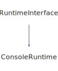

<h1>ConsoleRuntime</h1>

<a href="https://github.com/CharlesCarley/HackComputer#~">~</a>
<a href="index.md#index">HackComputer</a>
/
<a href="namespaceHack.md#hack">Hack</a>
::
<a href="namespaceHack_1_1Computer.md#computer">Computer</a>
::
<b>ConsoleRuntime</b>
 
 

<h4>Derived From</h4>

<a href="classHack_1_1Computer_1_1RuntimeInterface.md#runtimeinterface">Hack::Computer::RuntimeInterface</a>

 

<h2>Private Members</h2>
<a href="#_private" class="icon-list-item">_private
</a>

 

<h2>Public Methods</h2>
<a href="#consoleruntime" class="icon-list-item">ConsoleRuntime
</a>

 
<a href="#~consoleruntime" class="icon-list-item">~ConsoleRuntime
</a>

 
<a href="#exitrequest" class="icon-list-item">exitRequest
</a>

 
<a href="#flushmemory" class="icon-list-item">flushMemory
</a>

 
<a href="#initialize" class="icon-list-item">initialize
</a>

 
<a href="#processevents" class="icon-list-item">processEvents
</a>

 
<a href="#shouldupdate" class="icon-list-item">shouldUpdate
</a>

 
<a href="#update" class="icon-list-item">update
</a>

 

<h4>Defined in</h4>
<a href="https://github.com/CharlesCarley/HackComputer/blob/master/Source/Computer/ConsoleRuntime.h#L31" class="icon-list-item">ConsoleRuntime.h
</a>

 
<a href="#consoleruntime" class="icon-list-item">top
</a>

<h2>_private</h2>
<a href="classHack_1_1Computer_1_1ConsoleRuntimePrivate.md#consoleruntimeprivate">ConsoleRuntimePrivate</a>
 *
<b>_private</b>
 

<h4>Defined in</h4>
<a href="https://github.com/CharlesCarley/HackComputer/blob/master/Source/Computer/ConsoleRuntime.h#L33" class="icon-list-item">ConsoleRuntime.h
</a>

 
<a href="#consoleruntime" class="icon-list-item">top
</a>

 

<h2>ConsoleRuntime</h2>
<b>ConsoleRuntime</b>
<i>(</i>
<i>)</i>

<h4>Defined in</h4>
<a href="https://github.com/CharlesCarley/HackComputer/blob/master/Source/Computer/ConsoleRuntime.h#L36" class="icon-list-item">ConsoleRuntime.h
</a>

 
<a href="https://github.com/CharlesCarley/HackComputer/blob/master/Source/Computer/ConsoleRuntime.cpp#L30" class="icon-list-item">ConsoleRuntime.cpp
</a>

 
<a href="#consoleruntime" class="icon-list-item">top
</a>

 

<h2>~ConsoleRuntime</h2>
<b>~ConsoleRuntime</b>
<i>(</i>
<i>)</i>

<h4>Defined in</h4>
<a href="https://github.com/CharlesCarley/HackComputer/blob/master/Source/Computer/ConsoleRuntime.h#L38" class="icon-list-item">ConsoleRuntime.h
</a>

 
<a href="https://github.com/CharlesCarley/HackComputer/blob/master/Source/Computer/ConsoleRuntime.cpp#L35" class="icon-list-item">ConsoleRuntime.cpp
</a>

 
<a href="#consoleruntime" class="icon-list-item">top
</a>

 

<h2>exitRequest</h2>
bool
<b>exitRequest</b>
<i>(</i>
<i>)</i>

<h4>References</h4>

<a href="classHack_1_1Computer_1_1ConsoleRuntimePrivate.md#input">input</a>

<a href="namespaceHack_1_1Ui.md#pr_exit">PR_EXIT</a>

<h4>Defined in</h4>
<a href="https://github.com/CharlesCarley/HackComputer/blob/master/Source/Computer/ConsoleRuntime.h#L44" class="icon-list-item">ConsoleRuntime.h
</a>

 
<a href="https://github.com/CharlesCarley/HackComputer/blob/master/Source/Computer/ConsoleRuntime.cpp#L52" class="icon-list-item">ConsoleRuntime.cpp
</a>

 
<a href="#consoleruntime" class="icon-list-item">top
</a>

 

<h2>flushMemory</h2>
void
<b>flushMemory</b>
<i>(</i>

<a href="classHack_1_1Chips_1_1Computer.md#computer">Chips::Computer</a>
 *
computer

<i>)</i>

<h4>Defined in</h4>
<a href="https://github.com/CharlesCarley/HackComputer/blob/master/Source/Computer/ConsoleRuntime.h#L48" class="icon-list-item">ConsoleRuntime.h
</a>

 
<a href="https://github.com/CharlesCarley/HackComputer/blob/master/Source/Computer/ConsoleRuntime.cpp#L62" class="icon-list-item">ConsoleRuntime.cpp
</a>

 
<a href="#consoleruntime" class="icon-list-item">top
</a>

 

<h2>initialize</h2>
void
<b>initialize</b>
<i>(</i>

<a href="classHack_1_1Chips_1_1Computer.md#computer">Chips::Computer</a>
 *
computer

<a href="namespaceHack_1_1Chips.md#screen">Chips::Screen</a>
 *

<i>)</i>

<h4>References</h4>

<a href="classHack_1_1Computer_1_1ConsoleRuntimePrivate.md#initialize">initialize</a>

<h4>Defined in</h4>
<a href="https://github.com/CharlesCarley/HackComputer/blob/master/Source/Computer/ConsoleRuntime.h#L42" class="icon-list-item">ConsoleRuntime.h
</a>

 
<a href="https://github.com/CharlesCarley/HackComputer/blob/master/Source/Computer/ConsoleRuntime.cpp#L46" class="icon-list-item">ConsoleRuntime.cpp
</a>

 
<a href="#consoleruntime" class="icon-list-item">top
</a>

 

<h2>processEvents</h2>
void
<b>processEvents</b>
<i>(</i>

<a href="classHack_1_1Chips_1_1Computer.md#computer">Chips::Computer</a>
 *
computer

<i>)</i>

<h4>References</h4>

<a href="classHack_1_1Computer_1_1ConsoleRuntimePrivate.md#processevents">processEvents</a>

<h4>Defined in</h4>
<a href="https://github.com/CharlesCarley/HackComputer/blob/master/Source/Computer/ConsoleRuntime.h#L46" class="icon-list-item">ConsoleRuntime.h
</a>

 
<a href="https://github.com/CharlesCarley/HackComputer/blob/master/Source/Computer/ConsoleRuntime.cpp#L57" class="icon-list-item">ConsoleRuntime.cpp
</a>

 
<a href="#consoleruntime" class="icon-list-item">top
</a>

 

<h2>shouldUpdate</h2>
bool
<b>shouldUpdate</b>
<i>(</i>
<i>)</i>

<h4>Defined in</h4>
<a href="https://github.com/CharlesCarley/HackComputer/blob/master/Source/Computer/ConsoleRuntime.h#L40" class="icon-list-item">ConsoleRuntime.h
</a>

 
<a href="https://github.com/CharlesCarley/HackComputer/blob/master/Source/Computer/ConsoleRuntime.cpp#L41" class="icon-list-item">ConsoleRuntime.cpp
</a>

 
<a href="#consoleruntime" class="icon-list-item">top
</a>

 

<h2>update</h2>
void
<b>update</b>
<i>(</i>

<a href="classHack_1_1Chips_1_1Computer.md#computer">Chips::Computer</a>
 *
computer

<i>)</i>

<h4>References</h4>

<a href="classHack_1_1Computer_1_1RuntimeInterface.md#getrate">getRate</a>

<a href="classHack_1_1Chips_1_1Computer.md#update">update</a>

<a href="classHack_1_1Computer_1_1ConsoleRuntimePrivate.md#update">update</a>

<h4>Defined in</h4>
<a href="https://github.com/CharlesCarley/HackComputer/blob/master/Source/Computer/ConsoleRuntime.h#L50" class="icon-list-item">ConsoleRuntime.h
</a>

 
<a href="https://github.com/CharlesCarley/HackComputer/blob/master/Source/Computer/ConsoleRuntime.cpp#L66" class="icon-list-item">ConsoleRuntime.cpp
</a>

 
<a href="#consoleruntime" class="icon-list-item">top
</a>

 

</body>
</html>
