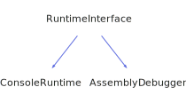

<h1>RuntimeInterface</h1>

<a href="https://github.com/CharlesCarley/HackComputer#~">~</a>
<a href="index.md#index">HackComputer</a>
/
<a href="namespaceHack.md#hack">Hack</a>
::
<a href="namespaceHack_1_1Computer.md#computer">Computer</a>
::
<b>RuntimeInterface</b>
 
 

<h4>Derived By</h4>

<a href="classHack_1_1Computer_1_1AssemblyDebugger.md#assemblydebugger">Hack::Computer::AssemblyDebugger</a>

<a href="classHack_1_1Computer_1_1ConsoleRuntime.md#consoleruntime">Hack::Computer::ConsoleRuntime</a>

 

<h2>Public Methods</h2>
<a href="#~runtimeinterface" class="icon-list-item">~RuntimeInterface
</a>

 
<a href="#exitrequest" class="icon-list-item">exitRequest
</a>

 
<a href="#flushmemory" class="icon-list-item">flushMemory
</a>

 
<a href="#getrate" class="icon-list-item">getRate
</a>

 
<a href="#initialize" class="icon-list-item">initialize
</a>

 
<a href="#processevents" class="icon-list-item">processEvents
</a>

 
<a href="#setinstructions" class="icon-list-item">setInstructions
</a>

 
<a href="#setrate" class="icon-list-item">setRate
</a>

 
<a href="#shouldupdate" class="icon-list-item">shouldUpdate
</a>

 
<a href="#update" class="icon-list-item">update
</a>

 

<h4>Defined in</h4>
<a href="https://github.com/CharlesCarley/HackComputer/blob/master/Source/Computer/RuntimeInterface.h#L30" class="icon-list-item">RuntimeInterface.h
</a>

 
<a href="#runtimeinterface" class="icon-list-item">top
</a>

<h2>~RuntimeInterface</h2>
<b>~RuntimeInterface</b>
<i>(</i>
<i>)</i>

<h4>Defined in</h4>
<a href="https://github.com/CharlesCarley/HackComputer/blob/master/Source/Computer/RuntimeInterface.h#L32" class="icon-list-item">RuntimeInterface.h
</a>

 
<a href="#runtimeinterface" class="icon-list-item">top
</a>

 

<h2>exitRequest</h2>
bool
<b>exitRequest</b>
<i>(</i>
<i>)</i>

<h4>Defined in</h4>
<a href="https://github.com/CharlesCarley/HackComputer/blob/master/Source/Computer/RuntimeInterface.h#L42" class="icon-list-item">RuntimeInterface.h
</a>

 
<a href="#runtimeinterface" class="icon-list-item">top
</a>

 

<h2>flushMemory</h2>
void
<b>flushMemory</b>
<i>(</i>

<a href="classHack_1_1Chips_1_1Computer.md#computer">Chips::Computer</a>
 *
computer

<i>)</i>

<h4>Defined in</h4>
<a href="https://github.com/CharlesCarley/HackComputer/blob/master/Source/Computer/RuntimeInterface.h#L46" class="icon-list-item">RuntimeInterface.h
</a>

 
<a href="#runtimeinterface" class="icon-list-item">top
</a>

 

<h2>getRate</h2>
int16_t
<b>getRate</b>
<i>(</i>
<i>)</i>

<h4>Defined in</h4>
<a href="https://github.com/CharlesCarley/HackComputer/blob/master/Source/Computer/RuntimeInterface.h#L36" class="icon-list-item">RuntimeInterface.h
</a>

 
<a href="#runtimeinterface" class="icon-list-item">top
</a>

 

<h2>initialize</h2>
void
<b>initialize</b>
<i>(</i>

<a href="classHack_1_1Chips_1_1Computer.md#computer">Chips::Computer</a>
 *
computer

<a href="namespaceHack_1_1Chips.md#screen">Chips::Screen</a>
 *
screen

<i>)</i>

<h4>Defined in</h4>
<a href="https://github.com/CharlesCarley/HackComputer/blob/master/Source/Computer/RuntimeInterface.h#L40" class="icon-list-item">RuntimeInterface.h
</a>

 
<a href="#runtimeinterface" class="icon-list-item">top
</a>

 

<h2>processEvents</h2>
void
<b>processEvents</b>
<i>(</i>

<a href="classHack_1_1Chips_1_1Computer.md#computer">Chips::Computer</a>
 *
computer

<i>)</i>

<h4>Defined in</h4>
<a href="https://github.com/CharlesCarley/HackComputer/blob/master/Source/Computer/RuntimeInterface.h#L44" class="icon-list-item">RuntimeInterface.h
</a>

 
<a href="#runtimeinterface" class="icon-list-item">top
</a>

 

<h2>setInstructions</h2>
void
<b>setInstructions</b>
<i>(</i>

const 
<a href="classHack_1_1Assembler_1_1Parser.md#instructions">Assembler::Parser::Instructions</a>
 &amp;
is

<i>)</i>

<h4>Defined in</h4>
<a href="https://github.com/CharlesCarley/HackComputer/blob/master/Source/Computer/RuntimeInterface.h#L50" class="icon-list-item">RuntimeInterface.h
</a>

 
<a href="#runtimeinterface" class="icon-list-item">top
</a>

 

<h2>setRate</h2>
void
<b>setRate</b>
<i>(</i>

int16_t
v

<i>)</i>

<h4>Defined in</h4>
<a href="https://github.com/CharlesCarley/HackComputer/blob/master/Source/Computer/RuntimeInterface.h#L38" class="icon-list-item">RuntimeInterface.h
</a>

 
<a href="#runtimeinterface" class="icon-list-item">top
</a>

 

<h2>shouldUpdate</h2>
bool
<b>shouldUpdate</b>
<i>(</i>
<i>)</i>

<h4>Defined in</h4>
<a href="https://github.com/CharlesCarley/HackComputer/blob/master/Source/Computer/RuntimeInterface.h#L34" class="icon-list-item">RuntimeInterface.h
</a>

 
<a href="#runtimeinterface" class="icon-list-item">top
</a>

 

<h2>update</h2>
void
<b>update</b>
<i>(</i>

<a href="classHack_1_1Chips_1_1Computer.md#computer">Chips::Computer</a>
 *
computer

<i>)</i>

<h4>Defined in</h4>
<a href="https://github.com/CharlesCarley/HackComputer/blob/master/Source/Computer/RuntimeInterface.h#L48" class="icon-list-item">RuntimeInterface.h
</a>

 
<a href="#runtimeinterface" class="icon-list-item">top
</a>

 

</body>
</html>
