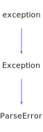

<h1>ParseError</h1>

<a href="https://github.com/CharlesCarley/HackComputer#~">~</a>
<a href="index.md#index">HackComputer</a>
/
<a href="namespaceHack.md#hack">Hack</a>
::
<b>ParseError</b>
 
 

<h4>Derived From</h4>

<a href="classHack_1_1Exception.md#exception">Hack::Exception</a>

 

<h2>Public Methods</h2>
<a href="#parseerror" class="icon-list-item">ParseError
</a>

 
<a href="#parseerror" class="icon-list-item">ParseError
</a>

 
<a href="#parseerror" class="icon-list-item">ParseError
</a>

 

<h2>Private Static Methods</h2>
<a href="#geterror" class="icon-list-item">getError
</a>

 

<h4>Defined in</h4>
<a href="https://github.com/CharlesCarley/HackComputer/blob/master/Source/Utils/ParserBase/ParseError.h#L28" class="icon-list-item">ParseError.h
</a>

 
<a href="#parseerror" class="icon-list-item">top
</a>

<h2>ParseError</h2>
<b>ParseError</b>
<i>(</i>
<i>)</i>

<h4>Defined in</h4>
<a href="https://github.com/CharlesCarley/HackComputer/blob/master/Source/Utils/ParserBase/ParseError.h#L30" class="icon-list-item">ParseError.h
</a>

 
<a href="#parseerror" class="icon-list-item">top
</a>

 

<h2>ParseError</h2>
<b>ParseError</b>
<i>(</i>

const 
<a href="namespaceHack.md#string">String</a>
 &amp;
message

<i>)</i>

<h4>Defined in</h4>
<a href="https://github.com/CharlesCarley/HackComputer/blob/master/Source/Utils/ParserBase/ParseError.h#L35" class="icon-list-item">ParseError.h
</a>

 
<a href="#parseerror" class="icon-list-item">top
</a>

 

<h2>ParseError</h2>
<b>ParseError</b>
<i>(</i>

const int
stage

const 
<a href="namespaceHack.md#string">String</a>
 &amp;
file

const size_t
line

const 
<a href="namespaceHack.md#string">String</a>
 &amp;
message

<i>)</i>

<h4>Defined in</h4>
<a href="https://github.com/CharlesCarley/HackComputer/blob/master/Source/Utils/ParserBase/ParseError.h#L40" class="icon-list-item">ParseError.h
</a>

 
<a href="#parseerror" class="icon-list-item">top
</a>

 

<h2>getError</h2>
<a href="namespaceHack.md#string">String</a>
<b>getError</b>
<i>(</i>

int
stage

const 
<a href="namespaceHack.md#string">String</a>
 &amp;
file

const size_t &amp;
line

const 
<a href="namespaceHack.md#string">String</a>
 &amp;
message
 = 
&quot;&quot;

<i>)</i>

<h4>Defined in</h4>
<a href="https://github.com/CharlesCarley/HackComputer/blob/master/Source/Utils/ParserBase/ParseError.h#L49" class="icon-list-item">ParseError.h
</a>

 
<a href="https://github.com/CharlesCarley/HackComputer/blob/master/Source/Utils/ParserBase/ParseError.cpp#L26" class="icon-list-item">ParseError.cpp
</a>

 
<a href="#parseerror" class="icon-list-item">top
</a>

 

</body>
</html>
