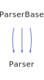

<h1>ParserBase</h1>

<a href="https://github.com/CharlesCarley/HackComputer#~">~</a>
<a href="index.md#index">HackComputer</a>
/
<a href="namespaceHack.md#hack">Hack</a>
::
<b>ParserBase</b>
 
 

<h4>Derived By</h4>

<a href="classHack_1_1Assembler_1_1Parser.md#parser">Hack::Assembler::Parser</a>

<a href="classHack_1_1Compiler_1_1Analyzer_1_1Parser.md#parser">Hack::Compiler::Analyzer::Parser</a>

<a href="classHack_1_1VirtualMachine_1_1Parser.md#parser">Hack::VirtualMachine::Parser</a>

 

<h2>Public Typedefs</h2>
<a href="#tokens" class="icon-list-item">Tokens
</a>

 

<h2>Protected Members</h2>
<a href="#_cursor" class="icon-list-item">_cursor
</a>

 
<a href="#_file" class="icon-list-item">_file
</a>

 
<a href="#_filepath" class="icon-list-item">_filePath
</a>

 
<a href="#_scanner" class="icon-list-item">_scanner
</a>

 
<a href="#_tokens" class="icon-list-item">_tokens
</a>

 

<h2>Protected Methods</h2>
<a href="#advancecursor" class="icon-list-item">advanceCursor
</a>

 
<a href="#gettoken" class="icon-list-item">getToken
</a>

 
<a href="#parseerror" class="icon-list-item">parseError
</a>

 
<a href="#parseimpl" class="icon-list-item">parseImpl
</a>

 
<a href="#readtoken" class="icon-list-item">readToken
</a>

 
<a href="#writeimpl" class="icon-list-item">writeImpl
</a>

 

<h2>Private Methods</h2>
<a href="#parseerrorthrow" class="icon-list-item">parseErrorThrow
</a>

 

<h2>Public Methods</h2>
<a href="#parserbase" class="icon-list-item">ParserBase
</a>

 
<a href="#~parserbase" class="icon-list-item">~ParserBase
</a>

 
<a href="#filename" class="icon-list-item">filename
</a>

 
<a href="#line" class="icon-list-item">line
</a>

 
<a href="#parse" class="icon-list-item">parse
</a>

 
<a href="#parse" class="icon-list-item">parse
</a>

 
<a href="#write" class="icon-list-item">write
</a>

 
<a href="#write" class="icon-list-item">write
</a>

 

<h4>Defined in</h4>
<a href="https://github.com/CharlesCarley/HackComputer/blob/master/Source/Utils/ParserBase/ParserBase.h#L33" class="icon-list-item">ParserBase.h
</a>

 
<a href="#parserbase" class="icon-list-item">top
</a>

<h2>Tokens</h2>
std::vector&lt; 
<a href="classHack_1_1TokenBase.md#tokenbase">TokenBase</a>
 &gt;
<b>Tokens</b>
 

<h4>Defined in</h4>
<a href="https://github.com/CharlesCarley/HackComputer/blob/master/Source/Utils/ParserBase/ParserBase.h#L35" class="icon-list-item">ParserBase.h
</a>

 
<a href="#parserbase" class="icon-list-item">top
</a>

 

<h2>_cursor</h2>
int32_t
<b>_cursor</b>
 

<h4>Defined in</h4>
<a href="https://github.com/CharlesCarley/HackComputer/blob/master/Source/Utils/ParserBase/ParserBase.h#L39" class="icon-list-item">ParserBase.h
</a>

 
<a href="#parserbase" class="icon-list-item">top
</a>

 

<h2>_file</h2>
<a href="namespaceHack.md#string">String</a>
<b>_file</b>
 

<h4>Defined in</h4>
<a href="https://github.com/CharlesCarley/HackComputer/blob/master/Source/Utils/ParserBase/ParserBase.h#L41" class="icon-list-item">ParserBase.h
</a>

 
<a href="#parserbase" class="icon-list-item">top
</a>

 

<h2>_filePath</h2>
<a href="namespaceHack.md#string">String</a>
<b>_filePath</b>
 

<h4>Defined in</h4>
<a href="https://github.com/CharlesCarley/HackComputer/blob/master/Source/Utils/ParserBase/ParserBase.h#L42" class="icon-list-item">ParserBase.h
</a>

 
<a href="#parserbase" class="icon-list-item">top
</a>

 

<h2>_scanner</h2>
<a href="classHack_1_1ScannerBase.md#scannerbase">ScannerBase</a>
 *
<b>_scanner</b>
 

<h4>Defined in</h4>
<a href="https://github.com/CharlesCarley/HackComputer/blob/master/Source/Utils/ParserBase/ParserBase.h#L40" class="icon-list-item">ParserBase.h
</a>

 
<a href="#parserbase" class="icon-list-item">top
</a>

 

<h2>_tokens</h2>
<a href="classHack_1_1ParserBase.md#tokens">Tokens</a>
<b>_tokens</b>
 

<h4>Defined in</h4>
<a href="https://github.com/CharlesCarley/HackComputer/blob/master/Source/Utils/ParserBase/ParserBase.h#L38" class="icon-list-item">ParserBase.h
</a>

 
<a href="#parserbase" class="icon-list-item">top
</a>

 

<h2>advanceCursor</h2>
void
<b>advanceCursor</b>
<i>(</i>

int32_t
n
 = 
1

<i>)</i>

<h4>References</h4>

<a href="classHack_1_1ParserBase.md#_cursor">_cursor</a>

<h4>Defined in</h4>
<a href="https://github.com/CharlesCarley/HackComputer/blob/master/Source/Utils/ParserBase/ParserBase.h#L50" class="icon-list-item">ParserBase.h
</a>

 
<a href="https://github.com/CharlesCarley/HackComputer/blob/master/Source/Utils/ParserBase/ParserBase.cpp#L66" class="icon-list-item">ParserBase.cpp
</a>

 
<a href="#parserbase" class="icon-list-item">top
</a>

 

<h2>getToken</h2>
<a href="classHack_1_1TokenBase.md#tokenbase">TokenBase</a>
<b>getToken</b>
<i>(</i>

int32_t
offs

<i>)</i>

<h4>References</h4>

<a href="classHack_1_1ParserBase.md#_cursor">_cursor</a>

<a href="classHack_1_1ParserBase.md#_tokens">_tokens</a>

<a href="classHack_1_1ParserBase.md#readtoken">readToken</a>

<a href="classHack_1_1ParserBase.md#parseerror">parseError</a>

<h4>Defined in</h4>
<a href="https://github.com/CharlesCarley/HackComputer/blob/master/Source/Utils/ParserBase/ParserBase.h#L48" class="icon-list-item">ParserBase.h
</a>

 
<a href="https://github.com/CharlesCarley/HackComputer/blob/master/Source/Utils/ParserBase/ParserBase.cpp#L53" class="icon-list-item">ParserBase.cpp
</a>

 
<a href="#parserbase" class="icon-list-item">top
</a>

 

<h2>parseError</h2>
void
<b>parseError</b>
<i>(</i>

const 
<a href="namespaceHack.md#string">String</a>
 &amp;
what

Args &amp;&amp;...
args

<i>)</i>

<h4>Defined in</h4>
<a href="https://github.com/CharlesCarley/HackComputer/blob/master/Source/Utils/ParserBase/ParserBase.h#L55" class="icon-list-item">ParserBase.h
</a>

 
<a href="#parserbase" class="icon-list-item">top
</a>

 

<h2>parseImpl</h2>
void
<b>parseImpl</b>
<i>(</i>

<a href="namespaceHack.md#istream">IStream</a>
 &amp;
is

<i>)</i>

<h4>Defined in</h4>
<a href="https://github.com/CharlesCarley/HackComputer/blob/master/Source/Utils/ParserBase/ParserBase.h#L44" class="icon-list-item">ParserBase.h
</a>

 
<a href="#parserbase" class="icon-list-item">top
</a>

 

<h2>readToken</h2>
void
<b>readToken</b>
<i>(</i>

int32_t
n
 = 
1

<i>)</i>

<h4>References</h4>

<a href="classHack_1_1ParserBase.md#_scanner">_scanner</a>

<a href="classHack_1_1ScannerBase.md#scan">scan</a>

<a href="classHack_1_1ParserBase.md#_tokens">_tokens</a>

<h4>Defined in</h4>
<a href="https://github.com/CharlesCarley/HackComputer/blob/master/Source/Utils/ParserBase/ParserBase.h#L52" class="icon-list-item">ParserBase.h
</a>

 
<a href="https://github.com/CharlesCarley/HackComputer/blob/master/Source/Utils/ParserBase/ParserBase.cpp#L41" class="icon-list-item">ParserBase.cpp
</a>

 
<a href="#parserbase" class="icon-list-item">top
</a>

 

<h2>writeImpl</h2>
void
<b>writeImpl</b>
<i>(</i>

<a href="namespaceHack.md#ostream">OStream</a>
 &amp;
is

int
format
 = 
0

<i>)</i>

<h4>Defined in</h4>
<a href="https://github.com/CharlesCarley/HackComputer/blob/master/Source/Utils/ParserBase/ParserBase.h#L46" class="icon-list-item">ParserBase.h
</a>

 
<a href="#parserbase" class="icon-list-item">top
</a>

 

<h2>parseErrorThrow</h2>
void
<b>parseErrorThrow</b>
<i>(</i>

const 
<a href="namespaceHack.md#string">String</a>
 &amp;
message

<i>)</i>

<h4>Defined in</h4>
<a href="https://github.com/CharlesCarley/HackComputer/blob/master/Source/Utils/ParserBase/ParserBase.h#L64" class="icon-list-item">ParserBase.h
</a>

 
<a href="https://github.com/CharlesCarley/HackComputer/blob/master/Source/Utils/ParserBase/ParserBase.cpp#L71" class="icon-list-item">ParserBase.cpp
</a>

 
<a href="#parserbase" class="icon-list-item">top
</a>

 

<h2>ParserBase</h2>
<b>ParserBase</b>
<i>(</i>
<i>)</i>

<h4>Defined in</h4>
<a href="https://github.com/CharlesCarley/HackComputer/blob/master/Source/Utils/ParserBase/ParserBase.h#L67" class="icon-list-item">ParserBase.h
</a>

 
<a href="https://github.com/CharlesCarley/HackComputer/blob/master/Source/Utils/ParserBase/ParserBase.cpp#L33" class="icon-list-item">ParserBase.cpp
</a>

 
<a href="#parserbase" class="icon-list-item">top
</a>

 

<h2>~ParserBase</h2>
<b>~ParserBase</b>
<i>(</i>
<i>)</i>

<h4>Defined in</h4>
<a href="https://github.com/CharlesCarley/HackComputer/blob/master/Source/Utils/ParserBase/ParserBase.h#L68" class="icon-list-item">ParserBase.h
</a>

 
<a href="#parserbase" class="icon-list-item">top
</a>

 

<h2>filename</h2>
const 
<a href="namespaceHack.md#string">String</a>
 &amp;
<b>filename</b>
<i>(</i>
<i>)</i>

<h4>References</h4>

<a href="classHack_1_1ParserBase.md#_filepath">_filePath</a>

<h4>Defined in</h4>
<a href="https://github.com/CharlesCarley/HackComputer/blob/master/Source/Utils/ParserBase/ParserBase.h#L78" class="icon-list-item">ParserBase.h
</a>

 
<a href="#parserbase" class="icon-list-item">top
</a>

 

<h2>line</h2>
size_t
<b>line</b>
<i>(</i>
<i>)</i>

<h4>References</h4>

<a href="classHack_1_1ParserBase.md#_scanner">_scanner</a>

<a href="classHack_1_1ScannerBase.md#line">line</a>

<h4>Defined in</h4>
<a href="https://github.com/CharlesCarley/HackComputer/blob/master/Source/Utils/ParserBase/ParserBase.h#L80" class="icon-list-item">ParserBase.h
</a>

 
<a href="#parserbase" class="icon-list-item">top
</a>

 

<h2>parse</h2>
void
<b>parse</b>
<i>(</i>

const 
<a href="namespaceHack.md#string">String</a>
 &amp;
file

<i>)</i>

<h4>References</h4>

<a href="classHack_1_1ParserBase.md#_file">_file</a>

<a href="classHack_1_1ParserBase.md#_filepath">_filePath</a>

<a href="classHack_1_1ParserBase.md#parseimpl">parseImpl</a>

<h4>Defined in</h4>
<a href="https://github.com/CharlesCarley/HackComputer/blob/master/Source/Utils/ParserBase/ParserBase.h#L70" class="icon-list-item">ParserBase.h
</a>

 
<a href="https://github.com/CharlesCarley/HackComputer/blob/master/Source/Utils/ParserBase/ParserBase.cpp#L76" class="icon-list-item">ParserBase.cpp
</a>

 
<a href="#parserbase" class="icon-list-item">top
</a>

 

<h2>parse</h2>
void
<b>parse</b>
<i>(</i>

<a href="namespaceHack.md#istream">IStream</a>
 &amp;
is

const 
<a href="namespaceHack.md#string">String</a>
 &amp;
file
 = 
&quot;&quot;

<i>)</i>

<h4>References</h4>

<a href="classHack_1_1StringUtils.md#scramble">scramble</a>

<a href="classHack_1_1ParserBase.md#_file">_file</a>

<a href="namespaceHack.md#stringcombine">StringCombine</a>

<a href="classHack_1_1ParserBase.md#_filepath">_filePath</a>

<a href="classHack_1_1ParserBase.md#parseimpl">parseImpl</a>

<h4>Defined in</h4>
<a href="https://github.com/CharlesCarley/HackComputer/blob/master/Source/Utils/ParserBase/ParserBase.h#L72" class="icon-list-item">ParserBase.h
</a>

 
<a href="https://github.com/CharlesCarley/HackComputer/blob/master/Source/Utils/ParserBase/ParserBase.cpp#L91" class="icon-list-item">ParserBase.cpp
</a>

 
<a href="#parserbase" class="icon-list-item">top
</a>

 

<h2>write</h2>
void
<b>write</b>
<i>(</i>

const 
<a href="namespaceHack.md#string">String</a>
 &amp;
file

int
format
 = 
0

<i>)</i>

<h4>References</h4>

<a href="classHack_1_1ParserBase.md#writeimpl">writeImpl</a>

<h4>Defined in</h4>
<a href="https://github.com/CharlesCarley/HackComputer/blob/master/Source/Utils/ParserBase/ParserBase.h#L74" class="icon-list-item">ParserBase.h
</a>

 
<a href="https://github.com/CharlesCarley/HackComputer/blob/master/Source/Utils/ParserBase/ParserBase.cpp#L107" class="icon-list-item">ParserBase.cpp
</a>

 
<a href="#parserbase" class="icon-list-item">top
</a>

 

<h2>write</h2>
void
<b>write</b>
<i>(</i>

<a href="namespaceHack.md#ostream">OStream</a>
 &amp;
os

int
format
 = 
0

<i>)</i>

<h4>References</h4>

<a href="classHack_1_1ParserBase.md#writeimpl">writeImpl</a>

<h4>Defined in</h4>
<a href="https://github.com/CharlesCarley/HackComputer/blob/master/Source/Utils/ParserBase/ParserBase.h#L76" class="icon-list-item">ParserBase.h
</a>

 
<a href="https://github.com/CharlesCarley/HackComputer/blob/master/Source/Utils/ParserBase/ParserBase.cpp#L116" class="icon-list-item">ParserBase.cpp
</a>

 
<a href="#parserbase" class="icon-list-item">top
</a>

 

</body>
</html>
