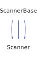

<h1>ScannerBase</h1>

<a href="https://github.com/CharlesCarley/HackComputer#~">~</a>
<a href="index.md#index">HackComputer</a>
/
<a href="namespaceHack.md#hack">Hack</a>
::
<b>ScannerBase</b>
 
 

<h4>Derived By</h4>

<a href="classHack_1_1Assembler_1_1Scanner.md#scanner">Hack::Assembler::Scanner</a>

<a href="classHack_1_1Compiler_1_1Analyzer_1_1Scanner.md#scanner">Hack::Compiler::Analyzer::Scanner</a>

<a href="classHack_1_1VirtualMachine_1_1Scanner.md#scanner">Hack::VirtualMachine::Scanner</a>

 

<h2>Protected Members</h2>
<a href="#_file" class="icon-list-item">_file
</a>

 
<a href="#_inttable" class="icon-list-item">_intTable
</a>

 
<a href="#_line" class="icon-list-item">_line
</a>

 
<a href="#_stream" class="icon-list-item">_stream
</a>

 
<a href="#_stringtable" class="icon-list-item">_stringTable
</a>

 

<h2>Protected Methods</h2>
<a href="#extractcode" class="icon-list-item">extractCode
</a>

 
<a href="#save" class="icon-list-item">save
</a>

 
<a href="#save" class="icon-list-item">save
</a>

 
<a href="#scanany" class="icon-list-item">scanAny
</a>

 
<a href="#scanlinecomment" class="icon-list-item">scanLineComment
</a>

 
<a href="#scanmultilinecomment" class="icon-list-item">scanMultiLineComment
</a>

 
<a href="#scanwhitespace" class="icon-list-item">scanWhiteSpace
</a>

 
<a href="#syntaxerror" class="icon-list-item">syntaxError
</a>

 

<h2>Private Methods</h2>
<a href="#syntaxerrorthrow" class="icon-list-item">syntaxErrorThrow
</a>

 

<h2>Public Methods</h2>
<a href="#scannerbase" class="icon-list-item">ScannerBase
</a>

 
<a href="#~scannerbase" class="icon-list-item">~ScannerBase
</a>

 
<a href="#attach" class="icon-list-item">attach
</a>

 
<a href="#containsstring" class="icon-list-item">containsString
</a>

 
<a href="#integer" class="icon-list-item">integer
</a>

 
<a href="#line" class="icon-list-item">line
</a>

 
<a href="#scan" class="icon-list-item">scan
</a>

 
<a href="#string" class="icon-list-item">string
</a>

 
<a href="#string" class="icon-list-item">string
</a>

 

<h4>Defined in</h4>
<a href="https://github.com/CharlesCarley/HackComputer/blob/master/Source/Utils/ParserBase/ScannerBase.h#L32" class="icon-list-item">ScannerBase.h
</a>

 
<a href="#scannerbase" class="icon-list-item">top
</a>

<h2>_file</h2>
<a href="namespaceHack.md#string">String</a>
<b>_file</b>
 

<h4>Defined in</h4>
<a href="https://github.com/CharlesCarley/HackComputer/blob/master/Source/Utils/ParserBase/ScannerBase.h#L37" class="icon-list-item">ScannerBase.h
</a>

 
<a href="#scannerbase" class="icon-list-item">top
</a>

 

<h2>_intTable</h2>
<a href="namespaceHack.md#inttable">IntTable</a>
<b>_intTable</b>
 

<h4>Defined in</h4>
<a href="https://github.com/CharlesCarley/HackComputer/blob/master/Source/Utils/ParserBase/ScannerBase.h#L36" class="icon-list-item">ScannerBase.h
</a>

 
<a href="#scannerbase" class="icon-list-item">top
</a>

 

<h2>_line</h2>
size_t
<b>_line</b>
 

<h4>Defined in</h4>
<a href="https://github.com/CharlesCarley/HackComputer/blob/master/Source/Utils/ParserBase/ScannerBase.h#L38" class="icon-list-item">ScannerBase.h
</a>

 
<a href="#scannerbase" class="icon-list-item">top
</a>

 

<h2>_stream</h2>
<a href="namespaceHack.md#istream">IStream</a>
 *
<b>_stream</b>
 

<h4>Defined in</h4>
<a href="https://github.com/CharlesCarley/HackComputer/blob/master/Source/Utils/ParserBase/ScannerBase.h#L34" class="icon-list-item">ScannerBase.h
</a>

 
<a href="#scannerbase" class="icon-list-item">top
</a>

 

<h2>_stringTable</h2>
<a href="namespaceHack.md#stringtable">StringTable</a>
<b>_stringTable</b>
 

<h4>Defined in</h4>
<a href="https://github.com/CharlesCarley/HackComputer/blob/master/Source/Utils/ParserBase/ScannerBase.h#L35" class="icon-list-item">ScannerBase.h
</a>

 
<a href="#scannerbase" class="icon-list-item">top
</a>

 

<h2>extractCode</h2>
void
<b>extractCode</b>
<i>(</i>

<a href="namespaceHack.md#string">String</a>
 &amp;
dest

char
seqStart

char
seqEnd

<i>)</i>

<h4>Defined in</h4>
<a href="https://github.com/CharlesCarley/HackComputer/blob/master/Source/Utils/ParserBase/ScannerBase.h#L69" class="icon-list-item">ScannerBase.h
</a>

 
<a href="#scannerbase" class="icon-list-item">top
</a>

 

<h2>save</h2>
size_t
<b>save</b>
<i>(</i>

const 
<a href="namespaceHack.md#string">String</a>
 &amp;
str

<i>)</i>

<h4>References</h4>

<a href="classHack_1_1ScannerBase.md#_stringtable">_stringTable</a>

<a href="classHack_1_1IndexCache.md#insert">insert</a>

<h4>Defined in</h4>
<a href="https://github.com/CharlesCarley/HackComputer/blob/master/Source/Utils/ParserBase/ScannerBase.h#L40" class="icon-list-item">ScannerBase.h
</a>

 
<a href="#scannerbase" class="icon-list-item">top
</a>

 

<h2>save</h2>
size_t
<b>save</b>
<i>(</i>

const int &amp;
val

<i>)</i>

<h4>References</h4>

<a href="classHack_1_1ScannerBase.md#_inttable">_intTable</a>

<a href="classHack_1_1IndexCache.md#insert">insert</a>

<h4>Defined in</h4>
<a href="https://github.com/CharlesCarley/HackComputer/blob/master/Source/Utils/ParserBase/ScannerBase.h#L45" class="icon-list-item">ScannerBase.h
</a>

 
<a href="#scannerbase" class="icon-list-item">top
</a>

 

<h2>scanAny</h2>
void
<b>scanAny</b>
<i>(</i>

<a href="namespaceHack.md#string">String</a>
 &amp;
dest

char
seqStart

char
seqEnd

<i>)</i>

<h4>Defined in</h4>
<a href="https://github.com/CharlesCarley/HackComputer/blob/master/Source/Utils/ParserBase/ScannerBase.h#L66" class="icon-list-item">ScannerBase.h
</a>

 
<a href="#scannerbase" class="icon-list-item">top
</a>

 

<h2>scanLineComment</h2>
void
<b>scanLineComment</b>
<i>(</i>
<i>)</i>

<h4>References</h4>

<a href="classHack_1_1ScannerBase.md#_stream">_stream</a>

<a href="classHack_1_1ScannerBase.md#_line">_line</a>

<h4>Defined in</h4>
<a href="https://github.com/CharlesCarley/HackComputer/blob/master/Source/Utils/ParserBase/ScannerBase.h#L61" class="icon-list-item">ScannerBase.h
</a>

 
<a href="https://github.com/CharlesCarley/HackComputer/blob/master/Source/Utils/ParserBase/ScannerBase.cpp#L66" class="icon-list-item">ScannerBase.cpp
</a>

 
<a href="#scannerbase" class="icon-list-item">top
</a>

 

<h2>scanMultiLineComment</h2>
void
<b>scanMultiLineComment</b>
<i>(</i>
<i>)</i>

<h4>References</h4>

<a href="classHack_1_1ScannerBase.md#_stream">_stream</a>

<a href="classHack_1_1ScannerBase.md#_line">_line</a>

<h4>Defined in</h4>
<a href="https://github.com/CharlesCarley/HackComputer/blob/master/Source/Utils/ParserBase/ScannerBase.h#L63" class="icon-list-item">ScannerBase.h
</a>

 
<a href="https://github.com/CharlesCarley/HackComputer/blob/master/Source/Utils/ParserBase/ScannerBase.cpp#L78" class="icon-list-item">ScannerBase.cpp
</a>

 
<a href="#scannerbase" class="icon-list-item">top
</a>

 

<h2>scanWhiteSpace</h2>
void
<b>scanWhiteSpace</b>
<i>(</i>
<i>)</i>

<h4>Defined in</h4>
<a href="https://github.com/CharlesCarley/HackComputer/blob/master/Source/Utils/ParserBase/ScannerBase.h#L59" class="icon-list-item">ScannerBase.h
</a>

 
<a href="#scannerbase" class="icon-list-item">top
</a>

 

<h2>syntaxError</h2>
void
<b>syntaxError</b>
<i>(</i>

const 
<a href="namespaceHack.md#string">String</a>
 &amp;
what

Args &amp;&amp;...
args

<i>)</i>

<h4>Defined in</h4>
<a href="https://github.com/CharlesCarley/HackComputer/blob/master/Source/Utils/ParserBase/ScannerBase.h#L51" class="icon-list-item">ScannerBase.h
</a>

 
<a href="#scannerbase" class="icon-list-item">top
</a>

 

<h2>syntaxErrorThrow</h2>
void
<b>syntaxErrorThrow</b>
<i>(</i>

const 
<a href="namespaceHack.md#string">String</a>
 &amp;
message

<i>)</i>

<h4>Defined in</h4>
<a href="https://github.com/CharlesCarley/HackComputer/blob/master/Source/Utils/ParserBase/ScannerBase.h#L72" class="icon-list-item">ScannerBase.h
</a>

 
<a href="https://github.com/CharlesCarley/HackComputer/blob/master/Source/Utils/ParserBase/ScannerBase.cpp#L61" class="icon-list-item">ScannerBase.cpp
</a>

 
<a href="#scannerbase" class="icon-list-item">top
</a>

 

<h2>ScannerBase</h2>
<b>ScannerBase</b>
<i>(</i>
<i>)</i>

<h4>Defined in</h4>
<a href="https://github.com/CharlesCarley/HackComputer/blob/master/Source/Utils/ParserBase/ScannerBase.h#L75" class="icon-list-item">ScannerBase.h
</a>

 
<a href="https://github.com/CharlesCarley/HackComputer/blob/master/Source/Utils/ParserBase/ScannerBase.cpp#L28" class="icon-list-item">ScannerBase.cpp
</a>

 
<a href="#scannerbase" class="icon-list-item">top
</a>

 

<h2>~ScannerBase</h2>
<b>~ScannerBase</b>
<i>(</i>
<i>)</i>

<h4>Defined in</h4>
<a href="https://github.com/CharlesCarley/HackComputer/blob/master/Source/Utils/ParserBase/ScannerBase.h#L77" class="icon-list-item">ScannerBase.h
</a>

 
<a href="#scannerbase" class="icon-list-item">top
</a>

 

<h2>attach</h2>
void
<b>attach</b>
<i>(</i>

<a href="namespaceHack.md#istream">IStream</a>
 *
stream

const 
<a href="namespaceHack.md#string">String</a>
 &amp;
file

<i>)</i>

<h4>References</h4>

<a href="classHack_1_1ScannerBase.md#_stream">_stream</a>

<a href="classHack_1_1ScannerBase.md#_file">_file</a>

<a href="classHack_1_1ScannerBase.md#_line">_line</a>

<h4>Defined in</h4>
<a href="https://github.com/CharlesCarley/HackComputer/blob/master/Source/Utils/ParserBase/ScannerBase.h#L81" class="icon-list-item">ScannerBase.h
</a>

 
<a href="https://github.com/CharlesCarley/HackComputer/blob/master/Source/Utils/ParserBase/ScannerBase.cpp#L34" class="icon-list-item">ScannerBase.cpp
</a>

 
<a href="#scannerbase" class="icon-list-item">top
</a>

 

<h2>containsString</h2>
bool
<b>containsString</b>
<i>(</i>

size_t
id

<i>)</i>

<h4>References</h4>

<a href="classHack_1_1ScannerBase.md#_stringtable">_stringTable</a>

<a href="classHack_1_1IndexCache.md#contains">contains</a>

<h4>Defined in</h4>
<a href="https://github.com/CharlesCarley/HackComputer/blob/master/Source/Utils/ParserBase/ScannerBase.h#L91" class="icon-list-item">ScannerBase.h
</a>

 
<a href="https://github.com/CharlesCarley/HackComputer/blob/master/Source/Utils/ParserBase/ScannerBase.cpp#L56" class="icon-list-item">ScannerBase.cpp
</a>

 
<a href="#scannerbase" class="icon-list-item">top
</a>

 

<h2>integer</h2>
int
<b>integer</b>
<i>(</i>

const size_t &amp;
i

<i>)</i>

<h4>References</h4>

<a href="classHack_1_1ScannerBase.md#_inttable">_intTable</a>

<a href="classHack_1_1IndexCache.md#at">at</a>

<h4>Defined in</h4>
<a href="https://github.com/CharlesCarley/HackComputer/blob/master/Source/Utils/ParserBase/ScannerBase.h#L87" class="icon-list-item">ScannerBase.h
</a>

 
<a href="https://github.com/CharlesCarley/HackComputer/blob/master/Source/Utils/ParserBase/ScannerBase.cpp#L51" class="icon-list-item">ScannerBase.cpp
</a>

 
<a href="#scannerbase" class="icon-list-item">top
</a>

 

<h2>line</h2>
size_t
<b>line</b>
<i>(</i>
<i>)</i>

<h4>References</h4>

<a href="classHack_1_1ScannerBase.md#_line">_line</a>

<h4>Defined in</h4>
<a href="https://github.com/CharlesCarley/HackComputer/blob/master/Source/Utils/ParserBase/ScannerBase.h#L89" class="icon-list-item">ScannerBase.h
</a>

 
<a href="#scannerbase" class="icon-list-item">top
</a>

 

<h2>scan</h2>
void
<b>scan</b>
<i>(</i>

<a href="classHack_1_1TokenBase.md#tokenbase">TokenBase</a>
 &amp;
tok

<i>)</i>

<h4>Defined in</h4>
<a href="https://github.com/CharlesCarley/HackComputer/blob/master/Source/Utils/ParserBase/ScannerBase.h#L79" class="icon-list-item">ScannerBase.h
</a>

 
<a href="#scannerbase" class="icon-list-item">top
</a>

 

<h2>string</h2>
const 
<a href="namespaceHack.md#string">String</a>
 &amp;
<b>string</b>
<i>(</i>

const size_t &amp;
i

<i>)</i>

<h4>References</h4>

<a href="classHack_1_1ScannerBase.md#_stringtable">_stringTable</a>

<a href="classHack_1_1IndexCache.md#at">at</a>

<h4>Defined in</h4>
<a href="https://github.com/CharlesCarley/HackComputer/blob/master/Source/Utils/ParserBase/ScannerBase.h#L83" class="icon-list-item">ScannerBase.h
</a>

 
<a href="https://github.com/CharlesCarley/HackComputer/blob/master/Source/Utils/ParserBase/ScannerBase.cpp#L41" class="icon-list-item">ScannerBase.cpp
</a>

 
<a href="#scannerbase" class="icon-list-item">top
</a>

 

<h2>string</h2>
void
<b>string</b>
<i>(</i>

<a href="namespaceHack.md#string">String</a>
 &amp;
dest

const size_t &amp;
i

<i>)</i>

<h4>References</h4>

<a href="classHack_1_1ScannerBase.md#_stringtable">_stringTable</a>

<a href="classHack_1_1IndexCache.md#at">at</a>

<h4>Defined in</h4>
<a href="https://github.com/CharlesCarley/HackComputer/blob/master/Source/Utils/ParserBase/ScannerBase.h#L85" class="icon-list-item">ScannerBase.h
</a>

 
<a href="https://github.com/CharlesCarley/HackComputer/blob/master/Source/Utils/ParserBase/ScannerBase.cpp#L46" class="icon-list-item">ScannerBase.cpp
</a>

 
<a href="#scannerbase" class="icon-list-item">top
</a>

 

</body>
</html>
