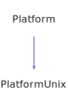

<h1>Platform</h1>

<a href="https://github.com/CharlesCarley/HackComputer#~">~</a>
<a href="index.md#index">HackComputer</a>
/
<a href="namespaceHack.md#hack">Hack</a>
::
<a href="namespaceHack_1_1Ui.md#ui">Ui</a>
::
<b>Platform</b>
 
 

<h4>Derived By</h4>

<a href="classHack_1_1Ui_1_1PlatformUnix.md#platformunix">Hack::Ui::PlatformUnix</a>

 

<h2>Public Typedefs</h2>
<a href="#colorcache" class="icon-list-item">ColorCache
</a>

 

<h2>Private Members</h2>
<a href="#_cache" class="icon-list-item">_cache
</a>

 

<h2>Public Methods</h2>
<a href="#platform" class="icon-list-item">Platform
</a>

 
<a href="#~platform" class="icon-list-item">~Platform
</a>

 
<a href="#clear" class="icon-list-item">clear
</a>

 
<a href="#color" class="icon-list-item">color
</a>

 
<a href="#flush" class="icon-list-item">flush
</a>

 
<a href="#getscreensize" class="icon-list-item">getScreenSize
</a>

 
<a href="#poll" class="icon-list-item">poll
</a>

 
<a href="#put" class="icon-list-item">put
</a>

 
<a href="#put" class="icon-list-item">put
</a>

 
<a href="#resetcolor" class="icon-list-item">resetColor
</a>

 
<a href="#resetcursor" class="icon-list-item">resetCursor
</a>

 
<a href="#setcursor" class="icon-list-item">setCursor
</a>

 
<a href="#showcursor" class="icon-list-item">showCursor
</a>

 
<a href="#usebackbuffer" class="icon-list-item">useBackBuffer
</a>

 

<h2>Public Static Methods</h2>
<a href="#sleep" class="icon-list-item">sleep
</a>

 

<h4>Defined in</h4>
<a href="https://github.com/CharlesCarley/HackComputer/blob/master/Source/Utils/UserInterface/Platform.h#L57" class="icon-list-item">Platform.h
</a>

 
<a href="#platform" class="icon-list-item">top
</a>

<h2>ColorCache</h2>
std::unordered_map&lt; 
<b>uint8_t</b>
, 
<a href="classHack_1_1Ui_1_1ColorCacheItem.md#colorcacheitem">ColorCacheItem</a>
 * &gt;
<b>ColorCache</b>
 

<h4>Defined in</h4>
<a href="https://github.com/CharlesCarley/HackComputer/blob/master/Source/Utils/UserInterface/Platform.h#L59" class="icon-list-item">Platform.h
</a>

 
<a href="#platform" class="icon-list-item">top
</a>

 

<h2>_cache</h2>
<a href="classHack_1_1Ui_1_1Platform.md#colorcache">ColorCache</a>
<b>_cache</b>
 

<h4>Defined in</h4>
<a href="https://github.com/CharlesCarley/HackComputer/blob/master/Source/Utils/UserInterface/Platform.h#L62" class="icon-list-item">Platform.h
</a>

 
<a href="#platform" class="icon-list-item">top
</a>

 

<h2>Platform</h2>
<b>Platform</b>
<i>(</i>
<i>)</i>

<h4>Defined in</h4>
<a href="https://github.com/CharlesCarley/HackComputer/blob/master/Source/Utils/UserInterface/Platform.h#L65" class="icon-list-item">Platform.h
</a>

 
<a href="#platform" class="icon-list-item">top
</a>

 

<h2>~Platform</h2>
<b>~Platform</b>
<i>(</i>
<i>)</i>

<h4>Defined in</h4>
<a href="https://github.com/CharlesCarley/HackComputer/blob/master/Source/Utils/UserInterface/Platform.h#L66" class="icon-list-item">Platform.h
</a>

 
<a href="https://github.com/CharlesCarley/HackComputer/blob/master/Source/Utils/UserInterface/Platform.cpp#L34" class="icon-list-item">Platform.cpp
</a>

 
<a href="#platform" class="icon-list-item">top
</a>

 

<h2>clear</h2>
void
<b>clear</b>
<i>(</i>
<i>)</i>

<h4>References</h4>

<a href="classHack_1_1Ui_1_1Platform.md#put">put</a>

<a href="namespaceHack_1_1Ui_1_1Detail.md#clear">Clear</a>

<h4>Defined in</h4>
<a href="https://github.com/CharlesCarley/HackComputer/blob/master/Source/Utils/UserInterface/Platform.h#L80" class="icon-list-item">Platform.h
</a>

 
<a href="https://github.com/CharlesCarley/HackComputer/blob/master/Source/Utils/UserInterface/Platform.cpp#L139" class="icon-list-item">Platform.cpp
</a>

 
<a href="#platform" class="icon-list-item">top
</a>

 

<h2>color</h2>
void
<b>color</b>
<i>(</i>

<b>uint8_t</b>
index

uint32_t
color

bool
background

<i>)</i>

<h4>References</h4>

<a href="classHack_1_1Ui_1_1Platform.md#put">put</a>

<a href="classHack_1_1Ui_1_1ColorCacheItem.md#background">background</a>

<a href="classHack_1_1Ui_1_1ColorCacheItem.md#foreground">foreground</a>

<h4>Defined in</h4>
<a href="https://github.com/CharlesCarley/HackComputer/blob/master/Source/Utils/UserInterface/Platform.h#L74" class="icon-list-item">Platform.h
</a>

 
<a href="https://github.com/CharlesCarley/HackComputer/blob/master/Source/Utils/UserInterface/Platform.cpp#L42" class="icon-list-item">Platform.cpp
</a>

 
<a href="#platform" class="icon-list-item">top
</a>

 

<h2>flush</h2>
void
<b>flush</b>
<i>(</i>
<i>)</i>

<h4>Defined in</h4>
<a href="https://github.com/CharlesCarley/HackComputer/blob/master/Source/Utils/UserInterface/Platform.h#L90" class="icon-list-item">Platform.h
</a>

 
<a href="https://github.com/CharlesCarley/HackComputer/blob/master/Source/Utils/UserInterface/Platform.cpp#L164" class="icon-list-item">Platform.cpp
</a>

 
<a href="#platform" class="icon-list-item">top
</a>

 

<h2>getScreenSize</h2>
void
<b>getScreenSize</b>
<i>(</i>

<a href="classHack_1_1Ui_1_1Point.md#point">Point</a>
 &amp;
sz

<i>)</i>

<h4>Defined in</h4>
<a href="https://github.com/CharlesCarley/HackComputer/blob/master/Source/Utils/UserInterface/Platform.h#L68" class="icon-list-item">Platform.h
</a>

 
<a href="#platform" class="icon-list-item">top
</a>

 

<h2>poll</h2>
int
<b>poll</b>
<i>(</i>

bool
block

<i>)</i>

<h4>Defined in</h4>
<a href="https://github.com/CharlesCarley/HackComputer/blob/master/Source/Utils/UserInterface/Platform.h#L70" class="icon-list-item">Platform.h
</a>

 
<a href="#platform" class="icon-list-item">top
</a>

 

<h2>put</h2>
void
<b>put</b>
<i>(</i>

char
ch

<i>)</i>

<h4>References</h4>

<a href="namespaceHack_1_1Ui.md#cs_start">CS_START</a>

<a href="namespaceHack_1_1Ui.md#cs_end">CS_END</a>

<a href="namespaceHack_1_1Ui.md#cs_seq_start">CS_SEQ_START</a>

<a href="namespaceHack_1_1Ui.md#cs_seq_end">CS_SEQ_END</a>

<a href="namespaceHack_1_1Ui.md#cs_none">CS_NONE</a>

<a href="namespaceHack_1_1Ui.md#cs_rect_hz">CS_RECT_HZ</a>

<a href="namespaceHack_1_1Ui_1_1Detail.md#linehz">LineHz</a>

<a href="namespaceHack_1_1Ui.md#cs_rect_vt">CS_RECT_VT</a>

<a href="namespaceHack_1_1Ui_1_1Detail.md#linevt">LineVt</a>

<a href="namespaceHack_1_1Ui.md#cs_rect_lt">CS_RECT_LT</a>

<a href="namespaceHack_1_1Ui_1_1Detail.md#linelt">LineLt</a>

<a href="namespaceHack_1_1Ui.md#cs_rect_rt">CS_RECT_RT</a>

<a href="namespaceHack_1_1Ui_1_1Detail.md#linert">LineRt</a>

<a href="namespaceHack_1_1Ui.md#cs_rect_rb">CS_RECT_RB</a>

<a href="namespaceHack_1_1Ui_1_1Detail.md#linerb">LineRb</a>

<a href="namespaceHack_1_1Ui.md#cs_rect_lb">CS_RECT_LB</a>

<a href="namespaceHack_1_1Ui_1_1Detail.md#linelb">LineLb</a>

<a href="namespaceHack_1_1Ui.md#cs_rect_cl">CS_RECT_CL</a>

<a href="namespaceHack_1_1Ui_1_1Detail.md#linecl">LineCl</a>

<a href="namespaceHack_1_1Ui.md#cs_rect_cr">CS_RECT_CR</a>

<a href="namespaceHack_1_1Ui_1_1Detail.md#linecr">LineCr</a>

<a href="namespaceHack_1_1Ui.md#cs_rect_ct">CS_RECT_CT</a>

<a href="namespaceHack_1_1Ui_1_1Detail.md#linect">LineCt</a>

<a href="namespaceHack_1_1Ui.md#cs_rect_cb">CS_RECT_CB</a>

<a href="namespaceHack_1_1Ui_1_1Detail.md#linecb">LineCb</a>

<h4>Defined in</h4>
<a href="https://github.com/CharlesCarley/HackComputer/blob/master/Source/Utils/UserInterface/Platform.h#L72" class="icon-list-item">Platform.h
</a>

 
<a href="https://github.com/CharlesCarley/HackComputer/blob/master/Source/Utils/UserInterface/Platform.cpp#L61" class="icon-list-item">Platform.cpp
</a>

 
<a href="#platform" class="icon-list-item">top
</a>

 

<h2>put</h2>
void
<b>put</b>
<i>(</i>

const char *
ch

<i>)</i>

<h4>Defined in</h4>
<a href="https://github.com/CharlesCarley/HackComputer/blob/master/Source/Utils/UserInterface/Platform.h#L76" class="icon-list-item">Platform.h
</a>

 
<a href="https://github.com/CharlesCarley/HackComputer/blob/master/Source/Utils/UserInterface/Platform.cpp#L111" class="icon-list-item">Platform.cpp
</a>

 
<a href="#platform" class="icon-list-item">top
</a>

 

<h2>resetColor</h2>
void
<b>resetColor</b>
<i>(</i>
<i>)</i>

<h4>References</h4>

<a href="classHack_1_1Ui_1_1Platform.md#put">put</a>

<a href="namespaceHack_1_1Ui_1_1Detail.md#resetcolor">ResetColor</a>

<h4>Defined in</h4>
<a href="https://github.com/CharlesCarley/HackComputer/blob/master/Source/Utils/UserInterface/Platform.h#L84" class="icon-list-item">Platform.h
</a>

 
<a href="https://github.com/CharlesCarley/HackComputer/blob/master/Source/Utils/UserInterface/Platform.cpp#L134" class="icon-list-item">Platform.cpp
</a>

 
<a href="#platform" class="icon-list-item">top
</a>

 

<h2>resetCursor</h2>
void
<b>resetCursor</b>
<i>(</i>
<i>)</i>

<h4>References</h4>

<a href="classHack_1_1Ui_1_1Platform.md#put">put</a>

<a href="namespaceHack_1_1Ui_1_1Detail.md#zerocursor">ZeroCursor</a>

<h4>Defined in</h4>
<a href="https://github.com/CharlesCarley/HackComputer/blob/master/Source/Utils/UserInterface/Platform.h#L82" class="icon-list-item">Platform.h
</a>

 
<a href="https://github.com/CharlesCarley/HackComputer/blob/master/Source/Utils/UserInterface/Platform.cpp#L129" class="icon-list-item">Platform.cpp
</a>

 
<a href="#platform" class="icon-list-item">top
</a>

 

<h2>setCursor</h2>
void
<b>setCursor</b>
<i>(</i>

int16_t
x

int16_t
y

<i>)</i>

<h4>References</h4>

<a href="namespaceHack_1_1Ui_1_1Detail.md#setcursor">SetCursor</a>

<h4>Defined in</h4>
<a href="https://github.com/CharlesCarley/HackComputer/blob/master/Source/Utils/UserInterface/Platform.h#L78" class="icon-list-item">Platform.h
</a>

 
<a href="https://github.com/CharlesCarley/HackComputer/blob/master/Source/Utils/UserInterface/Platform.cpp#L116" class="icon-list-item">Platform.cpp
</a>

 
<a href="#platform" class="icon-list-item">top
</a>

 

<h2>showCursor</h2>
void
<b>showCursor</b>
<i>(</i>

bool
show

<i>)</i>

<h4>References</h4>

<a href="classHack_1_1Ui_1_1Platform.md#put">put</a>

<a href="namespaceHack_1_1Ui_1_1Detail.md#showcursor">ShowCursor</a>

<a href="namespaceHack_1_1Ui_1_1Detail.md#hidecursor">HideCursor</a>

<h4>Defined in</h4>
<a href="https://github.com/CharlesCarley/HackComputer/blob/master/Source/Utils/UserInterface/Platform.h#L86" class="icon-list-item">Platform.h
</a>

 
<a href="https://github.com/CharlesCarley/HackComputer/blob/master/Source/Utils/UserInterface/Platform.cpp#L121" class="icon-list-item">Platform.cpp
</a>

 
<a href="#platform" class="icon-list-item">top
</a>

 

<h2>useBackBuffer</h2>
void
<b>useBackBuffer</b>
<i>(</i>

bool
use

<i>)</i>

<h4>References</h4>

<a href="classHack_1_1Ui_1_1Platform.md#put">put</a>

<a href="namespaceHack_1_1Ui_1_1Detail.md#clear">Clear</a>

<a href="namespaceHack_1_1Ui_1_1Detail.md#hidecursor">HideCursor</a>

<a href="namespaceHack_1_1Ui_1_1Detail.md#zerocursor">ZeroCursor</a>

<a href="namespaceHack_1_1Ui_1_1Detail.md#usebackbuffer">UseBackBuffer</a>

<a href="classHack_1_1Ui_1_1Platform.md#flush">flush</a>

<a href="namespaceHack_1_1Ui_1_1Detail.md#showcursor">ShowCursor</a>

<a href="namespaceHack_1_1Ui_1_1Detail.md#usefrontbuffer">UseFrontBuffer</a>

<h4>Defined in</h4>
<a href="https://github.com/CharlesCarley/HackComputer/blob/master/Source/Utils/UserInterface/Platform.h#L88" class="icon-list-item">Platform.h
</a>

 
<a href="https://github.com/CharlesCarley/HackComputer/blob/master/Source/Utils/UserInterface/Platform.cpp#L144" class="icon-list-item">Platform.cpp
</a>

 
<a href="#platform" class="icon-list-item">top
</a>

 

<h2>sleep</h2>
void
<b>sleep</b>
<i>(</i>

const uint32_t &amp;
ms

<i>)</i>

<h4>Defined in</h4>
<a href="https://github.com/CharlesCarley/HackComputer/blob/master/Source/Utils/UserInterface/Platform.h#L92" class="icon-list-item">Platform.h
</a>

 
<a href="https://github.com/CharlesCarley/HackComputer/blob/master/Source/Utils/UserInterface/Platform.cpp#L170" class="icon-list-item">Platform.cpp
</a>

 
<a href="#platform" class="icon-list-item">top
</a>

 

</body>
</html>
