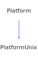

<h1>PlatformUnix</h1>

<a href="https://github.com/CharlesCarley/HackComputer#~">~</a>
<a href="index.md#index">HackComputer</a>
/
<a href="namespaceHack.md#hack">Hack</a>
::
<a href="namespaceHack_1_1Ui.md#ui">Ui</a>
::
<b>PlatformUnix</b>
 
 

<h4>Derived From</h4>

<a href="classHack_1_1Ui_1_1Platform.md#platform">Hack::Ui::Platform</a>

 

<h2>Private Members</h2>
<a href="#_message" class="icon-list-item">_message
</a>

 
<a href="#_size" class="icon-list-item">_size
</a>

 
<a href="#_term" class="icon-list-item">_term
</a>

 

<h2>Private Methods</h2>
<a href="#checksignals" class="icon-list-item">checkSignals
</a>

 
<a href="#checksize" class="icon-list-item">checkSize
</a>

 
<a href="#readstdin" class="icon-list-item">readStdin
</a>

 
<a href="#restorestate" class="icon-list-item">restoreState
</a>

 
<a href="#savestate" class="icon-list-item">saveState
</a>

 
<a href="#scan" class="icon-list-item">scan
</a>

 

<h2>Public Methods</h2>
<a href="#platformunix" class="icon-list-item">PlatformUnix
</a>

 
<a href="#~platformunix" class="icon-list-item">~PlatformUnix
</a>

 
<a href="#getscreensize" class="icon-list-item">getScreenSize
</a>

 
<a href="#poll" class="icon-list-item">poll
</a>

 

<h4>Defined in</h4>
<a href="https://github.com/CharlesCarley/HackComputer/blob/master/Source/Utils/UserInterface/PlatformUnix.h#L32" class="icon-list-item">PlatformUnix.h
</a>

 
<a href="#platformunix" class="icon-list-item">top
</a>

<h2>_message</h2>
<a href="namespaceHack.md#string">String</a>
<b>_message</b>
 

<h4>Defined in</h4>
<a href="https://github.com/CharlesCarley/HackComputer/blob/master/Source/Utils/UserInterface/PlatformUnix.h#L36" class="icon-list-item">PlatformUnix.h
</a>

 
<a href="#platformunix" class="icon-list-item">top
</a>

 

<h2>_size</h2>
<a href="classHack_1_1Ui_1_1Point.md#point">Point</a>
<b>_size</b>
 

<h4>Defined in</h4>
<a href="https://github.com/CharlesCarley/HackComputer/blob/master/Source/Utils/UserInterface/PlatformUnix.h#L35" class="icon-list-item">PlatformUnix.h
</a>

 
<a href="#platformunix" class="icon-list-item">top
</a>

 

<h2>_term</h2>
class 
<a href="classHack_1_1Ui_1_1Terminal.md#terminal">Terminal</a>
 *
<b>_term</b>
 

<h4>Defined in</h4>
<a href="https://github.com/CharlesCarley/HackComputer/blob/master/Source/Utils/UserInterface/PlatformUnix.h#L34" class="icon-list-item">PlatformUnix.h
</a>

 
<a href="#platformunix" class="icon-list-item">top
</a>

 

<h2>checkSignals</h2>
int
<b>checkSignals</b>
<i>(</i>
<i>)</i>

<h4>Defined in</h4>
<a href="https://github.com/CharlesCarley/HackComputer/blob/master/Source/Utils/UserInterface/PlatformUnix.h#L48" class="icon-list-item">PlatformUnix.h
</a>

 
<a href="https://github.com/CharlesCarley/HackComputer/blob/master/Source/Utils/UserInterface/PlatformUnix.cpp#L285" class="icon-list-item">PlatformUnix.cpp
</a>

 
<a href="#platformunix" class="icon-list-item">top
</a>

 

<h2>checkSize</h2>
bool
<b>checkSize</b>
<i>(</i>
<i>)</i>

<h4>Defined in</h4>
<a href="https://github.com/CharlesCarley/HackComputer/blob/master/Source/Utils/UserInterface/PlatformUnix.h#L42" class="icon-list-item">PlatformUnix.h
</a>

 
<a href="https://github.com/CharlesCarley/HackComputer/blob/master/Source/Utils/UserInterface/PlatformUnix.cpp#L187" class="icon-list-item">PlatformUnix.cpp
</a>

 
<a href="#platformunix" class="icon-list-item">top
</a>

 

<h2>readStdin</h2>
int
<b>readStdin</b>
<i>(</i>
<i>)</i>

<h4>Defined in</h4>
<a href="https://github.com/CharlesCarley/HackComputer/blob/master/Source/Utils/UserInterface/PlatformUnix.h#L44" class="icon-list-item">PlatformUnix.h
</a>

 
<a href="https://github.com/CharlesCarley/HackComputer/blob/master/Source/Utils/UserInterface/PlatformUnix.cpp#L263" class="icon-list-item">PlatformUnix.cpp
</a>

 
<a href="#platformunix" class="icon-list-item">top
</a>

 

<h2>restoreState</h2>
void
<b>restoreState</b>
<i>(</i>
<i>)</i>

<h4>Defined in</h4>
<a href="https://github.com/CharlesCarley/HackComputer/blob/master/Source/Utils/UserInterface/PlatformUnix.h#L40" class="icon-list-item">PlatformUnix.h
</a>

 
<a href="https://github.com/CharlesCarley/HackComputer/blob/master/Source/Utils/UserInterface/PlatformUnix.cpp#L179" class="icon-list-item">PlatformUnix.cpp
</a>

 
<a href="#platformunix" class="icon-list-item">top
</a>

 

<h2>saveState</h2>
void
<b>saveState</b>
<i>(</i>
<i>)</i>

<h4>Defined in</h4>
<a href="https://github.com/CharlesCarley/HackComputer/blob/master/Source/Utils/UserInterface/PlatformUnix.h#L38" class="icon-list-item">PlatformUnix.h
</a>

 
<a href="https://github.com/CharlesCarley/HackComputer/blob/master/Source/Utils/UserInterface/PlatformUnix.cpp#L164" class="icon-list-item">PlatformUnix.cpp
</a>

 
<a href="#platformunix" class="icon-list-item">top
</a>

 

<h2>scan</h2>
int
<b>scan</b>
<i>(</i>

const char *
cp

int
len

<i>)</i>

<h4>Defined in</h4>
<a href="https://github.com/CharlesCarley/HackComputer/blob/master/Source/Utils/UserInterface/PlatformUnix.h#L46" class="icon-list-item">PlatformUnix.h
</a>

 
<a href="https://github.com/CharlesCarley/HackComputer/blob/master/Source/Utils/UserInterface/PlatformUnix.cpp#L207" class="icon-list-item">PlatformUnix.cpp
</a>

 
<a href="#platformunix" class="icon-list-item">top
</a>

 

<h2>PlatformUnix</h2>
<b>PlatformUnix</b>
<i>(</i>
<i>)</i>

<h4>Defined in</h4>
<a href="https://github.com/CharlesCarley/HackComputer/blob/master/Source/Utils/UserInterface/PlatformUnix.h#L51" class="icon-list-item">PlatformUnix.h
</a>

 
<a href="https://github.com/CharlesCarley/HackComputer/blob/master/Source/Utils/UserInterface/PlatformUnix.cpp#L152" class="icon-list-item">PlatformUnix.cpp
</a>

 
<a href="#platformunix" class="icon-list-item">top
</a>

 

<h2>~PlatformUnix</h2>
<b>~PlatformUnix</b>
<i>(</i>
<i>)</i>

<h4>Defined in</h4>
<a href="https://github.com/CharlesCarley/HackComputer/blob/master/Source/Utils/UserInterface/PlatformUnix.h#L52" class="icon-list-item">PlatformUnix.h
</a>

 
<a href="https://github.com/CharlesCarley/HackComputer/blob/master/Source/Utils/UserInterface/PlatformUnix.cpp#L159" class="icon-list-item">PlatformUnix.cpp
</a>

 
<a href="#platformunix" class="icon-list-item">top
</a>

 

<h2>getScreenSize</h2>
void
<b>getScreenSize</b>
<i>(</i>

<a href="classHack_1_1Ui_1_1Point.md#point">Point</a>
 &amp;
sz

<i>)</i>

<h4>Defined in</h4>
<a href="https://github.com/CharlesCarley/HackComputer/blob/master/Source/Utils/UserInterface/PlatformUnix.h#L54" class="icon-list-item">PlatformUnix.h
</a>

 
<a href="https://github.com/CharlesCarley/HackComputer/blob/master/Source/Utils/UserInterface/PlatformUnix.cpp#L201" class="icon-list-item">PlatformUnix.cpp
</a>

 
<a href="#platformunix" class="icon-list-item">top
</a>

 

<h2>poll</h2>
int
<b>poll</b>
<i>(</i>

bool
block

<i>)</i>

<h4>References</h4>

<a href="namespaceHack_1_1Ui.md#pr_no_input">PR_NO_INPUT</a>

<a href="classHack_1_1Ui_1_1Terminal.md#update">update</a>

<a href="namespaceHack_1_1Ui.md#pr_exit">PR_EXIT</a>

<a href="namespaceHack_1_1Ui.md#pr_resize">PR_RESIZE</a>

<h4>Defined in</h4>
<a href="https://github.com/CharlesCarley/HackComputer/blob/master/Source/Utils/UserInterface/PlatformUnix.h#L56" class="icon-list-item">PlatformUnix.h
</a>

 
<a href="https://github.com/CharlesCarley/HackComputer/blob/master/Source/Utils/UserInterface/PlatformUnix.cpp#L298" class="icon-list-item">PlatformUnix.cpp
</a>

 
<a href="#platformunix" class="icon-list-item">top
</a>

 

</body>
</html>
