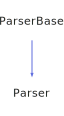

<h1>Parser</h1>

<a href="https://github.com/CharlesCarley/HackComputer#~">~</a>
<a href="index.md#index">HackComputer</a>
/
<a href="namespaceHack.md#hack">Hack</a>
::
<a href="namespaceHack_1_1VirtualMachine.md#virtualmachine">VirtualMachine</a>
::
<b>Parser</b>
 
 

<h4>Derived From</h4>

<a href="classHack_1_1ParserBase.md#parserbase">Hack::ParserBase</a>

 

<h2>Private Members</h2>
<a href="#_emitter" class="icon-list-item">_emitter
</a>

 
<a href="#_labels" class="icon-list-item">_labels
</a>

 

<h2>Private Methods</h2>
<a href="#callexpression" class="icon-list-item">callExpression
</a>

 
<a href="#expression" class="icon-list-item">expression
</a>

 
<a href="#functionexpression" class="icon-list-item">functionExpression
</a>

 
<a href="#gotoexpression" class="icon-list-item">gotoExpression
</a>

 
<a href="#inlineasm" class="icon-list-item">inlineAsm
</a>

 
<a href="#labelexpression" class="icon-list-item">labelExpression
</a>

 
<a href="#parseimpl" class="icon-list-item">parseImpl
</a>

 
<a href="#popexpression" class="icon-list-item">popExpression
</a>

 
<a href="#pushexpression" class="icon-list-item">pushExpression
</a>

 
<a href="#setexpression" class="icon-list-item">setExpression
</a>

 
<a href="#writeimpl" class="icon-list-item">writeImpl
</a>

 

<h2>Public Methods</h2>
<a href="#parser" class="icon-list-item">Parser
</a>

 
<a href="#~parser" class="icon-list-item">~Parser
</a>

 

<h4>Defined in</h4>
<a href="https://github.com/CharlesCarley/HackComputer/blob/master/Source/VirtualMachine/Parser.h#L33" class="icon-list-item">Parser.h
</a>

 
<a href="#parser" class="icon-list-item">top
</a>

<h2>_emitter</h2>
<a href="classHack_1_1VirtualMachine_1_1Emitter.md#emitter">Emitter</a>
<b>_emitter</b>
 

<h4>Defined in</h4>
<a href="https://github.com/CharlesCarley/HackComputer/blob/master/Source/VirtualMachine/Parser.h#L35" class="icon-list-item">Parser.h
</a>

 
<a href="#parser" class="icon-list-item">top
</a>

 

<h2>_labels</h2>
<a href="namespaceHack_1_1VirtualMachine.md#stringcache">StringCache</a>
<b>_labels</b>
 

<h4>Defined in</h4>
<a href="https://github.com/CharlesCarley/HackComputer/blob/master/Source/VirtualMachine/Parser.h#L36" class="icon-list-item">Parser.h
</a>

 
<a href="#parser" class="icon-list-item">top
</a>

 

<h2>callExpression</h2>
void
<b>callExpression</b>
<i>(</i>
<i>)</i>

<h4>Defined in</h4>
<a href="https://github.com/CharlesCarley/HackComputer/blob/master/Source/VirtualMachine/Parser.h#L57" class="icon-list-item">Parser.h
</a>

 
<a href="https://github.com/CharlesCarley/HackComputer/blob/master/Source/VirtualMachine/Parser.cpp#L217" class="icon-list-item">Parser.cpp
</a>

 
<a href="#parser" class="icon-list-item">top
</a>

 

<h2>expression</h2>
void
<b>expression</b>
<i>(</i>
<i>)</i>

<h4>Defined in</h4>
<a href="https://github.com/CharlesCarley/HackComputer/blob/master/Source/VirtualMachine/Parser.h#L43" class="icon-list-item">Parser.h
</a>

 
<a href="https://github.com/CharlesCarley/HackComputer/blob/master/Source/VirtualMachine/Parser.cpp#L284" class="icon-list-item">Parser.cpp
</a>

 
<a href="#parser" class="icon-list-item">top
</a>

 

<h2>functionExpression</h2>
void
<b>functionExpression</b>
<i>(</i>
<i>)</i>

<h4>Defined in</h4>
<a href="https://github.com/CharlesCarley/HackComputer/blob/master/Source/VirtualMachine/Parser.h#L55" class="icon-list-item">Parser.h
</a>

 
<a href="https://github.com/CharlesCarley/HackComputer/blob/master/Source/VirtualMachine/Parser.cpp#L187" class="icon-list-item">Parser.cpp
</a>

 
<a href="#parser" class="icon-list-item">top
</a>

 

<h2>gotoExpression</h2>
void
<b>gotoExpression</b>
<i>(</i>
<i>)</i>

<h4>Defined in</h4>
<a href="https://github.com/CharlesCarley/HackComputer/blob/master/Source/VirtualMachine/Parser.h#L51" class="icon-list-item">Parser.h
</a>

 
<a href="https://github.com/CharlesCarley/HackComputer/blob/master/Source/VirtualMachine/Parser.cpp#L161" class="icon-list-item">Parser.cpp
</a>

 
<a href="#parser" class="icon-list-item">top
</a>

 

<h2>inlineAsm</h2>
void
<b>inlineAsm</b>
<i>(</i>
<i>)</i>

<h4>Defined in</h4>
<a href="https://github.com/CharlesCarley/HackComputer/blob/master/Source/VirtualMachine/Parser.h#L45" class="icon-list-item">Parser.h
</a>

 
<a href="https://github.com/CharlesCarley/HackComputer/blob/master/Source/VirtualMachine/Parser.cpp#L274" class="icon-list-item">Parser.cpp
</a>

 
<a href="#parser" class="icon-list-item">top
</a>

 

<h2>labelExpression</h2>
void
<b>labelExpression</b>
<i>(</i>
<i>)</i>

<h4>Defined in</h4>
<a href="https://github.com/CharlesCarley/HackComputer/blob/master/Source/VirtualMachine/Parser.h#L53" class="icon-list-item">Parser.h
</a>

 
<a href="https://github.com/CharlesCarley/HackComputer/blob/master/Source/VirtualMachine/Parser.cpp#L139" class="icon-list-item">Parser.cpp
</a>

 
<a href="#parser" class="icon-list-item">top
</a>

 

<h2>parseImpl</h2>
void
<b>parseImpl</b>
<i>(</i>

<a href="namespaceHack.md#istream">IStream</a>
 &amp;
is

<i>)</i>

<h4>Defined in</h4>
<a href="https://github.com/CharlesCarley/HackComputer/blob/master/Source/VirtualMachine/Parser.h#L39" class="icon-list-item">Parser.h
</a>

 
<a href="https://github.com/CharlesCarley/HackComputer/blob/master/Source/VirtualMachine/Parser.cpp#L374" class="icon-list-item">Parser.cpp
</a>

 
<a href="#parser" class="icon-list-item">top
</a>

 

<h2>popExpression</h2>
void
<b>popExpression</b>
<i>(</i>
<i>)</i>

<h4>Defined in</h4>
<a href="https://github.com/CharlesCarley/HackComputer/blob/master/Source/VirtualMachine/Parser.h#L49" class="icon-list-item">Parser.h
</a>

 
<a href="https://github.com/CharlesCarley/HackComputer/blob/master/Source/VirtualMachine/Parser.cpp#L91" class="icon-list-item">Parser.cpp
</a>

 
<a href="#parser" class="icon-list-item">top
</a>

 

<h2>pushExpression</h2>
void
<b>pushExpression</b>
<i>(</i>
<i>)</i>

<h4>Defined in</h4>
<a href="https://github.com/CharlesCarley/HackComputer/blob/master/Source/VirtualMachine/Parser.h#L47" class="icon-list-item">Parser.h
</a>

 
<a href="https://github.com/CharlesCarley/HackComputer/blob/master/Source/VirtualMachine/Parser.cpp#L41" class="icon-list-item">Parser.cpp
</a>

 
<a href="#parser" class="icon-list-item">top
</a>

 

<h2>setExpression</h2>
void
<b>setExpression</b>
<i>(</i>
<i>)</i>

<h4>Defined in</h4>
<a href="https://github.com/CharlesCarley/HackComputer/blob/master/Source/VirtualMachine/Parser.h#L59" class="icon-list-item">Parser.h
</a>

 
<a href="https://github.com/CharlesCarley/HackComputer/blob/master/Source/VirtualMachine/Parser.cpp#L247" class="icon-list-item">Parser.cpp
</a>

 
<a href="#parser" class="icon-list-item">top
</a>

 

<h2>writeImpl</h2>
void
<b>writeImpl</b>
<i>(</i>

<a href="namespaceHack.md#ostream">OStream</a>
 &amp;
os

int
format
 = 
0

<i>)</i>

<h4>Defined in</h4>
<a href="https://github.com/CharlesCarley/HackComputer/blob/master/Source/VirtualMachine/Parser.h#L41" class="icon-list-item">Parser.h
</a>

 
<a href="https://github.com/CharlesCarley/HackComputer/blob/master/Source/VirtualMachine/Parser.cpp#L401" class="icon-list-item">Parser.cpp
</a>

 
<a href="#parser" class="icon-list-item">top
</a>

 

<h2>Parser</h2>
<b>Parser</b>
<i>(</i>
<i>)</i>

<h4>References</h4>

<a href="classHack_1_1ParserBase.md#_scanner">_scanner</a>

<h4>Defined in</h4>
<a href="https://github.com/CharlesCarley/HackComputer/blob/master/Source/VirtualMachine/Parser.h#L62" class="icon-list-item">Parser.h
</a>

 
<a href="https://github.com/CharlesCarley/HackComputer/blob/master/Source/VirtualMachine/Parser.cpp#L30" class="icon-list-item">Parser.cpp
</a>

 
<a href="#parser" class="icon-list-item">top
</a>

 

<h2>~Parser</h2>
<b>~Parser</b>
<i>(</i>
<i>)</i>

<h4>References</h4>

<a href="classHack_1_1ParserBase.md#_scanner">_scanner</a>

<h4>Defined in</h4>
<a href="https://github.com/CharlesCarley/HackComputer/blob/master/Source/VirtualMachine/Parser.h#L64" class="icon-list-item">Parser.h
</a>

 
<a href="https://github.com/CharlesCarley/HackComputer/blob/master/Source/VirtualMachine/Parser.cpp#L35" class="icon-list-item">Parser.cpp
</a>

 
<a href="#parser" class="icon-list-item">top
</a>

 

</body>
</html>
