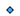

<h1>Chips</h1>

<a href="https://github.com/CharlesCarley/HackComputer#~">~</a>
<a href="index.md#index">HackComputer</a>
/
<a href="namespaceHack.md#hack">Hack</a>
::
<b>Chips</b>
 
 

<h2>Namespaces</h2>

<a href="namespaceHack_1_1Chips_1_1BitwiseGates.md#bitwisegates">BitwiseGates</a>

<a href="namespaceHack_1_1Chips_1_1Gates.md#gates">Gates</a>

<h2>Classes</h2>

<a href="classHack_1_1Chips_1_1Add16.md#add16">Add16</a>

<a href="classHack_1_1Chips_1_1Alu.md#alu">Alu</a>

<a href="classHack_1_1Chips_1_1And.md#and">And</a>

<a href="classHack_1_1Chips_1_1And16.md#and16">And16</a>

<a href="classHack_1_1Chips_1_1Bit.md#bit">Bit</a>

<a href="unionHack_1_1Chips_1_1bit16__t.md#bit16_t">bit16_t</a>

<a href="unionHack_1_1Chips_1_1bit32__t.md#bit32_t">bit32_t</a>

<a href="unionHack_1_1Chips_1_1bit64__t.md#bit64_t">bit64_t</a>

<a href="classHack_1_1Chips_1_1BitUtils.md#bitutils">BitUtils</a>

<a href="classHack_1_1Chips_1_1Chip.md#chip">Chip</a>

<a href="classHack_1_1Chips_1_1Clock.md#clock">Clock</a>

<a href="classHack_1_1Chips_1_1Computer.md#computer">Computer</a>

<a href="classHack_1_1Chips_1_1Cpu.md#cpu">Cpu</a>

<a href="structHack_1_1Chips_1_1CpuState.md#cpustate">CpuState</a>

<a href="classHack_1_1Chips_1_1DefaultMemorySegment.md#defaultmemorysegment">DefaultMemorySegment</a>

<a href="classHack_1_1Chips_1_1DFlipFlop.md#dflipflop">DFlipFlop</a>

<a href="classHack_1_1Chips_1_1DMux.md#dmux">DMux</a>

<a href="classHack_1_1Chips_1_1DMux4Way.md#dmux4way">DMux4Way</a>

<a href="classHack_1_1Chips_1_1DMux8Way.md#dmux8way">DMux8Way</a>

<a href="classHack_1_1Chips_1_1FullAdder.md#fulladder">FullAdder</a>

<a href="classHack_1_1Chips_1_1HalfAdder.md#halfadder">HalfAdder</a>

<a href="classHack_1_1Chips_1_1IMemorySegment.md#imemorysegment">IMemorySegment</a>

<a href="classHack_1_1Chips_1_1Inc16.md#inc16">Inc16</a>

<a href="classHack_1_1Chips_1_1Memory.md#memory">Memory</a>

<a href="classHack_1_1Chips_1_1Mux.md#mux">Mux</a>

<a href="classHack_1_1Chips_1_1Mux16.md#mux16">Mux16</a>

<a href="classHack_1_1Chips_1_1Mux4Way16.md#mux4way16">Mux4Way16</a>

<a href="classHack_1_1Chips_1_1Mux8Way16.md#mux8way16">Mux8Way16</a>

<a href="classHack_1_1Chips_1_1NAnd.md#nand">NAnd</a>

<a href="classHack_1_1Chips_1_1NOr.md#nor">NOr</a>

<a href="classHack_1_1Chips_1_1Not.md#not">Not</a>

<a href="classHack_1_1Chips_1_1Not16.md#not16">Not16</a>

<a href="classHack_1_1Chips_1_1Or.md#or">Or</a>

<a href="classHack_1_1Chips_1_1Or16.md#or16">Or16</a>

<a href="classHack_1_1Chips_1_1Or8Way.md#or8way">Or8Way</a>

<a href="classHack_1_1Chips_1_1ProgramCounter.md#programcounter">ProgramCounter</a>

<a href="classHack_1_1Chips_1_1Ram4k.md#ram4k">Ram4k</a>

<a href="classHack_1_1Chips_1_1Ram512.md#ram512">Ram512</a>

<a href="classHack_1_1Chips_1_1Ram64.md#ram64">Ram64</a>

<a href="classHack_1_1Chips_1_1Ram8.md#ram8">Ram8</a>

<a href="classHack_1_1Chips_1_1Register.md#register">Register</a>

<a href="classHack_1_1Chips_1_1Rom32.md#rom32">Rom32</a>

<a href="classHack_1_1Chips_1_1SRLatch.md#srlatch">SRLatch</a>

<a href="classHack_1_1Chips_1_1Timer.md#timer">Timer</a>

<a href="classHack_1_1Chips_1_1XOr.md#xor">XOr</a>

<h2>Enums</h2>
<a href="#aluflags" class="icon-list-item">AluFlags
</a>

 
<a href="#bitindex" class="icon-list-item">BitIndex
</a>

 
<a href="#control" class="icon-list-item">Control
</a>

 
<a href="#programcounterflags" class="icon-list-item">ProgramCounterFlags
</a>

 

<h2>Typedefs</h2>
<a href="#b16" class="icon-list-item">B16
</a>

 
<a href="#b8" class="icon-list-item">B8
</a>

 
<a href="#ram16k" class="icon-list-item">Ram16k
</a>

 
<a href="#screen" class="icon-list-item">Screen
</a>

 
<a href="#screensegment" class="icon-list-item">ScreenSegment
</a>

 

<h2>Variables</h2>
<a href="#abits" class="icon-list-item">ABits
</a>

 
<a href="#aload" class="icon-list-item">ALoad
</a>

 
<a href="#bitmask" class="icon-list-item">BitMask
</a>

 
<a href="#cbits" class="icon-list-item">CBits
</a>

 
<a href="#clockmask" class="icon-list-item">ClockMask
</a>

 
<a href="#dload" class="icon-list-item">DLoad
</a>

 
<a href="#dmux8waymask" class="icon-list-item">DMux8WayMask
</a>

 
<a href="#mload" class="icon-list-item">MLoad
</a>

 
<a href="#mux8way16mask" class="icon-list-item">Mux8Way16Mask
</a>

 
<a href="#rmask" class="icon-list-item">RMask
</a>

 
<a href="#srlatchmask" class="icon-list-item">SrLatchMask
</a>

 

<h2>Functions</h2>
<a href="#cpudirty" class="icon-list-item">CpuDirty
</a>

 
<a href="#cpuislocked" class="icon-list-item">CpuIsLocked
</a>

 

<h4>Defined in</h4>
<a href="https://github.com/CharlesCarley/HackComputer/blob/master/Source/Chips/Add16.cpp#L28" class="icon-list-item">Add16.cpp
</a>

 
<a href="#chips" class="icon-list-item">top
</a>

<h2>AluFlags</h2>
<b>AluFlags</b>
 

No

Fn

Ny

Zy

Nx

Zx

Ne

Zr

<h4>Defined in</h4>
<a href="https://github.com/CharlesCarley/HackComputer/blob/master/Source/Chips/ALU.h#L28" class="icon-list-item">ALU.h
</a>

 
<a href="#chips" class="icon-list-item">top
</a>

 

<h2>BitIndex</h2>
<b>BitIndex</b>
 

Bit0

Bit1

Bit2

Bit3

Bit4

Bit5

Bit6

Bit7

Bit8

Bit9

Bit10

Bit11

Bit12

Bit13

Bit14

Bit15

<h4>Defined in</h4>
<a href="https://github.com/CharlesCarley/HackComputer/blob/master/Source/Chips/BitUtils.h#L32" class="icon-list-item">BitUtils.h
</a>

 
<a href="#chips" class="icon-list-item">top
</a>

 

<h2>Control</h2>
<b>Control</b>
 

XAndY

Zero

One

NegativeOne

OutX

OutY

NotX

NotY

NegativeX

NegativeY

XPlusOne

YPlusOne

XMinusOne

YMinusOne

XPlusY

XMinusY

YMinusX

XOrY

<h4>Defined in</h4>
<a href="https://github.com/CharlesCarley/HackComputer/blob/master/Source/Chips/ALU.h#L40" class="icon-list-item">ALU.h
</a>

 
<a href="#chips" class="icon-list-item">top
</a>

 

<h2>ProgramCounterFlags</h2>
<b>ProgramCounterFlags</b>
 

PCF_INC

PCF_RESET

PCF_LOAD

<h4>Defined in</h4>
<a href="https://github.com/CharlesCarley/HackComputer/blob/master/Source/Chips/ProgramCounter.h#L32" class="icon-list-item">ProgramCounter.h
</a>

 
<a href="#chips" class="icon-list-item">top
</a>

 

<h2>B16</h2>
<a href="classHack_1_1Chips_1_1BitUtils.md#bitutils">BitUtils</a>
&lt; 
<b>uint16_t</b>
, 16 &gt;
<b>B16</b>
 

<h4>Defined in</h4>
<a href="https://github.com/CharlesCarley/HackComputer/blob/master/Source/Chips/BitUtils.h#L258" class="icon-list-item">BitUtils.h
</a>

 
<a href="#chips" class="icon-list-item">top
</a>

 

<h2>B8</h2>
<a href="classHack_1_1Chips_1_1BitUtils.md#bitutils">BitUtils</a>
&lt; 
<b>uint8_t</b>
, 8 &gt;
<b>B8</b>
 

<h4>Defined in</h4>
<a href="https://github.com/CharlesCarley/HackComputer/blob/master/Source/Chips/BitUtils.h#L257" class="icon-list-item">BitUtils.h
</a>

 
<a href="#chips" class="icon-list-item">top
</a>

 

<h2>Ram16k</h2>
<a href="classHack_1_1Chips_1_1DefaultMemorySegment.md#defaultmemorysegment">DefaultMemorySegment</a>
&lt; 0x4000, 0x8000 &gt;
<b>Ram16k</b>
 

<h4>Defined in</h4>
<a href="https://github.com/CharlesCarley/HackComputer/blob/master/Source/Chips/Ram16k.h#L27" class="icon-list-item">Ram16k.h
</a>

 
<a href="#chips" class="icon-list-item">top
</a>

 

<h2>Screen</h2>
<a href="classHack_1_1Chips_1_1IMemorySegment.md#imemorysegment">IMemorySegment</a>
&lt; 0x6000, 0x4000 &gt;
<b>Screen</b>
 

<h4>Defined in</h4>
<a href="https://github.com/CharlesCarley/HackComputer/blob/master/Source/Chips/Screen.h#L27" class="icon-list-item">Screen.h
</a>

 
<a href="#chips" class="icon-list-item">top
</a>

 

<h2>ScreenSegment</h2>
<a href="classHack_1_1Chips_1_1DefaultMemorySegment.md#defaultmemorysegment">DefaultMemorySegment</a>
&lt; 0x6000, 0x4000 &gt;
<b>ScreenSegment</b>
 

<h4>Defined in</h4>
<a href="https://github.com/CharlesCarley/HackComputer/blob/master/Source/Chips/Screen.h#L28" class="icon-list-item">Screen.h
</a>

 
<a href="#chips" class="icon-list-item">top
</a>

 

<h2>ABits</h2>
constexpr 
<b>uint16_t</b>
<b>ABits</b>
 

<h4>Defined in</h4>
<a href="https://github.com/CharlesCarley/HackComputer/blob/master/Source/Chips/CPU.cpp#L50" class="icon-list-item">CPU.cpp
</a>

 
<a href="#chips" class="icon-list-item">top
</a>

 

<h2>ALoad</h2>
constexpr 
<b>uint16_t</b>
<b>ALoad</b>
 

<h4>Defined in</h4>
<a href="https://github.com/CharlesCarley/HackComputer/blob/master/Source/Chips/CPU.cpp#L49" class="icon-list-item">CPU.cpp
</a>

 
<a href="#chips" class="icon-list-item">top
</a>

 

<h2>BitMask</h2>
constexpr 
<b>uint8_t</b>
<b>BitMask</b>
 

<h4>Defined in</h4>
<a href="https://github.com/CharlesCarley/HackComputer/blob/master/Source/Chips/Bit.cpp#L30" class="icon-list-item">Bit.cpp
</a>

 
<a href="#chips" class="icon-list-item">top
</a>

 

<h2>CBits</h2>
constexpr 
<b>uint16_t</b>
<b>CBits</b>
 

<h4>Defined in</h4>
<a href="https://github.com/CharlesCarley/HackComputer/blob/master/Source/Chips/CPU.cpp#L51" class="icon-list-item">CPU.cpp
</a>

 
<a href="#chips" class="icon-list-item">top
</a>

 

<h2>ClockMask</h2>
constexpr 
<b>uint8_t</b>
<b>ClockMask</b>
 

<h4>Defined in</h4>
<a href="https://github.com/CharlesCarley/HackComputer/blob/master/Source/Chips/Clock.cpp#L26" class="icon-list-item">Clock.cpp
</a>

 
<a href="#chips" class="icon-list-item">top
</a>

 

<h2>DLoad</h2>
constexpr 
<b>uint16_t</b>
<b>DLoad</b>
 

<h4>Defined in</h4>
<a href="https://github.com/CharlesCarley/HackComputer/blob/master/Source/Chips/CPU.cpp#L48" class="icon-list-item">CPU.cpp
</a>

 
<a href="#chips" class="icon-list-item">top
</a>

 

<h2>DMux8WayMask</h2>
constexpr 
<b>uint16_t</b>
<b>DMux8WayMask</b>
 

<h4>Defined in</h4>
<a href="https://github.com/CharlesCarley/HackComputer/blob/master/Source/Chips/DMux8Way.cpp#L30" class="icon-list-item">DMux8Way.cpp
</a>

 
<a href="#chips" class="icon-list-item">top
</a>

 

<h2>MLoad</h2>
constexpr 
<b>uint16_t</b>
<b>MLoad</b>
 

<h4>Defined in</h4>
<a href="https://github.com/CharlesCarley/HackComputer/blob/master/Source/Chips/CPU.cpp#L47" class="icon-list-item">CPU.cpp
</a>

 
<a href="#chips" class="icon-list-item">top
</a>

 

<h2>Mux8Way16Mask</h2>
constexpr 
<b>uint8_t</b>
<b>Mux8Way16Mask</b>
 

<h4>Defined in</h4>
<a href="https://github.com/CharlesCarley/HackComputer/blob/master/Source/Chips/Mux8Way16.cpp#L30" class="icon-list-item">Mux8Way16.cpp
</a>

 
<a href="#chips" class="icon-list-item">top
</a>

 

<h2>RMask</h2>
constexpr 
<b>uint16_t</b>
<b>RMask</b>
 

<h4>Defined in</h4>
<a href="https://github.com/CharlesCarley/HackComputer/blob/master/Source/Chips/CPU.cpp#L46" class="icon-list-item">CPU.cpp
</a>

 
<a href="#chips" class="icon-list-item">top
</a>

 

<h2>SrLatchMask</h2>
constexpr 
<b>uint8_t</b>
<b>SrLatchMask</b>
 

<h4>Defined in</h4>
<a href="https://github.com/CharlesCarley/HackComputer/blob/master/Source/Chips/SRLatch.cpp#L26" class="icon-list-item">SRLatch.cpp
</a>

 
<a href="#chips" class="icon-list-item">top
</a>

 

<h2>CpuDirty</h2>
bool
<b>CpuDirty</b>
<i>(</i>

const 
<b>uint8_t</b>
 &amp;
bits

<i>)</i>

<h4>References</h4>

<a href="namespaceHack_1_1Chips.md#bit7">Bit7</a>

<a href="namespaceHack_1_1Chips.md#cpuislocked">CpuIsLocked</a>

<h4>Defined in</h4>
<a href="https://github.com/CharlesCarley/HackComputer/blob/master/Source/Chips/CPU.cpp#L40" class="icon-list-item">CPU.cpp
</a>

 
<a href="#chips" class="icon-list-item">top
</a>

 

<h2>CpuIsLocked</h2>
bool
<b>CpuIsLocked</b>
<i>(</i>

const 
<b>uint8_t</b>
 &amp;
bits

<i>)</i>

<h4>References</h4>

<a href="namespaceHack_1_1Chips.md#bit2">Bit2</a>

<h4>Defined in</h4>
<a href="https://github.com/CharlesCarley/HackComputer/blob/master/Source/Chips/CPU.cpp#L35" class="icon-list-item">CPU.cpp
</a>

 
<a href="#chips" class="icon-list-item">top
</a>

 

</body>
</html>
